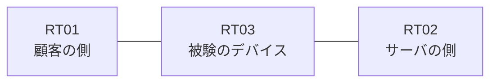

# 問題 20260822-003

> **本問は機器に接続せずに解答すること。追加の show 実行は認めない。**

## トポロジ

あなたの組織は、下記に示されているところのネットワークを運用しています。ある企業のネットワークにおいて、RT03 は、顧客の側のネットワークと、サーバの側のネットワークとの間に配置されており、IPv6 によって運用されています。



## 要件

1. `2001:DB8:8E:B::/64` からの通信は、許可されることはできません。
2. 管理のための構成に対して、変更が加えられてはなりません。
3. 対象としていないネットワークが、一致の対象に含まれてはなりません。また、拒否のエントリを使用してはなりません。
4. RT03 において、`2001:DB8:8E:8::/64`、`2001:DB8:8E:9::/64`、`2001:DB8:8E:A::/64` のネットワークからの通信のみが、`2001:DB8:8E:FF::10` の TCP ポート 22 に到達できなければなりません。
5. `2001:DB8:8E:D::/64` からの通信は、許可されてはなりません。

## 現在の状態

いくつかの宛先への通信について、報告が上がっています。示されているところの出力および構成に基づいて、要求されているところの動作が得られていない理由が、判断されなければなりません。

観測 | サーバへの到達
--- | ---
送信元が 2001:DB8:8E:8::/64 のネットワークにあるホストから、2001:DB8:8E:FF::10 の TCP ポート 22 宛ての通信 | 到達不可
送信元が 2001:DB8:8E:9::/64 のネットワークにあるホストから、2001:DB8:8E:FF::10 の TCP ポート 22 宛ての通信 | 到達不可
送信元が 2001:DB8:8E:A::/64 のネットワークにあるホストから、2001:DB8:8E:FF::10 の TCP ポート 22 宛ての通信 | 到達不可
送信元が 2001:DB8:8E:B::/64 のネットワークにあるホストから、2001:DB8:8E:FF::10 の TCP ポート 22 宛ての通信 | 到達不可
送信元が 2001:DB8:8E:D::/64 のネットワークにあるホストから、2001:DB8:8E:FF::10 の TCP ポート 22 宛ての通信 | 到達不可
送信元が 2001:DB8:8E:FA::/64 のネットワークにあるホストから、2001:DB8:8E:FF::10 の TCP ポート 22 宛ての通信 | 到達不可

```
RT03# show ipv6 access-list
IPv6 access list V6-CUST-IN
    permit ipv6 2001:DB8:8E:8::/62 any sequence 10
    deny ipv6 any any sequence 20
```
```
RT03# show ipv6 neighbors
IPv6 Address                              Age Link-layer Addr State Interface
2001:DB8:8E:8::3                            0 -               INCMP Et0/0
```

## 設定抜粋

```
RT03# show running-config | section ipv6 access-list|traffic-filter
ipv6 access-list V6-CUST-IN
 sequence 10 permit ipv6 2001:DB8:8E:8::/62 any
 sequence 20 deny ipv6 any any
interface Ethernet0/0
 ipv6 traffic-filter V6-CUST-IN in
```

## 設問

次のうち、正しいものは、どれですか。

## 選択肢
A. 末尾に明示の拒否のエントリが記述されているため、近隣探索に対する暗黙の許可が失われ、隣接のアドレスが解決できていない

B. シーケンス番号が連続していないため、エントリが評価されていない

C. ワイルドカードによる指定が受理されず、意図されたエントリが存在していない

D. 参照されているアクセス・リストが定義されていない

E. 先行するエントリが広い範囲を許可しており、後続のエントリが評価されない

F. アクセス・リストが `ip access-group` によって適用されている
