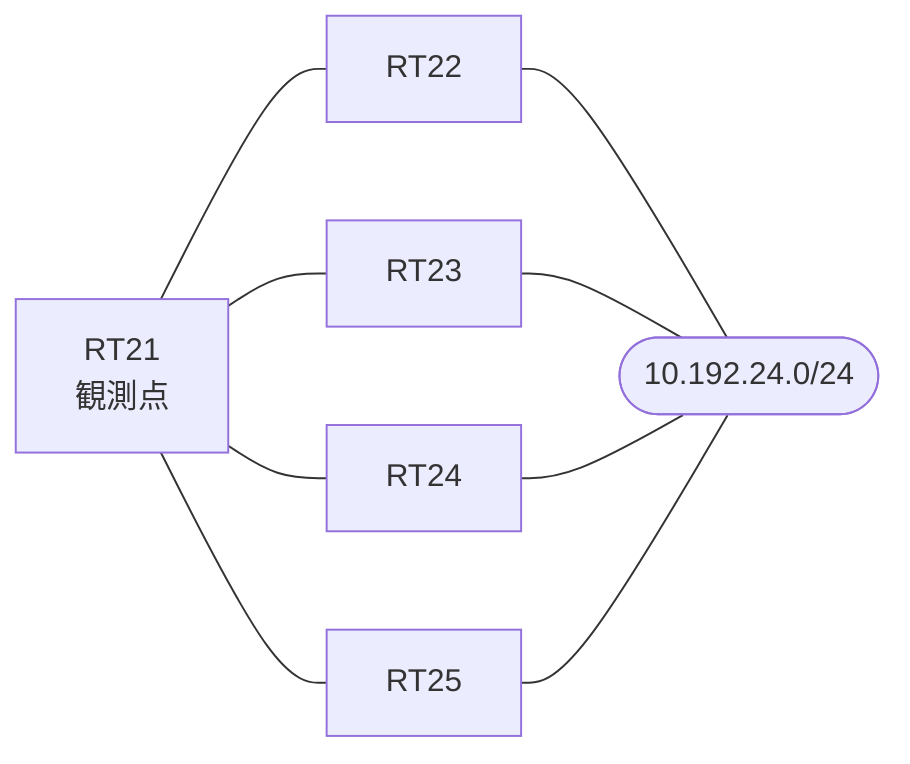

# 問題 20260822-005

> **本問は機器に接続せずに解答すること。追加の show 実行は認めない。**

## シナリオ

あなたは、下記のネットワークの保守を担当する技術者です。拠点のルータ RT21 は、複数の隣接するルータを経由して、10.192.24.0/24 への経路を学習しています。ネットワークは単一の EIGRP のオートノマス システム(100)として運用されており、そして、冗長なパスの活用が検討されています。経路の選好に関する挙動のレビューが、実施されています。スタティック ルートおよび既定のルートによる迂回は、実施されてはなりません。現在選好されているところの経路の側の構成は、変更されてはなりません。既存の隣接関係は、維持される必要があります。RT21 における 10.192.24.0/24 への転送のパスは、運用の設計の意図と一致していなければなりません。構成の変更は、1 箇所に限られなければなりません。



| 対象 | 内容 |
|------|------|
| RT21 ⇔ RT22 | Ethernet0/0・10.228.2.0/24（RT21 側の delay = 100） |
| RT21 ⇔ RT23 | Ethernet0/1・10.228.3.0/24（RT21 側の delay = 450） |
| RT21 ⇔ RT24 | Ethernet0/2・10.228.4.0/24（RT21 側の delay = 300） |
| RT21 ⇔ RT25 | Ethernet0/3・10.228.5.0/24（RT21 側の delay = 100） |
| 宛先 | 10.192.24.0/24（すべての隣接から到達可能） |

## 出力

```
RT21# show running-config | section interface
interface Ethernet0/0
 description === to RT22 ===
 ip address 10.228.2.1 255.255.255.0
 delay 100
interface Ethernet0/1
 description === to RT23 ===
 ip address 10.228.3.1 255.255.255.0
 delay 450
interface Ethernet0/2
 description === to RT24 ===
 ip address 10.228.4.1 255.255.255.0
 delay 300
interface Ethernet0/3
 description === to RT25 ===
 ip address 10.228.5.1 255.255.255.0
 delay 100
```
```
RT21# show running-config | section router eigrp
router eigrp 100
 eigrp router-id 80.0.0.1
 network 10.228.0.0 0.0.255.255
 no auto-summary
```
```
RT21# show ip eigrp topology all-links
EIGRP-IPv4 Topology Table for AS(100)/ID(80.0.0.1)
Codes: P - Passive, A - Active, U - Update, Q - Query, R - Reply,
       r - reply Status, s - sia Status 

P 10.228.2.0/24, 1 successors, FD is 281600, serno 2
        via Connected, Ethernet0/0
P 10.228.3.0/24, 1 successors, FD is 371200, serno 3
        via Connected, Ethernet0/1
P 10.192.24.0/24, 1 successors, FD is 435200, serno 8, refcount 1
        via 10.228.2.2 (435200/409600), Ethernet0/0
        via 10.228.5.5 (473600/448000), Ethernet0/3
        via 10.228.4.4 (491520/414720), Ethernet0/2
        via 10.228.3.3 (524800/409600), Ethernet0/1
```

## 設問

RT21 の EIGRP のプロセスに `variance 3` が構成された場合、10.192.24.0/24 に対して、ルーティング・テーブルに搭載される経路は、どれですか。(1つを選択してください)

## 選択肢
A. RT22(10.228.2.2)経由の 1 本が搭載される

B. RT22(10.228.2.2)経由・RT24(10.228.4.4)経由・RT23(10.228.3.3)経由の 3 本が搭載される

C. RT24(10.228.4.4)経由・RT23(10.228.3.3)経由の 2 本が搭載される

D. RT22(10.228.2.2)経由・RT25(10.228.5.5)経由・RT24(10.228.4.4)経由・RT23(10.228.3.3)経由の 4 本が搭載される

E. RT22(10.228.2.2)経由・RT23(10.228.3.3)経由の 2 本が搭載される
