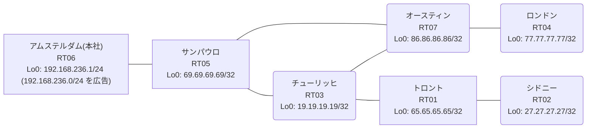

# 問題 20260822-006

> **本問は機器に接続せずに解答すること。追加の show 実行は認めない。**

## シナリオ

あなたは、ネットワークの運用を担当しています。本社の顧客のネットワークは、BGP AS 65492 の RT06 によって、広告されています。あなたの会社の内部は、BGP / EIGRP / OSPF という 3 つのドメインから構成されています。サイトと、ルーターおよびアドレスとの対応は、下記の表に示されているとおりです。通信の一部において、想定されていない挙動が、観測されています。あなたは、示されているところの出力および構成に基づいて、その構成が、下記において記述されているとおりに動作していない理由を、判断する必要があります。`192.168.236.0/24` 宛のパケットが、広告元である RT06 の方向へ転送され、そして、転送のループが存在していないこと。管理のための構成に対して、変更が加えられてはなりません。既存の再配送の設計が、変更または撤去されることはできません。スタティック・ルートによる回避も、許可されていません。distance コマンドによる管理距離の操作は、監査のポリシー上、使用されることができません。インタフェースの IP アドレッシングは、変更されてはなりません。経路の遮断は、当該の経路の出自に基づいて、実施されなければなりません。顧客のネットワーク `192.168.236.0/24` を含むすべての宛先への到達可能性が、すべてのサイトにおいて、確保されていること。



| 拠点 | ルータ | 拠点網 / 広告網 |
|------|--------|------------------|
| アムステルダム(本社) | RT06 | 192.168.236.1/24 (`192.168.236.0/24` を広告) |
| オースティン | RT07 | 86.86.86.86/32 |
| サンパウロ | RT05 | 69.69.69.69/32 |
| シドニー | RT02 | 27.27.27.27/32 |
| チューリッヒ | RT03 | 19.19.19.19/32 |
| トロント | RT01 | 65.65.65.65/32 |
| ロンドン | RT04 | 77.77.77.77/32 |

リンク一覧:
```
  RT06:E0/0(.1) ── RT05:E0/0(.2)   10.62.201.0/30
  RT05:E0/1(.1) ── RT07:E0/0(.2)   10.87.126.0/30
  RT05:E0/2(.1) ── RT03:E0/0(.2)   10.35.1.0/30
  RT07:E0/1(.1) ── RT03:E0/1(.2)   10.87.17.0/30
  RT03:E0/2(.1) ── RT01:E0/0(.2)   10.139.55.0/30
  RT01:E0/1(.1) ── RT02:E0/0(.2)   10.90.250.0/30
  RT07:E0/2(.1) ── RT04:E0/0(.2)   10.156.129.0/30
```

## 出力

```
RT05# show ip route
Gateway of last resort is not set
      10.0.0.0/8 is variably subnetted, 10 subnets, 2 masks
C        10.35.1.0/30 is directly connected, Ethernet0/2
L        10.35.1.1/32 is directly connected, Ethernet0/2
C        10.62.201.0/30 is directly connected, Ethernet0/0
L        10.62.201.2/32 is directly connected, Ethernet0/0
O        10.87.17.0/30 [110/20] via 10.35.1.2, 00:04:54, Ethernet0/2
C        10.87.126.0/30 is directly connected, Ethernet0/1
L        10.87.126.1/32 is directly connected, Ethernet0/1
O        10.90.250.0/30 [110/30] via 10.35.1.2, 00:04:29, Ethernet0/2
O        10.139.55.0/30 [110/20] via 10.35.1.2, 00:04:33, Ethernet0/2
O        10.156.129.0/30 [110/30] via 10.35.1.2, 00:04:54, Ethernet0/2
      19.0.0.0/32 is subnetted, 1 subnets
O        19.19.19.19 [110/11] via 10.35.1.2, 00:04:58, Ethernet0/2
      27.0.0.0/32 is subnetted, 1 subnets
O        27.27.27.27 [110/31] via 10.35.1.2, 00:04:25, Ethernet0/2
      65.0.0.0/32 is subnetted, 1 subnets
O        65.65.65.65 [110/21] via 10.35.1.2, 00:04:29, Ethernet0/2
      69.0.0.0/32 is subnetted, 1 subnets
C        69.69.69.69 is directly connected, Loopback0
      77.0.0.0/32 is subnetted, 1 subnets
O        77.77.77.77 [110/31] via 10.35.1.2, 00:04:21, Ethernet0/2
      86.0.0.0/32 is subnetted, 1 subnets
O        86.86.86.86 [110/21] via 10.35.1.2, 00:04:54, Ethernet0/2
D EX  192.168.236.0/24 [170/307200] via 10.87.126.2, 00:04:01, Ethernet0/1
```
```
RT05# show route-map
route-map RM-LEGACY1, deny, sequence 10
  Match clauses:
    ip address prefix-lists: PL-LEGACY1 
  Set clauses:
  Policy routing matches: 0 packets, 0 bytes
route-map RM-LEGACY1, permit, sequence 20
  Match clauses:
  Set clauses:
  Policy routing matches: 0 packets, 0 bytes
```
```
RT05# show ip prefix-list
ip prefix-list PL-LEGACY1: 2 entries
   seq 5 deny 69.69.69.69/32
   seq 10 permit 0.0.0.0/0 le 32
```
```
RT05# show access-lists
Standard IP access list 75
    10 deny   69.69.69.69
    20 permit any
```
```
RT05# show ip bgp
BGP table version is 14, local router ID is 69.69.69.69
Status codes: s suppressed, d damped, h history, * valid, > best, i - internal, 
              r RIB-failure, S Stale, m multipath, b backup-path, f RT-Filter, 
              x best-external, a additional-path, c RIB-compressed, 
              t secondary path, L long-lived-stale,
Origin codes: i - IGP, e - EGP, ? - incomplete
RPKI validation codes: V valid, I invalid, N Not found

     Network          Next Hop            Metric LocPrf Weight Path
 *>   10.35.1.0/30     0.0.0.0                  0         32768 ?
 *>   10.87.17.0/30    10.35.1.2               20         32768 ?
 *>   10.90.250.0/30   10.35.1.2               30         32768 ?
 *>   10.139.55.0/30   10.35.1.2               20         32768 ?
 *>   10.156.129.0/30  10.35.1.2               30         32768 ?
 *>   19.19.19.19/32   10.35.1.2               11         32768 ?
 *>   27.27.27.27/32   10.35.1.2               31         32768 ?
 *>   65.65.65.65/32   10.35.1.2               21         32768 ?
 *>   69.69.69.69/32   0.0.0.0                  0         32768 i
 *>   77.77.77.77/32   10.35.1.2               31         32768 ?
 *>   86.86.86.86/32   10.35.1.2               21         32768 ?
 r>i  192.168.236.0    10.62.201.1              0    100      0 i
```
```
RT05# show ip protocols | include Routing Protocol|Distance
Routing Protocol is "application"
    Gateway         Distance      Last Update
  Distance: (default is 4)
Routing Protocol is "eigrp 836"
      Distance: internal 90 external 170
    Gateway         Distance      Last Update
  Distance: internal 90 external 170
Routing Protocol is "ospf 34"
    Gateway         Distance      Last Update
  Distance: (default is 110)
Routing Protocol is "bgp 65492"
    Gateway         Distance      Last Update
  Distance: external 20 internal 200 local 200
```
```
RT04# traceroute 192.168.236.1 probe 1 timeout 1 ttl 1 8
Type escape sequence to abort.
Tracing the route to 192.168.236.1
VRF info: (vrf in name/id, vrf out name/id)
  1 10.156.129.1 1 msec
  2 10.87.17.2 2 msec
  3 10.35.1.1 1 msec
  4 10.87.126.2 2 msec
  5 10.87.17.2 2 msec
  6 10.35.1.1 2 msec
  7 10.87.126.2 2 msec
  8 10.87.17.2 2 msec
```
```
RT05# show running-config | section router
router eigrp 836
 network 10.87.126.0 0.0.0.3
 passive-interface Loopback0
router ospf 34
 router-id 69.69.69.69
 redistribute eigrp 836
 redistribute bgp 65492
 network 10.35.1.0 0.0.0.3 area 0
 network 69.69.69.69 0.0.0.0 area 0
router bgp 65492
 bgp router-id 69.69.69.69
 bgp log-neighbor-changes
 bgp redistribute-internal
 network 69.69.69.69 mask 255.255.255.255
 redistribute ospf 34
 neighbor 10.62.201.1 remote-as 65492
```
```
RT07# show running-config | section router
router eigrp 836
 network 10.87.126.0 0.0.0.3
 redistribute ospf 34 metric 100000 100 255 1 1500
router ospf 34
 router-id 86.86.86.86
 redistribute eigrp 836
 network 10.87.17.0 0.0.0.3 area 0
 network 10.156.129.0 0.0.0.3 area 0
 network 86.86.86.86 0.0.0.0 area 0
```
```
RT03# show running-config | section router
router ospf 34
 router-id 19.19.19.19
 timers throttle spf 50 200 5000
 passive-interface Loopback0
 network 10.35.1.0 0.0.0.3 area 0
 network 10.87.17.0 0.0.0.3 area 0
 network 10.139.55.0 0.0.0.3 area 0
 network 19.19.19.19 0.0.0.0 area 0
```
```
RT06# show running-config | section router
router bgp 65492
 bgp router-id 192.168.236.1
 bgp log-neighbor-changes
 network 192.168.236.0
 neighbor 10.62.201.2 remote-as 65492
```

## 設問

次のうち、正しいものは、どれですか。

## 選択肢
**A.**
```
! RT05
route-map RM-ORIGIN permit 10
 set tag 65492
router ospf 34
 redistribute bgp 65492 route-map RM-ORIGIN
! RT07
route-map RM-NOBACK deny 10
 match tag 65492
route-map RM-NOBACK permit 20
router eigrp 836
 redistribute ospf 34 route-map RM-NOBACK
```

**B.**
```
! RT07
route-map RM-MARK permit 10
 set tag 65492
router eigrp 836
 redistribute ospf 34 route-map RM-MARK
! RT05
route-map RM-DROP deny 10
 match tag 65492
route-map RM-DROP permit 20
router ospf 34
 redistribute bgp 65492 route-map RM-DROP
```

**C.**
```
router bgp 65492
 no bgp redistribute-internal
```

**D.**
```
! RT07 側で両方向の redistribute に deny route-map を適用
route-map RM-BLK deny 10
 match ip address prefix-list PL-BLK
route-map RM-BLK permit 20
```

**E.**
```
router bgp 65492
 distance bgp 20 165 165
end
clear ip route *
```

**F.**
```
ip prefix-list PL-BLOCK seq 5 deny 192.168.236.0/24
ip prefix-list PL-BLOCK seq 10 permit 0.0.0.0/0 le 32
router eigrp 836
 distribute-list prefix PL-BLOCK in
```

**G.**
```
route-map RM-ORIGIN permit 10
 set tag 65492
router ospf 34
 redistribute bgp 65492 route-map RM-ORIGIN
```
