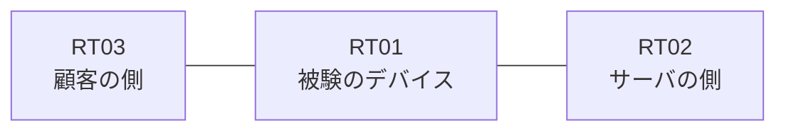

# 問題 20260822-008

> **本問は機器に接続せずに解答すること。追加の show 実行は認めない。**

## トポロジ

あなたは、ネットワークの運用を担当しています。ある企業のネットワークにおいて、RT01 は、顧客の側のネットワークと、サーバの側のネットワークとの間に配置されており、IPv6 によって運用されています。



## 要件

1. RT01 において、`2001:DB8:7E:30::/64`、`2001:DB8:7E:31::/64`、`2001:DB8:7E:32::/64` のネットワークからの通信のみが、`2001:DB8:7E:FF::10` の TCP ポート 443 に到達できなければなりません。
2. `2001:DB8:7E:35::/64` からの通信は、許可されることはできません。
3. 拒否のエントリを使用してはなりません。
4. 管理のための構成に対して、変更が加えられてはなりません。

## 現在の状態

ユーザーから、通信に関する事象が、報告されています。あなたは、提示されているところの情報のみを使用して、要求されている状態が満たされていない理由を、特定しなければなりません。

観測 | サーバへの到達
--- | ---
送信元が 2001:DB8:7E:30::/64 のネットワークにあるホストから、2001:DB8:7E:FF::10 の TCP ポート 443 宛ての通信 | 到達可
送信元が 2001:DB8:7E:31::/64 のネットワークにあるホストから、2001:DB8:7E:FF::10 の TCP ポート 443 宛ての通信 | 到達可
送信元が 2001:DB8:7E:32::/64 のネットワークにあるホストから、2001:DB8:7E:FF::10 の TCP ポート 443 宛ての通信 | 到達可
送信元が 2001:DB8:7E:33::/64 のネットワークにあるホストから、2001:DB8:7E:FF::10 の TCP ポート 443 宛ての通信 | 到達可
送信元が 2001:DB8:7E:35::/64 のネットワークにあるホストから、2001:DB8:7E:FF::10 の TCP ポート 443 宛ての通信 | 到達可
送信元が 2001:DB8:7E:FA::/64 のネットワークにあるホストから、2001:DB8:7E:FF::10 の TCP ポート 443 宛ての通信 | 到達可

```
RT01# show ipv6 access-list

```
```
RT01# show ipv6 neighbors
IPv6 Address                              Age Link-layer Addr State Interface
2001:DB8:7E:30::3                           0 aabb.cc02.4f00  REACH Et0/0
```

## 設定抜粋

```
RT01# show running-config | section ipv6 access-list|traffic-filter
interface Ethernet0/0
 ipv6 traffic-filter V6-CUST-IN in
```

## 設問

次のうち、正しいものは、どれですか。

## 選択肢
A. ワイルドカードによる指定が受理されず、意図されたエントリが存在していない

B. プレフィックスの長さが短く、対象としていないネットワークまでが一致の対象に含まれている

C. プレフィックスの長さが長く、対象としているネットワークの一部が一致の対象から外れている

D. インターフェイスにおいて IPv6 が有効にされていない

E. 参照されているアクセス・リストが定義されていない

F. アクセス・リストが `ip access-group` によって適用されている
