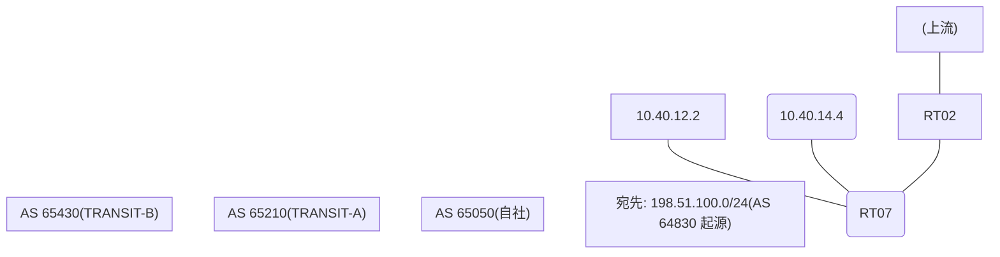

# 問題 20260822-009

> **本問は機器に接続せずに解答すること。追加の show 実行は認めない。**

## シナリオ

あなたの組織は、下記に示されているところのネットワークを運用しています。自社のルータ RT07 は、外部のネットワーク 198.51.100.0/24 への到達性を、複数の経路を通じて、確立しています。 TRANSIT-A とは、接続されています。 TRANSIT-B とも、接続されています。 一部の経路は、自 AS 内の境界ルーターから、iBGP で、学習されています。外部との 1 つのセッションが失われ、それまで使用されていたところの経路は、取り下げられました。ルータは、残るところの経路からの、ベストパスの選出を、行おうとしています。示されているところの出力は、その時点で、採取されたものです。示されているところの出力、および、構成に基づいて、判断すること。なお、機器の構成は、示されている抜粋のほかは、既定値である。



## 出力

```
RT07# show ip bgp
BGP table version is 12, local router ID is 82.82.82.82
Status codes: s suppressed, d damped, h history, * valid, > best, i - internal, 
              r RIB-failure, S Stale, m multipath, b backup-path, f RT-Filter, 
              x best-external, a additional-path, c RIB-compressed, 
              t secondary path, L long-lived-stale,
Origin codes: i - IGP, e - EGP, ? - incomplete
RPKI validation codes: V valid, I invalid, N Not found

     Network          Next Hop            Metric LocPrf Weight Path
 *    198.51.100.0     10.40.12.2             300             0 65210 64830 i
 * i                   4.6.6.6                       100      0 65210 65210 64830 64830 i
 *                     10.40.14.4              50             0 65430 64830 ?
```
```
RT07# show ip bgp 198.51.100.0
BGP routing table entry for 198.51.100.0/24, version 12
Paths: (3 available, no best path)
  Not advertised to any peer
  Refresh Epoch 2
  65210 64830
    10.40.12.2 from 10.40.12.2 (227.227.227.227)
      Origin IGP, metric 300, localpref 100, valid, external
      rx pathid: 0, tx pathid: 0
      Updated on Mar 10 2026 10:24:03 UTC
  Refresh Epoch 1
  65210 65210 64830 64830
    4.6.6.6 (metric 101) from 4.6.6.6 (4.6.6.6)
      Origin IGP, localpref 100, valid, internal
      rx pathid: 0, tx pathid: 0
      Updated on Mar 10 2026 08:13:56 UTC
  Refresh Epoch 2
  65430 64830
    10.40.14.4 from 10.40.14.4 (32.32.32.32)
      Origin incomplete, metric 50, localpref 100, valid, external
      rx pathid: 0, tx pathid: 0
      Updated on Mar 10 2026 08:09:07 UTC
```
```
RT07# show running-config | section router bgp
router bgp 65050
 bgp router-id 82.82.82.82
 bgp log-neighbor-changes
 neighbor 4.6.6.6 remote-as 65050
 neighbor 4.6.6.6 update-source Loopback0
 neighbor 10.40.12.2 remote-as 65210
 neighbor 10.40.14.4 remote-as 65430
 !
 address-family ipv4
  neighbor 4.6.6.6 activate
  neighbor 10.40.12.2 activate
  neighbor 10.40.14.4 activate
 exit-address-family
```

## 設問

示されているところの出力に基づいて、この後、198.51.100.0/24 のベストパスとして選出され、転送に使用されるところの経路は、どれですか。(1つを選択してください)

## 選択肢
A. next hop 10.40.14.4 の経路

B. next hop 10.40.12.2 の経路

C. next hop 4.6.6.6 の経路
