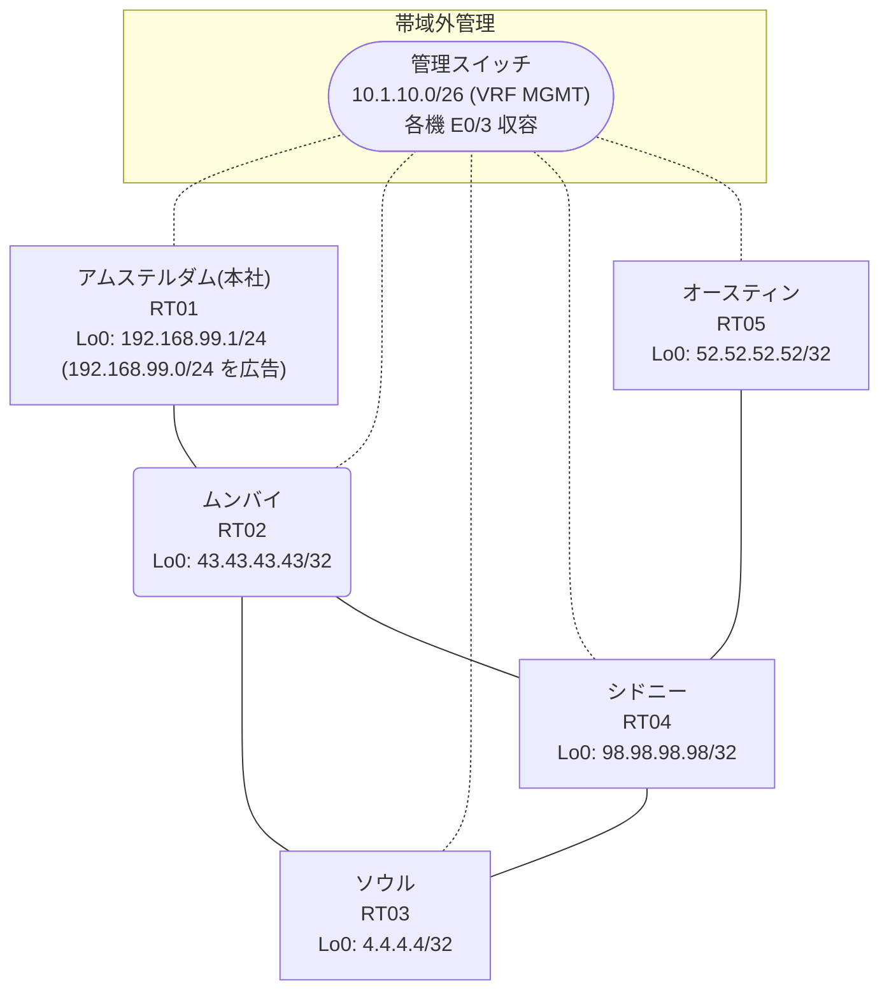

# 問題 20260822-010

> **本問は機器に接続せずに解答すること。追加の show 実行は認めない。**

## シナリオ

あなたの組織は、下記に示されているところのネットワークを運用しています。本社の顧客のネットワークは、BGP AS 64711 の RT01 によって、広告されています。あなたの会社の内部は、BGP / EIGRP / OSPF という 3 つのドメインから構成されています。サイトと、ルータおよびアドレスとの対応は、下記の表に示されているとおりです。本日の作業の時間帯において、下記の選択肢に示されている変更が、適用されました。作業の完了の直後から、複数のサイトにおいて、`192.168.99.0/24` 宛の通信が、タイムアウトしています。`192.168.99.0/24` 宛のトラフィックが RT01 へ配送され、経路の周回が、発生していないこと。ルーティング プロトコルの種別およびプロセスの配置は、変更されることはできません。それぞれのドメインの間の再配送の設計は、維持される必要があります。顧客のネットワーク `192.168.99.0/24` を含むすべての宛先への到達可能性が、すべてのサイトにおいて、確保されていること。管理のための構成に対して、変更が加えられてはなりません。



| 拠点 | ルータ | 拠点網 / 広告網 |
|------|--------|------------------|
| アムステルダム(本社) | RT01 | 192.168.99.1/24 (`192.168.99.0/24` を広告) |
| オースティン | RT05 | 52.52.52.52/32 |
| シドニー | RT04 | 98.98.98.98/32 |
| ソウル | RT03 | 4.4.4.4/32 |
| ムンバイ | RT02 | 43.43.43.43/32 |

リンク一覧:
```
  RT01:E0/0(.1) ── RT02:E0/0(.2)   10.221.2.0/30
  RT02:E0/1(.1) ── RT03:E0/0(.2)   10.37.202.0/30
  RT02:E0/2(.1) ── RT04:E0/0(.2)   10.37.47.0/30
  RT03:E0/1(.1) ── RT04:E0/1(.2)   10.192.122.0/30
  RT04:E0/2(.1) ── RT05:E0/0(.2)   10.185.100.0/30
```

## 出力

```
RT02# show ip route
Gateway of last resort is not set
      4.0.0.0/32 is subnetted, 1 subnets
O        4.4.4.4 [110/21] via 10.37.47.2, 00:03:46, Ethernet0/2
      10.0.0.0/8 is variably subnetted, 8 subnets, 2 masks
C        10.37.47.0/30 is directly connected, Ethernet0/2
L        10.37.47.1/32 is directly connected, Ethernet0/2
C        10.37.202.0/30 is directly connected, Ethernet0/1
L        10.37.202.1/32 is directly connected, Ethernet0/1
O        10.185.100.0/30 [110/20] via 10.37.47.2, 00:04:19, Ethernet0/2
O        10.192.122.0/30 [110/20] via 10.37.47.2, 00:04:19, Ethernet0/2
C        10.221.2.0/30 is directly connected, Ethernet0/0
L        10.221.2.2/32 is directly connected, Ethernet0/0
      43.0.0.0/32 is subnetted, 1 subnets
C        43.43.43.43 is directly connected, Loopback0
      52.0.0.0/32 is subnetted, 1 subnets
O        52.52.52.52 [110/21] via 10.37.47.2, 00:03:45, Ethernet0/2
      98.0.0.0/32 is subnetted, 1 subnets
O        98.98.98.98 [110/11] via 10.37.47.2, 00:04:19, Ethernet0/2
D EX  192.168.99.0/24 [170/307200] via 10.37.202.2, 00:03:29, Ethernet0/1
```
```
RT02# show route-map
route-map RM-MIGR1, deny, sequence 10
  Match clauses:
    ip address prefix-lists: PL-MIGR1 
  Set clauses:
  Policy routing matches: 0 packets, 0 bytes
route-map RM-MIGR1, permit, sequence 20
  Match clauses:
  Set clauses:
  Policy routing matches: 0 packets, 0 bytes
```
```
RT02# show ip prefix-list
ip prefix-list PL-MIGR1: 2 entries
   seq 5 deny 52.52.52.52/32
   seq 10 permit 0.0.0.0/0 le 32
```
```
RT02# show access-lists
Standard IP access list 78
    10 deny   52.52.52.52
    20 permit any
```
```
RT02# show ip bgp
BGP table version is 10, local router ID is 43.43.43.43
Status codes: s suppressed, d damped, h history, * valid, > best, i - internal, 
              r RIB-failure, S Stale, m multipath, b backup-path, f RT-Filter, 
              x best-external, a additional-path, c RIB-compressed, 
              t secondary path, L long-lived-stale,
Origin codes: i - IGP, e - EGP, ? - incomplete
RPKI validation codes: V valid, I invalid, N Not found

     Network          Next Hop            Metric LocPrf Weight Path
 *>   4.4.4.4/32       10.37.47.2              21         32768 ?
 *>   10.37.47.0/30    0.0.0.0                  0         32768 ?
 *>   10.185.100.0/30  10.37.47.2              20         32768 ?
 *>   10.192.122.0/30  10.37.47.2              20         32768 ?
 *>   43.43.43.43/32   0.0.0.0                  0         32768 i
 *>   52.52.52.52/32   10.37.47.2              21         32768 ?
 *>   98.98.98.98/32   10.37.47.2              11         32768 ?
 r>i  192.168.99.0     10.221.2.1               0    100      0 i
```
```
RT02# show ip protocols | include Routing Protocol|Distance
Routing Protocol is "application"
    Gateway         Distance      Last Update
  Distance: (default is 4)
Routing Protocol is "eigrp 313"
      Distance: internal 90 external 170
    Gateway         Distance      Last Update
  Distance: internal 90 external 170
Routing Protocol is "ospf 20"
    Gateway         Distance      Last Update
  Distance: (default is 110)
Routing Protocol is "bgp 64711"
    Gateway         Distance      Last Update
  Distance: external 20 internal 200 local 200
```
```
RT05# traceroute 192.168.99.1 probe 1 timeout 1 ttl 1 8
Type escape sequence to abort.
Tracing the route to 192.168.99.1
VRF info: (vrf in name/id, vrf out name/id)
  1 10.185.100.1 1 msec
  2 10.37.47.1 2 msec
  3 10.37.202.2 1 msec
  4 10.192.122.2 2 msec
  5 10.37.47.1 25 msec
  6 10.37.202.2 2 msec
  7 10.192.122.2 2 msec
  8 10.37.47.1 2 msec
```
```
RT02# show running-config | section router
router eigrp 313
 network 10.37.202.0 0.0.0.3
 passive-interface Loopback0
router ospf 20
 router-id 43.43.43.43
 redistribute eigrp 313
 redistribute bgp 64711
 network 10.37.47.0 0.0.0.3 area 0
 network 43.43.43.43 0.0.0.0 area 0
router bgp 64711
 bgp router-id 43.43.43.43
 bgp log-neighbor-changes
 bgp redistribute-internal
 network 43.43.43.43 mask 255.255.255.255
 redistribute ospf 20
 neighbor 10.221.2.1 remote-as 64711
```
```
RT03# show running-config | section router
router eigrp 313
 network 10.37.202.0 0.0.0.3
 redistribute ospf 20 metric 100000 100 255 1 1500
router ospf 20
 router-id 4.4.4.4
 redistribute eigrp 313
 network 4.4.4.4 0.0.0.0 area 0
 network 10.192.122.0 0.0.0.3 area 0
```
```
RT04# show running-config | section router
router ospf 20
 router-id 98.98.98.98
 timers throttle spf 50 200 5000
 passive-interface Loopback0
 network 10.37.47.0 0.0.0.3 area 0
 network 10.185.100.0 0.0.0.3 area 0
 network 10.192.122.0 0.0.0.3 area 0
 network 98.98.98.98 0.0.0.0 area 0
```
```
RT01# show running-config | section router
router bgp 64711
 bgp router-id 192.168.99.1
 bgp log-neighbor-changes
 network 192.168.99.0
 neighbor 10.221.2.2 remote-as 64711
```

## 設問

示されているところの変更のうち、この事象の原因であるものは、どれですか。(1つを選択してください)

## 選択肢
A. RT02: router bgp 64711 配下に「network 43.43.43.43 mask 255.255.255.255」を追加

B. RT01: 時刻同期(NTP)のサーバ参照設定を追加

C. RT04: 対向リンクのインタフェースに description を追加

D. RT03: router eigrp 313 配下に「redistribute ospf 20」(seed metric 付き)を追加

E. RT04: router ospf 20 配下に「network 98.98.98.98 0.0.0.0 area 0」を追加

F. RT02: router bgp 64711 配下に「bgp log-neighbor-changes」を追加
