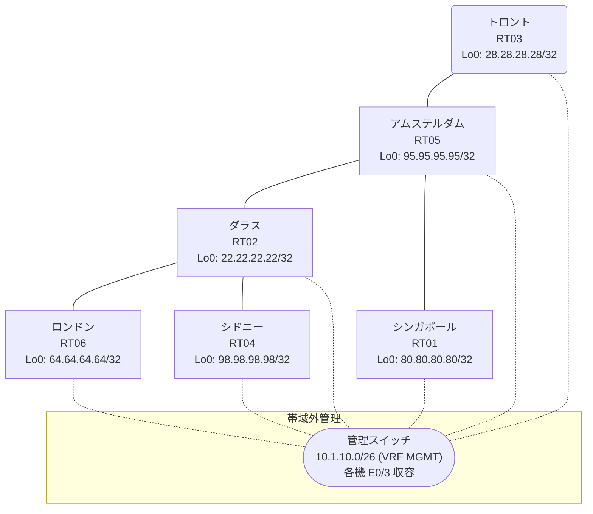

# 問題 20260822-014

> **本問は機器に接続せずに解答すること。追加の show 実行は認めない。**

## トポロジ

あなたは、下記のネットワークの保守を担当する技術者です。あなたの会社のネットワークは、複数のルーティング・ドメインが、境界のルーターによって接続され、そして、すべての拠点のリーチアビリティが提供されている、というものです。ルーティングの設計の詳細は、示されているところの構成から、読み取られることが、期待されています。各拠点のルータと、拠点のネットワークとの対応は、下記の表に示されているとおりです。



| 拠点 | ルータ | 拠点網 |
|------|--------|----------------------|
| アムステルダム | RT05 | `95.95.95.95/32` |
| シドニー | RT04 | `98.98.98.98/32` |
| シンガポール | RT01 | `80.80.80.80/32` |
| ダラス | RT02 | `22.22.22.22/32` |
| トロント | RT03 | `28.28.28.28/32` |
| ロンドン | RT06 | `64.64.64.64/32` |

リンク一覧:
```
  RT05:E0/0(.1) ── RT01:E0/0(.2)   10.178.40.0/30
  RT02:E0/0(.1) ── RT05:E0/1(.2)   10.164.50.0/30
  RT02:E0/1(.1) ── RT06:E0/0(.2)   10.129.228.0/30
  RT02:E0/2(.1) ── RT04:E0/0(.2)   10.54.178.0/30
  RT05:E0/2(.1) ── RT03:E0/0(.2)   10.150.14.0/30
```

## 要件

1. すべてのルーターのループバック・インターフェイス 0 (/32) が、すべてのドメインの間で、相互に到達可能であること。
2. 存在しないプロセス/AS を参照するところの構成のステートメントが、残置されてはなりません。
3. スタティック・ルートおよび既定のルートによる迂回は、実施されてはなりません。
4. 再配送に対するフィルターの適用は、禁止されているところのものです。
5. 本作業は、日中の時間帯において実施されるという理由により、対象外であるところのデバイスに対する構成の変更は、許可されていません。
6. シード メトリック `1000000 100 255 1 1500` は、redistribute のステートメントごとに、個別に指定される必要があります。

## 現在の状態

一部の通信が、意図されているとおりに動作していない、という報告があります。示されているところの出力および構成に基づいて、要求されているところの動作が得られていない理由が、判断されなければなりません。

```
RT03# show ip route
Gateway of last resort is not set
      10.0.0.0/8 is variably subnetted, 5 subnets, 2 masks
D EX     10.54.178.0/30 [170/332800] via 10.150.14.1, 00:04:52, Ethernet0/0
D        10.129.228.0/30 [90/332800] via 10.150.14.1, 00:04:52, Ethernet0/0
C        10.150.14.0/30 is directly connected, Ethernet0/0
L        10.150.14.2/32 is directly connected, Ethernet0/0
D        10.164.50.0/30 [90/307200] via 10.150.14.1, 00:04:52, Ethernet0/0
      22.0.0.0/32 is subnetted, 1 subnets
D        22.22.22.22 [90/435200] via 10.150.14.1, 00:04:52, Ethernet0/0
      28.0.0.0/32 is subnetted, 1 subnets
C        28.28.28.28 is directly connected, Loopback0
      64.0.0.0/32 is subnetted, 1 subnets
D        64.64.64.64 [90/460800] via 10.150.14.1, 00:04:42, Ethernet0/0
      95.0.0.0/32 is subnetted, 1 subnets
D        95.95.95.95 [90/409600] via 10.150.14.1, 00:04:52, Ethernet0/0
      98.0.0.0/32 is subnetted, 1 subnets
D EX     98.98.98.98 [170/332800] via 10.150.14.1, 00:04:10, Ethernet0/0
```
```
RT01# show ip route
Gateway of last resort is not set
      10.0.0.0/8 is variably subnetted, 6 subnets, 2 masks
O E2     10.54.178.0/30 [110/20] via 10.178.40.1, 00:04:32, Ethernet0/0
O E2     10.129.228.0/30 [110/20] via 10.178.40.1, 00:04:32, Ethernet0/0
O E2     10.150.14.0/30 [110/20] via 10.178.40.1, 00:04:32, Ethernet0/0
O E2     10.164.50.0/30 [110/20] via 10.178.40.1, 00:04:32, Ethernet0/0
C        10.178.40.0/30 is directly connected, Ethernet0/0
L        10.178.40.2/32 is directly connected, Ethernet0/0
      22.0.0.0/32 is subnetted, 1 subnets
O E2     22.22.22.22 [110/20] via 10.178.40.1, 00:04:32, Ethernet0/0
      28.0.0.0/32 is subnetted, 1 subnets
O E2     28.28.28.28 [110/20] via 10.178.40.1, 00:04:32, Ethernet0/0
      64.0.0.0/32 is subnetted, 1 subnets
O E2     64.64.64.64 [110/20] via 10.178.40.1, 00:04:32, Ethernet0/0
      80.0.0.0/32 is subnetted, 1 subnets
C        80.80.80.80 is directly connected, Loopback0
      95.0.0.0/32 is subnetted, 1 subnets
O        95.95.95.95 [110/11] via 10.178.40.1, 00:04:32, Ethernet0/0
      98.0.0.0/32 is subnetted, 1 subnets
O E2     98.98.98.98 [110/20] via 10.178.40.1, 00:04:28, Ethernet0/0
```
```
RT06# show ip route
Gateway of last resort is not set
      10.0.0.0/8 is variably subnetted, 5 subnets, 2 masks
D EX     10.54.178.0/30 [170/307200] via 10.129.228.1, 00:05:21, Ethernet0/0
C        10.129.228.0/30 is directly connected, Ethernet0/0
L        10.129.228.2/32 is directly connected, Ethernet0/0
D        10.150.14.0/30 [90/332800] via 10.129.228.1, 00:05:21, Ethernet0/0
D        10.164.50.0/30 [90/307200] via 10.129.228.1, 00:05:21, Ethernet0/0
      22.0.0.0/32 is subnetted, 1 subnets
D        22.22.22.22 [90/409600] via 10.129.228.1, 00:05:21, Ethernet0/0
      28.0.0.0/32 is subnetted, 1 subnets
D        28.28.28.28 [90/460800] via 10.129.228.1, 00:05:21, Ethernet0/0
      64.0.0.0/32 is subnetted, 1 subnets
C        64.64.64.64 is directly connected, Loopback0
      95.0.0.0/32 is subnetted, 1 subnets
D        95.95.95.95 [90/435200] via 10.129.228.1, 00:05:21, Ethernet0/0
      98.0.0.0/32 is subnetted, 1 subnets
D EX     98.98.98.98 [170/307200] via 10.129.228.1, 00:04:46, Ethernet0/0
```
```
RT05# show route-map
route-map RM-LEGACY1, deny, sequence 10
  Match clauses:
    ip address prefix-lists: PL-LEGACY1 
  Set clauses:
  Policy routing matches: 0 packets, 0 bytes
route-map RM-LEGACY1, permit, sequence 20
  Match clauses:
  Set clauses:
  Policy routing matches: 0 packets, 0 bytes
```
```
RT05# show ip prefix-list
ip prefix-list PL-LEGACY1: 2 entries
   seq 5 deny 64.64.64.64/32
   seq 10 permit 0.0.0.0/0 le 32
```
```
RT05# show access-lists
Standard IP access list 60
    10 deny   64.64.64.64
    20 permit any
```

## 設定抜粋

```
RT01# show running-config | section router
router ospf 79
 router-id 80.80.80.80
 network 10.178.40.0 0.0.0.3 area 0
 network 80.80.80.80 0.0.0.0 area 0
```
```
RT02# show running-config | section router
router eigrp 232
 network 10.129.228.0 0.0.0.3
 network 10.164.50.0 0.0.0.3
 network 22.22.22.22 0.0.0.0
 redistribute ospf 30 match internal external 1 external 2 metric 1000000 100 255 1 1500
router ospf 30
 router-id 22.22.22.22
 timers throttle spf 50 200 5000
 redistribute eigrp 232
 passive-interface Loopback0
 network 10.54.178.0 0.0.0.3 area 0
 network 22.22.22.22 0.0.0.0 area 0
```
```
RT03# show running-config | section router
router eigrp 232
 network 10.150.14.0 0.0.0.3
 network 28.28.28.28 0.0.0.0
```
```
RT04# show running-config | section router
router ospf 30
 router-id 98.98.98.98
 network 10.54.178.0 0.0.0.3 area 0
 network 98.98.98.98 0.0.0.0 area 0
```
```
RT05# show running-config | section router
router eigrp 232
 network 10.150.14.0 0.0.0.3
 network 10.164.50.0 0.0.0.3
 network 95.95.95.95 0.0.0.0
router ospf 79
 router-id 95.95.95.95
 redistribute eigrp 232
 passive-interface Loopback0
 network 10.178.40.0 0.0.0.3 area 0
 network 95.95.95.95 0.0.0.0 area 0
```
```
RT06# show running-config | section router
router eigrp 232
 timers active-time 5
 network 10.129.228.0 0.0.0.3
 network 64.64.64.64 0.0.0.0
 passive-interface Loopback0
```

## 設問

次のうち、正しいものは、どれですか。

## 選択肢
A. RT05 の router eigrp 232 配下に redistribute が設定されていない

B. RT03 の router eigrp 232 で、上流側インタフェースが passive-interface に設定されている

C. RT05 の redistribute に適用された route-map が特定の拠点網を deny している

D. RT05 と RT03 側ドメインの間のリンクで MTU が一致していない

E. RT05 の router eigrp 232 配下の redistribute が、実在しないプロセス/AS を参照している

F. RT05 の route-map RM-LEGACY1 が対象の経路を拒否している
