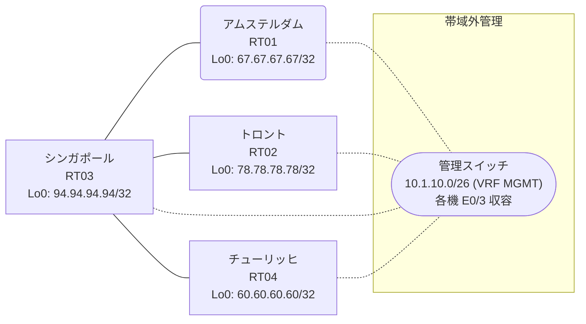

# 問題 20260822-015

> **本問は機器に接続せずに解答すること。追加の show 実行は認めない。**

## トポロジ

あなたの組織は、下記に示されているところのネットワークを運用しています。あなたの会社のネットワークは、複数のルーティング・ドメインが、境界のルータによって接続され、そして、すべてのサイトの到達可能性が提供されている、というものです。ルーティングの設計の詳細は、示されているところの構成から、読み取られることが、期待されています。各サイトのルータと、サイトの網との対応は、下記の表に示されているとおりです。



| 拠点 | ルータ | 拠点網 |
|------|--------|----------------------|
| アムステルダム | RT01 | `67.67.67.67/32` |
| シンガポール | RT03 | `94.94.94.94/32` |
| チューリッヒ | RT04 | `60.60.60.60/32` |
| トロント | RT02 | `78.78.78.78/32` |

リンク一覧:
```
  RT03:E0/0(.1) ── RT01:E0/0(.2)   10.67.34.0/30
  RT03:E0/1(.1) ── RT04:E0/0(.2)   10.16.66.0/30
  RT03:E0/2(.1) ── RT02:E0/0(.2)   10.241.166.0/30
```

## 要件

1. redistribute の参照先は、実在する隣接のプロセス/AS に限定され、無効な参照のステートメントが、コンフィギュレーションに残されてはなりません。
2. ルートの再配送に対して、フィルターが、適用されてはなりません。
3. すべてのルータのループバック インターフェイス 0 (/32) が、すべてのドメインの間で、相互に到達可能であること。
4. EIGRP へのルートの注入においては、redistribute のステートメントにおいて、シード・メトリック `10000 10 255 1 1500` が、直接に指定されなければなりません。
5. スタティック ルートおよび既定のルートによる迂回は、実施されてはなりません。

## 現在の状態

通信の一部において、想定されていない挙動が、観測されています。示されているところの出力および構成に基づいて、要求されているところの動作が得られていない理由が、判断されなければなりません。

```
RT03# show ip prefix-list
ip prefix-list PL-LEGACY1: 2 entries
   seq 5 deny 67.67.67.67/32
   seq 10 permit 0.0.0.0/0 le 32
ip prefix-list PL-MIGR2: 2 entries
   seq 5 deny 67.67.67.67/32
   seq 10 permit 0.0.0.0/0 le 32
ip prefix-list PL-SVC: 1 entries
   seq 5 permit 67.67.67.67/32
```
```
RT03# show route-map
route-map RM-SVC, deny, sequence 10
  Match clauses:
    ip address prefix-lists: PL-SVC 
  Set clauses:
  Policy routing matches: 0 packets, 0 bytes
route-map RM-SVC, permit, sequence 20
  Match clauses:
  Set clauses:
  Policy routing matches: 0 packets, 0 bytes
route-map RM-MIGR2, deny, sequence 10
  Match clauses:
    ip address prefix-lists: PL-MIGR2 
  Set clauses:
  Policy routing matches: 0 packets, 0 bytes
route-map RM-MIGR2, permit, sequence 20
  Match clauses:
  Set clauses:
  Policy routing matches: 0 packets, 0 bytes
route-map RM-LEGACY1, deny, sequence 10
  Match clauses:
    ip address prefix-lists: PL-LEGACY1 
  Set clauses:
  Policy routing matches: 0 packets, 0 bytes
route-map RM-LEGACY1, permit, sequence 20
  Match clauses:
  Set clauses:
  Policy routing matches: 0 packets, 0 bytes
```
```
RT04# show ip route
Gateway of last resort is not set
      10.0.0.0/8 is variably subnetted, 4 subnets, 2 masks
C        10.16.66.0/30 is directly connected, Ethernet0/0
L        10.16.66.2/32 is directly connected, Ethernet0/0
D EX     10.67.34.0/30 [170/284160] via 10.16.66.1, 00:04:13, Ethernet0/0
D        10.241.166.0/30 [90/307200] via 10.16.66.1, 00:04:13, Ethernet0/0
      60.0.0.0/32 is subnetted, 1 subnets
C        60.60.60.60 is directly connected, Loopback0
      78.0.0.0/32 is subnetted, 1 subnets
D        78.78.78.78 [90/435200] via 10.16.66.1, 00:04:13, Ethernet0/0
      94.0.0.0/32 is subnetted, 1 subnets
D        94.94.94.94 [90/409600] via 10.16.66.1, 00:04:13, Ethernet0/0
```
```
RT03# show access-lists
Standard IP access list 25
    10 deny   67.67.67.67
    20 permit any
Standard IP access list 75
    10 deny   67.67.67.67
    20 permit any
```
```
RT02# show ip route
Gateway of last resort is not set
      10.0.0.0/8 is variably subnetted, 4 subnets, 2 masks
D        10.16.66.0/30 [90/307200] via 10.241.166.1, 00:04:53, Ethernet0/0
D EX     10.67.34.0/30 [170/284160] via 10.241.166.1, 00:04:53, Ethernet0/0
C        10.241.166.0/30 is directly connected, Ethernet0/0
L        10.241.166.2/32 is directly connected, Ethernet0/0
      60.0.0.0/32 is subnetted, 1 subnets
D        60.60.60.60 [90/435200] via 10.241.166.1, 00:04:44, Ethernet0/0
      78.0.0.0/32 is subnetted, 1 subnets
C        78.78.78.78 is directly connected, Loopback0
      94.0.0.0/32 is subnetted, 1 subnets
D        94.94.94.94 [90/409600] via 10.241.166.1, 00:04:53, Ethernet0/0
```
```
RT01# show ip route
Gateway of last resort is not set
      10.0.0.0/8 is variably subnetted, 4 subnets, 2 masks
O E2     10.16.66.0/30 [110/20] via 10.67.34.1, 00:03:57, Ethernet0/0
C        10.67.34.0/30 is directly connected, Ethernet0/0
L        10.67.34.2/32 is directly connected, Ethernet0/0
O E2     10.241.166.0/30 [110/20] via 10.67.34.1, 00:03:57, Ethernet0/0
      60.0.0.0/32 is subnetted, 1 subnets
O E2     60.60.60.60 [110/20] via 10.67.34.1, 00:03:57, Ethernet0/0
      67.0.0.0/32 is subnetted, 1 subnets
C        67.67.67.67 is directly connected, Loopback0
      78.0.0.0/32 is subnetted, 1 subnets
O E2     78.78.78.78 [110/20] via 10.67.34.1, 00:03:57, Ethernet0/0
      94.0.0.0/32 is subnetted, 1 subnets
O        94.94.94.94 [110/11] via 10.67.34.1, 00:03:57, Ethernet0/0
```

## 設定抜粋

```
RT01# show running-config | section router
router ospf 34
 router-id 67.67.67.67
 network 10.67.34.0 0.0.0.3 area 0
 network 67.67.67.67 0.0.0.0 area 0
```
```
RT02# show running-config | section router
router eigrp 611
 timers active-time 5
 network 10.241.166.0 0.0.0.3
 network 78.78.78.78 0.0.0.0
 passive-interface Loopback0
```
```
RT03# show running-config | section router
router eigrp 611
 timers active-time 5
 network 10.16.66.0 0.0.0.3
 network 10.241.166.0 0.0.0.3
 network 94.94.94.94 0.0.0.0
 redistribute ospf 34 match internal external 1 external 2 metric 10000 10 255 1 1500 route-map RM-SVC
 passive-interface Loopback0
router ospf 34
 router-id 94.94.94.94
 redistribute eigrp 611
 network 10.67.34.0 0.0.0.3 area 0
 network 94.94.94.94 0.0.0.0 area 0
```
```
RT04# show running-config | section router
router eigrp 611
 network 10.16.66.0 0.0.0.3
 network 60.60.60.60 0.0.0.0
 passive-interface Loopback0
```

## 設問

次のうち、正しいものは、どれですか。

## 選択肢
A. RT04 の router eigrp 611 配下で「no passive-interface <上流IF>」を設定する

B. route-map RM-SVC のシーケンス 10 を deny から permit に変更する

C. RT03 の router ospf 34 配下の redistribute にも route-map RM-SVC を適用する

D. RT03 で「clear ip route *」を実行する

E. ip prefix-list PL-SVC に「seq 10 permit 0.0.0.0/0 le 32」を追加する

F. RT03 の router eigrp 611 配下で redistribute から route-map RM-SVC を外し、route-map / prefix-list を削除する
