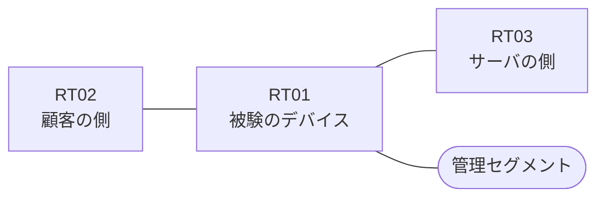

# 問題 20260822-017

> **本問は機器に接続せずに解答すること。追加の show 実行は認めない。**

## シナリオ

あなたは、下記のネットワークの保守を担当する技術者です。ある企業のネットワークにおいて、RT01 は、顧客の側のネットワークと、サーバの側のネットワークとの間に、配置されています。`10.172.229.0/24` からの通信は、許可されてはなりません。アクセス リストは、顧客の側のインターフェイスである `Ethernet0/0` において、着信の方向に適用される必要があります。RT01 において、`10.172.224.0/24`、`10.172.225.0/24`、`10.172.226.0/24` のネットワークからの通信が、サーバである `172.20.32.33` の TCP ポート 443 に到達できなければなりません。拒否のエントリを使用してはなりません。インタフェースの IP アドレッシングは、変更されてはなりません。`10.172.227.0/24` からの通信は、許可されてはなりません。当該のサーバの他のポートへの通信、および当該のサーバ以外の宛先への通信は、許可されてはなりません。



| 区間 | 被験デバイス側のインターフェイス | ネットワーク |
|------|----------------------------------|--------------|
| RT02（顧客の側） ⇔ RT01 | `Ethernet0/0` | 10.172.253.0/24 |
| RT01 ⇔ RT03（サーバの側） | `Ethernet0/1` | 10.172.254.0/24 |
| RT01 ⇔ 管理セグメント | `Ethernet0/2` | 10.172.255.0/24 |

## 出力

```
RT01# show ip access-lists
Extended IP access list 101
    10 permit tcp 10.172.224.0 0.0.7.255 host 172.20.32.33 eq 443
    20 deny   tcp 10.172.229.0 0.0.0.255 host 172.20.32.33 eq 443
```
```
RT01# show running-config | section ^interface
interface Ethernet0/0
 description === to RT02 ===
 ip address 10.172.253.1 255.255.255.0
 ip access-group 101 in
interface Ethernet0/1
 description === to RT03 ===
 ip address 10.172.254.1 255.255.255.0
interface Ethernet0/2
 description === management ===
 ip address 10.172.255.1 255.255.255.0
```

## 設問

示されているところの構成において、破棄されるものは、どれですか。(2つを選択してください)

## 選択肢
A. 送信元が 10.172.1.0/24 のネットワークにあるホストから、172.20.32.33 の TCP ポート 443 宛ての通信

B. 送信元が 10.172.226.0/24 のネットワークにあるホストから、172.20.32.33 の TCP ポート 443 宛ての通信

C. 送信元が 10.172.227.0/24 のネットワークにあるホストから、172.20.32.33 の TCP ポート 443 宛ての通信

D. 送信元が 10.172.224.0/24 のネットワークにあるホストから、172.20.32.33 の TCP ポート 443 宛ての通信

E. 送信元が 10.172.224.0/24 のネットワークにあるホストから、172.20.32.134 の TCP ポート 443 宛ての通信

F. 送信元が 10.172.229.0/24 のネットワークにあるホストから、172.20.32.33 の TCP ポート 443 宛ての通信
