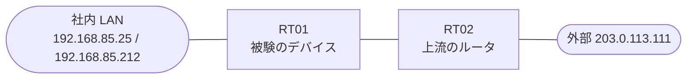

# 問題 20260822-019

> **本問は機器に接続せずに解答すること。追加の show 実行は認めない。**

## トポロジ

あなたは、ネットワークの運用を担当しています。あなたの会社の拠点のルーター RT01 は、上流のルーター RT02 を経由して、外部のネットワークへ接続されています。社内の LAN には、管理のステーション 192.168.85.25 およびサーバ 192.168.85.212 が存在し、そして、RT01 と RT02 の間では、ルーティング・プロトコルの隣接関係が確立されています。RT01 には、コントロール・プレーンを保護するためのサービス・ポリシーが、構成されています。



| 対象 | 内容 |
|------|------|
| RT01 ⇔ RT02（外部側） | Ethernet0/0・10.43.149.0/30（RT01=10.43.149.1 / RT02=10.43.149.2） |
| RT01 ⇔ 社内 LAN | Ethernet0/1・192.168.85.0/24（RT01=192.168.85.1） |
| 管理のステーション（NMS） | 192.168.85.25（SSH / ping の発信元） |
| サーバ | 192.168.85.212 |
| 外部の発信元 | 203.0.113.111 |

## 要件

1. ルータ自身に宛てられたトラフィックの保護は、control-plane の input のサービス ポリシーによって、実装される必要があります。
2. 導入の第1段階として、いかなるトラフィックも、破棄されてはなりません。
3. ルータ自身に宛てられた ICMP は、police の統計によって計測される必要があります。
4. 管理のステーション 192.168.85.25 からの SSH によるアクセス、および、ルーティング・プロトコルの隣接関係は、影響を受けてはなりません。
5. 本作業は、日中の時間帯において実施されるという理由により、対象外であるところのデバイスに対する構成の変更は、許可されていません。

## 現在の状態

一部の通信が、意図されているとおりに動作していない、という報告があります。示されているところの出力および構成に基づいて、要求されているところの動作が得られていない理由が、判断されなければなりません。

```
RT01# show policy-map control-plane
Control Plane 

  Service-policy input: COPP-POLICY

    Class-map: CM-ICMP-LIMIT (match-all)  
      Match: access-group 130
      police:
          cir 8000 bps, bc 1500 bytes
        conformed 27 packets, 3078 bytes; actions:
          transmit 
        exceeded 0 packets, 0 bytes; actions:
          drop 
        conformed 0000 bps, exceeded 0000 bps

    Class-map: class-default (match-any)  
      Match: any
```

## 設定抜粋

```
RT01# show running-config | section control-plane
control-plane
 service-policy input COPP-POLICY
```
```
RT01# show access-lists
Extended IP access list 130
    10 deny icmp host 203.0.113.111 any
    20 permit icmp any any
```
```
RT01# show running-config | section interface
interface Ethernet0/0
 description === to RT02 ===
 ip address 10.43.149.1 255.255.255.252
interface Ethernet0/1
 ip address 192.168.85.1 255.255.255.0
```
```
RT01# show running-config | section line
line con 0
 logging synchronous
line vty 0 4
 login local
 transport input ssh
```

## 設問

次のうち、正しいものは、どれですか。

## 選択肢
A. 物理インターフェイスの in 方向のアクセス・グループによって、当該のトラフィックが事前に破棄されている

B. アクセス・リストの deny のエントリによって、当該の発信元が class の一致から除外されている

C. より広い一致を持つところの class が先に評価されており、意図された class にトラフィックが到達していない

D. サービス・ポリシーが、コントロール・プレーンの output の方向に適用されており、着信するトラフィックに効果を持たない

E. 報告されているトラフィックは、ルータを通過するところの(transit の)ものであり、コントロール・プレーンのポリシーの対象の外にある

F. police の conform のアクションが drop に構成されており、適合するトラフィックまでもが破棄されている
