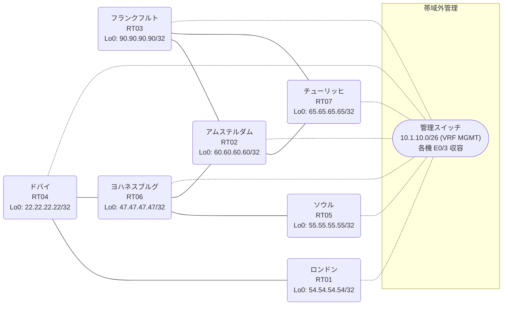

# 問題 20260823-001

> **本問は機器に接続せずに解答すること。追加の show 実行は認めない。**

## トポロジ

あなたは、ネットワークの運用を担当しています。あなたの会社のネットワークは、複数のルーティング・ドメインが、境界のルータによって接続され、そして、すべての拠点のリーチアビリティが提供されている、というものです。ルーティングの設計の詳細は、示されているところの構成から、読み取られることが、期待されています。各拠点のルータと、拠点の網との対応は、下記の表に示されているとおりです。



| 拠点 | ルータ | 拠点網 |
|------|--------|----------------------|
| アムステルダム | RT02 | `60.60.60.60/32` |
| ソウル | RT05 | `55.55.55.55/32` |
| チューリッヒ | RT07 | `65.65.65.65/32` |
| ドバイ | RT04 | `22.22.22.22/32` |
| フランクフルト | RT03 | `90.90.90.90/32` |
| ヨハネスブルグ | RT06 | `47.47.47.47/32` |
| ロンドン | RT01 | `54.54.54.54/32` |

リンク一覧:
```
  RT06:E0/0(.1) ── RT02:E0/0(.2)   10.100.17.0/30
  RT02:E0/1(.1) ── RT03:E0/0(.2)   10.159.249.0/30
  RT02:E0/2(.1) ── RT07:E0/0(.2)   10.244.124.0/30
  RT04:E0/0(.1) ── RT01:E0/0(.2)   10.130.91.0/30
  RT06:E0/1(.1) ── RT05:E0/0(.2)   10.253.195.0/30
  RT03:E0/1(.1) ── RT07:E0/1(.2)   10.86.35.0/30
  RT04:E0/1(.1) ── RT06:E0/2(.2)   10.58.177.0/30
```

## 要件

1. 各サイトのネットワークは、ドメインをまたいで、すべてのサイトから、到達されることができること。
2. redistribute の参照先は、実在する隣接のプロセス/AS に限定され、無効な参照のステートメントが、コンフィギュレーションに残されてはなりません。
3. 本作業は、日中の時間帯において実施されるという理由により、対象外であるところのデバイスに対する構成の変更は、許可されていません。
4. 再配送される経路の、選択的な制限は、実施されてはなりません。
5. EIGRP へ再配送される際の初期のメトリックは `100000 100 255 1 1500` とし、そして、それぞれの redistribute のステートメントに、直接に記述される必要があります。

## 現在の状態

一部の通信が、意図されているとおりに動作していない、という報告があります。示されているところの出力および構成に基づいて、要求されているところの動作が得られていない理由が、判断されなければなりません。

```
RT02# show ip route
Gateway of last resort is not set
      10.0.0.0/8 is variably subnetted, 10 subnets, 2 masks
D EX     10.58.177.0/30 [170/307200] via 10.100.17.1, 00:05:55, Ethernet0/0
D        10.86.35.0/30 [90/307200] via 10.244.124.2, 00:05:18, Ethernet0/2
                       [90/307200] via 10.159.249.2, 00:05:18, Ethernet0/1
C        10.100.17.0/30 is directly connected, Ethernet0/0
L        10.100.17.2/32 is directly connected, Ethernet0/0
D EX     10.130.91.0/30 [170/307200] via 10.100.17.1, 00:04:54, Ethernet0/0
C        10.159.249.0/30 is directly connected, Ethernet0/1
L        10.159.249.1/32 is directly connected, Ethernet0/1
C        10.244.124.0/30 is directly connected, Ethernet0/2
L        10.244.124.1/32 is directly connected, Ethernet0/2
D EX     10.253.195.0/30 [170/307200] via 10.100.17.1, 00:05:55, Ethernet0/0
      22.0.0.0/32 is subnetted, 1 subnets
D EX     22.22.22.22 [170/307200] via 10.100.17.1, 00:04:54, Ethernet0/0
      47.0.0.0/32 is subnetted, 1 subnets
D        47.47.47.47 [90/409600] via 10.100.17.1, 00:05:55, Ethernet0/0
      54.0.0.0/32 is subnetted, 1 subnets
D EX     54.54.54.54 [170/307200] via 10.100.17.1, 00:04:54, Ethernet0/0
      55.0.0.0/32 is subnetted, 1 subnets
D EX     55.55.55.55 [170/307200] via 10.100.17.1, 00:04:48, Ethernet0/0
      60.0.0.0/32 is subnetted, 1 subnets
C        60.60.60.60 is directly connected, Loopback0
      65.0.0.0/32 is subnetted, 1 subnets
D        65.65.65.65 [90/409600] via 10.244.124.2, 00:05:18, Ethernet0/2
      90.0.0.0/32 is subnetted, 1 subnets
D        90.90.90.90 [90/409600] via 10.159.249.2, 00:05:18, Ethernet0/1
```
```
RT05# show ip route
Gateway of last resort is not set
      10.0.0.0/8 is variably subnetted, 4 subnets, 2 masks
O        10.58.177.0/30 [110/20] via 10.253.195.1, 00:04:30, Ethernet0/0
O E2     10.130.91.0/30 [110/10] via 10.253.195.1, 00:04:30, Ethernet0/0
C        10.253.195.0/30 is directly connected, Ethernet0/0
L        10.253.195.2/32 is directly connected, Ethernet0/0
      22.0.0.0/32 is subnetted, 1 subnets
O E2     22.22.22.22 [110/1] via 10.253.195.1, 00:04:30, Ethernet0/0
      47.0.0.0/32 is subnetted, 1 subnets
O        47.47.47.47 [110/11] via 10.253.195.1, 00:04:30, Ethernet0/0
      54.0.0.0/32 is subnetted, 1 subnets
O E2     54.54.54.54 [110/11] via 10.253.195.1, 00:04:30, Ethernet0/0
      55.0.0.0/32 is subnetted, 1 subnets
C        55.55.55.55 is directly connected, Loopback0
```
```
RT06# show access-lists
Standard IP access list 15
    10 deny   65.65.65.65
    20 permit any
Standard IP access list 20
    10 deny   60.60.60.60
    20 permit any
```
```
RT06# show route-map
route-map RM-STG1, deny, sequence 10
  Match clauses:
    ip address prefix-lists: PL-STG1 
  Set clauses:
  Policy routing matches: 0 packets, 0 bytes
route-map RM-STG1, permit, sequence 20
  Match clauses:
  Set clauses:
  Policy routing matches: 0 packets, 0 bytes
route-map RM-BACKUP2, deny, sequence 10
  Match clauses:
    ip address prefix-lists: PL-BACKUP2 
  Set clauses:
  Policy routing matches: 0 packets, 0 bytes
route-map RM-BACKUP2, permit, sequence 20
  Match clauses:
  Set clauses:
  Policy routing matches: 0 packets, 0 bytes
```
```
RT06# show ip prefix-list
ip prefix-list PL-BACKUP2: 2 entries
   seq 5 deny 65.65.65.65/32
   seq 10 permit 0.0.0.0/0 le 32
ip prefix-list PL-STG1: 2 entries
   seq 5 deny 60.60.60.60/32
   seq 10 permit 0.0.0.0/0 le 32
```
```
RT07# show ip route
Gateway of last resort is not set
      10.0.0.0/8 is variably subnetted, 9 subnets, 2 masks
D EX     10.58.177.0/30 [170/332800] via 10.244.124.1, 00:05:42, Ethernet0/0
C        10.86.35.0/30 is directly connected, Ethernet0/1
L        10.86.35.2/32 is directly connected, Ethernet0/1
D        10.100.17.0/30 [90/307200] via 10.244.124.1, 00:05:42, Ethernet0/0
D EX     10.130.91.0/30 [170/332800] via 10.244.124.1, 00:05:13, Ethernet0/0
D        10.159.249.0/30 [90/307200] via 10.244.124.1, 00:05:42, Ethernet0/0
                         [90/307200] via 10.86.35.1, 00:05:42, Ethernet0/1
C        10.244.124.0/30 is directly connected, Ethernet0/0
L        10.244.124.2/32 is directly connected, Ethernet0/0
D EX     10.253.195.0/30 [170/332800] via 10.244.124.1, 00:05:42, Ethernet0/0
      22.0.0.0/32 is subnetted, 1 subnets
D EX     22.22.22.22 [170/332800] via 10.244.124.1, 00:05:13, Ethernet0/0
      47.0.0.0/32 is subnetted, 1 subnets
D        47.47.47.47 [90/435200] via 10.244.124.1, 00:05:42, Ethernet0/0
      54.0.0.0/32 is subnetted, 1 subnets
D EX     54.54.54.54 [170/332800] via 10.244.124.1, 00:05:13, Ethernet0/0
      55.0.0.0/32 is subnetted, 1 subnets
D EX     55.55.55.55 [170/332800] via 10.244.124.1, 00:05:07, Ethernet0/0
      60.0.0.0/32 is subnetted, 1 subnets
D        60.60.60.60 [90/409600] via 10.244.124.1, 00:05:42, Ethernet0/0
      65.0.0.0/32 is subnetted, 1 subnets
C        65.65.65.65 is directly connected, Loopback0
      90.0.0.0/32 is subnetted, 1 subnets
D        90.90.90.90 [90/409600] via 10.86.35.1, 00:05:42, Ethernet0/1
```

## 設定抜粋

```
RT01# show running-config | section router
router ospf 41
 router-id 54.54.54.54
 network 10.130.91.0 0.0.0.3 area 0
 network 54.54.54.54 0.0.0.0 area 0
```
```
RT02# show running-config | section router
router eigrp 880
 network 10.100.17.0 0.0.0.3
 network 10.159.249.0 0.0.0.3
 network 10.244.124.0 0.0.0.3
 network 60.60.60.60 0.0.0.0
```
```
RT03# show running-config | section router
router eigrp 880
 timers active-time 5
 network 10.86.35.0 0.0.0.3
 network 10.159.249.0 0.0.0.3
 network 90.90.90.90 0.0.0.0
 passive-interface Loopback0
```
```
RT04# show running-config | section router
router ospf 41
 router-id 22.22.22.22
 redistribute ospf 44 match internal external 1 external 2
 network 10.130.91.0 0.0.0.3 area 0
 network 22.22.22.22 0.0.0.0 area 0
router ospf 44
 redistribute ospf 41 match internal external 1 external 2
 passive-interface Loopback0
 network 10.58.177.0 0.0.0.3 area 0
```
```
RT05# show running-config | section router
router ospf 44
 router-id 55.55.55.55
 timers throttle spf 50 200 5000
 passive-interface Loopback0
 network 10.253.195.0 0.0.0.3 area 0
 network 55.55.55.55 0.0.0.0 area 0
```
```
RT06# show running-config | section router
router eigrp 880
 network 10.100.17.0 0.0.0.3
 network 47.47.47.47 0.0.0.0
 redistribute ospf 44 match internal external 1 external 2 metric 100000 100 255 1 1500
 passive-interface Loopback0
router ospf 44
 router-id 47.47.47.47
 network 10.58.177.0 0.0.0.3 area 0
 network 10.253.195.0 0.0.0.3 area 0
 network 47.47.47.47 0.0.0.0 area 0
```
```
RT07# show running-config | section router
router eigrp 880
 network 10.86.35.0 0.0.0.3
 network 10.244.124.0 0.0.0.3
 network 65.65.65.65 0.0.0.0
```

## 設問

次のうち、正しいものは、どれですか。

## 選択肢
A. RT06 の router ospf 44 配下に「redistribute eigrp 880 subnets」を追加する

B. RT06 の router ospf 44 配下に「default-metric 20」を追加する

C. RT06 の router eigrp 880 配下に「redistribute ospf 44 match internal external 1 external 2 metric 100000 100 255 1 1500」を追加する

D. RT06 で「clear ip route *」を実行する

E. RT06 の router ospf 44 配下に「redistribute eigrp 887 subnets」を追加する

F. RT05 の router ospf 44 配下で「no passive-interface <上流IF>」を設定する
