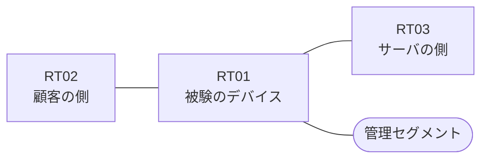

# 問題 20260823-003

> **本問は機器に接続せずに解答すること。追加の show 実行は認めない。**

## トポロジ

あなたは、下記のネットワークの保守を担当する技術者です。ある企業のネットワークにおいて、RT01 は、顧客の側のネットワークと、サーバの側のネットワークとの間に、配置されています。



| 区間 | 被験デバイス側のインターフェイス | ネットワーク |
|------|----------------------------------|--------------|
| RT02（顧客の側） ⇔ RT01 | `Ethernet0/0` | 10.149.253.0/24 |
| RT01 ⇔ RT03（サーバの側） | `Ethernet0/1` | 10.149.254.0/24 |
| RT01 ⇔ 管理セグメント | `Ethernet0/2` | 10.149.255.0/24 |

## 要件

1. 当該のサーバの他のポートへの通信、および当該のサーバ以外の宛先への通信は、許可されてはなりません。
2. `10.149.97.0/24` からの通信は、許可されてはなりません。
3. アクセス リストのエントリは、1行で構成されなければなりません。
4. RT01 において、`10.149.96.0/24`、`10.149.98.0/24`、`10.149.100.0/24`、`10.149.102.0/24` のネットワークからの通信のみが、サーバである `172.28.42.57` の TCP ポート 80 に到達できなければなりません。
5. ルーティング・プロトコルの種別およびプロセスの配置は、変更されてはなりません。
6. `10.149.99.0/24` からの通信は、許可されてはなりません。
7. アクセス・リストは、顧客の側のインターフェイスである `Ethernet0/0` において、着信の方向に適用されなければなりません。

## 現在の状態

```
RT01# show ip access-lists
Extended IP access list 110
    10 permit tcp 10.149.96.0 0.0.3.255 any eq www
```

## 設定抜粋

```
RT01# show running-config | section ^interface
interface Ethernet0/0
 description === to RT02 ===
 ip address 10.149.253.1 255.255.255.0
 ip access-group 110 in
interface Ethernet0/1
 description === to RT03 ===
 ip address 10.149.254.1 255.255.255.0
interface Ethernet0/2
 description === management ===
 ip address 10.149.255.1 255.255.255.0
```

## 設問

示されているところの構成において、破棄されるものは、どれですか。(1つを選択してください)

## 選択肢
A. 送信元が 10.149.98.0/24 のネットワークにあるホストから、172.28.42.57 の TCP ポート 80 宛ての通信

B. 送信元が 10.149.99.0/24 のネットワークにあるホストから、172.28.42.57 の TCP ポート 80 宛ての通信

C. 送信元が 10.149.97.0/24 のネットワークにあるホストから、172.28.42.57 の TCP ポート 80 宛ての通信

D. 送信元が 10.149.96.0/24 のネットワークにあるホストから、172.28.42.57 の TCP ポート 80 宛ての通信

E. 送信元が 10.149.96.0/24 のネットワークにあるホストから、172.28.42.116 の TCP ポート 80 宛ての通信

F. 送信元が 10.149.102.0/24 のネットワークにあるホストから、172.28.42.57 の TCP ポート 80 宛ての通信
