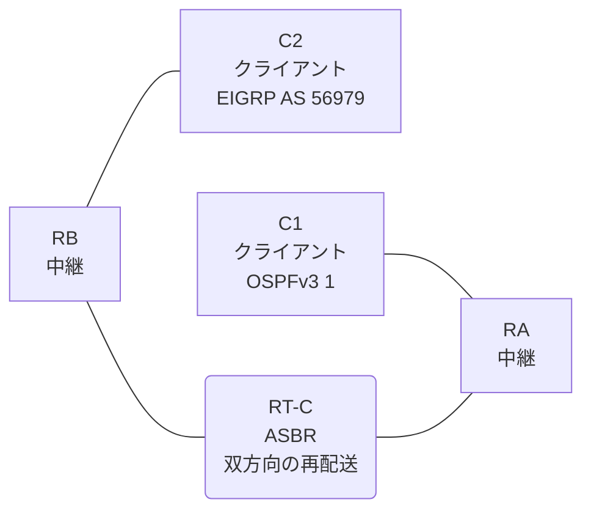

# 問題 20260823-005

> **本問は機器に接続せずに解答すること。追加の show 実行は認めない。**

## トポロジ

あなたは、ネットワークの運用を担当しています。クライアントである C1 は OSPFv3 の ドメイン に、そして、C2 は EIGRP の ドメイン に、それぞれ収容されています。RT-C は、2 つの ドメイン の境界に位置しており、双方向の 再配送 が構成されています。



| ルータ | 位置づけ | 参加プロトコル |
|--------|----------|----------------|
| C1 | クライアント | OSPFv3 1 area 0 |
| RA | 中継 | OSPFv3 1 area 0 |
| RT-C | **ASBR(2 つの ドメイン の 境界)** | 双方向の 再配送 |
| RB | 中継 | EIGRP LAB AS 56979 |
| C2 | クライアント | EIGRP LAB AS 56979 |

リンク一覧:
```
  (a) C1:Et0/0         ── RA:Et0/1                  2001:DB8:AA:B::/64    C1 = 2001:DB8:AA:B::2
  (b) RA:Et0/0         ── RT-C:GigabitEthernet0/0   2001:DB8:2A:10::/64
  (c) RT-C:Ethernet0/1 ── RB:Et0/0                  2001:DB8:20:C::/64
  (d) RB:Et0/1         ── C2:Et0/0                  2001:DB8:1C:1A::/64   C2 = 2001:DB8:1C:1A::2
```

OSPFv3 の ドメイン には、RA によって注入されたところの 外部の ルート `2001:DB8:10:1A::/64` が存在する。

## 要件

1. C1 と C2 は、相互に 通信 できなければなりません。
2. EIGRP の ドメイン において、2001:DB8:2A:10::/64 は、EIGRP の 内部の ルートとして受信されなければなりません。
3. ルーティング・プロトコルの種別およびプロセスの配置は、変更されてはなりません。

## 現在の状態

通信の一部において、想定されていない挙動が、観測されています。あなたは、提示されているところの情報のみを使用して、要求されている状態が満たされていない理由を、特定しなければなりません。

```
C1# ping 2001:DB8:1C:1A::2
Type escape sequence to abort.
Sending 5, 100-byte ICMP Echos to 2001:DB8:1C:1A::2, timeout is 2 seconds:
.....
Success rate is 0 percent (0/5)

C2# ping 2001:DB8:AA:B::2
Type escape sequence to abort.
Sending 5, 100-byte ICMP Echos to 2001:DB8:AA:B::2, timeout is 2 seconds:

% No valid route for destination
Success rate is 0 percent (0/1)
```

## 設定抜粋

```
RT-C# show running-config
Building configuration...
!
interface GigabitEthernet0/0
 description === to RA ===
 no ip address
 ipv6 address 2001:DB8:2A:10::1/64
 ipv6 enable
 ipv6 ospf 1 area 0
!
interface Ethernet0/1
 description === to RB ===
 no ip address
 ipv6 address 2001:DB8:20:C::1/64
 ipv6 enable
!
router eigrp LAB
 !
 address-family ipv6 unicast autonomous-system 56979
  !
  af-interface GigabitEthernet0/0
   shutdown
  exit-af-interface
  !
  topology base
   redistribute ospf 1 match internal route-map REDIST-MAP include-connected
  exit-af-topology
  eigrp router-id 9.6.5.7
 exit-address-family
!
router ospfv3 1
 router-id 3.2.8.2
 !
 address-family ipv6 unicast
  redistribute eigrp 56979 route-map RM-EIGRP include-connected
 exit-address-family
!
ipv6 prefix-list O544 seq 5 permit 2001:DB8:2A:10::/64
ipv6 prefix-list O544 seq 10 permit 2001:DB8:AA:B::/64
ipv6 prefix-list PL-CORE seq 5 permit ::/0 le 64
ipv6 prefix-list PL-EIGRP seq 5 permit 2001:DB8:2A:10::/64
ipv6 prefix-list PL-OSPF seq 5 permit 2001:DB8:20:C::/64
ipv6 prefix-list PL-OSPF seq 10 permit 2001:DB8:1C:1A::/64
!
route-map REDIST-MAP permit 10
 match ipv6 address prefix-list O544
route-map RM-EIGRP permit 10
 match ipv6 address prefix-list PL-OSPF
route-map RM-OSPF permit 10
 match ipv6 address prefix-list PL-CORE
!
```

## 設問

次のうち、正しいものは、どれですか。

## 選択肢
**A.**
```
C1# show ipv6 route ospf | include ^O|via
OE2 2001:DB8:10:1A::/64 [110/20]
     via FE80::A8BB:CCFF:FE01:5E00, Ethernet0/0
OE2 2001:DB8:1C:1A::/64 [110/20]
     via FE80::A8BB:CCFF:FE01:5E00, Ethernet0/0
```
**B.**
```
C1# show ipv6 route ospf | include ^O|via
OE2 ::/0 [110/1]
     via FE80::A8BB:CCFF:FE01:5E00, Ethernet0/0
OE2 2001:DB8:10:1A::/64 [110/20]
     via FE80::A8BB:CCFF:FE01:5E00, Ethernet0/0
OE2 2001:DB8:1C:1A::/64 [110/20]
     via FE80::A8BB:CCFF:FE01:5E00, Ethernet0/0
OE2 2001:DB8:20:C::/64 [110/20]
     via FE80::A8BB:CCFF:FE01:5E00, Ethernet0/0
```
**C.**
```
C1# show ipv6 route ospf | include ^O|via
OE2 2001:DB8:10:1A::/64 [110/20]
     via FE80::A8BB:CCFF:FE01:5E00, Ethernet0/0
OE2 2001:DB8:1C:1A::/64 [110/20]
     via FE80::A8BB:CCFF:FE01:5E00, Ethernet0/0
OE2 2001:DB8:20:C::/64 [110/20]
     via FE80::A8BB:CCFF:FE01:5E00, Ethernet0/0
```
