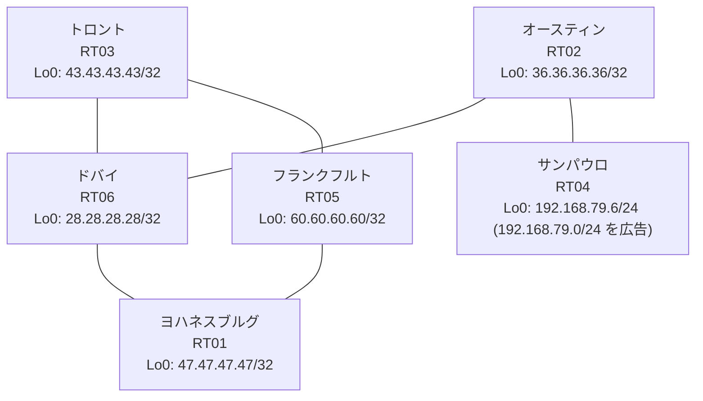

# 問題 20260823-006

> **本問は機器に接続せずに解答すること。追加の show 実行は認めない。**

## シナリオ

あなたは、下記のネットワークの保守を担当する技術者です。あなたの会社のネットワークは、OSPF のドメインと EIGRP のドメインとが、2 つの境界のルータによって接続され、そして、それらは境界において接続されています。顧客のネットワーク `192.168.79.0/24` は、サンパウロ のサイトにおいて、別のルーティング プロトコルによって学習され、そして、再配送によって、社内へ持ち込まれています。ルーティングの設計の詳細は、示されているところのコンフィギュレーションから、読み取られることが、期待されています。複数のサイトから、`192.168.79.0/24` 宛の通信が、タイムアウトする、ということが、報告されています。サイトの間の通信は、正常です。これは、意図された動作ではありません。示されているところの出力を、参照してください。既存の相互再配送の設計が、削除または停止されてはなりません。是正は、経路の出自に対するマーキングによって、実装されなければなりません。`192.168.79.0/24` 宛のパケットが、広告元である RT04 の方向へ転送され、そして、転送のループが存在していないこと。インタフェースの IP アドレッシングは、変更されてはなりません。スタティック・ルートおよび既定のルートによる迂回は、実施されることはできません。顧客のネットワーク `192.168.79.0/24` への到達可能性が、すべてのサイトにおいて、確保されていること。



| 拠点 | ルータ | 拠点網 / 広告網 |
|------|--------|------------------|
| オースティン | RT02 | 36.36.36.36/32 |
| サンパウロ | RT04 | 192.168.79.6/24 (`192.168.79.0/24` を広告) |
| トロント | RT03 | 43.43.43.43/32 |
| ドバイ | RT06 | 28.28.28.28/32 |
| フランクフルト | RT05 | 60.60.60.60/32 |
| ヨハネスブルグ | RT01 | 47.47.47.47/32 |

リンク一覧:
```
  RT05:E0/0(.1) ── RT01:E0/0(.2)   172.16.110.0/24
  RT05:E0/1(.1) ── RT03:E0/0(.3)   172.16.172.0/24
  RT01:E0/1(.2) ── RT06:E0/0(.4)   172.16.179.0/24
  RT03:E0/1(.3) ── RT06:E0/1(.4)   172.16.198.0/24
  RT06:E0/2(.4) ── RT02:E0/0(.5)   172.16.81.0/24
  RT02:E0/1(.5) ── RT04:E0/0(.6)   172.16.122.0/24
```

## 出力

```
RT06# show ip route
Gateway of last resort is not set
      28.0.0.0/32 is subnetted, 1 subnets
C        28.28.28.28 is directly connected, Loopback0
      36.0.0.0/32 is subnetted, 1 subnets
D        36.36.36.36 [90/409600] via 172.16.81.5, 00:04:51, Ethernet0/2
      43.0.0.0/32 is subnetted, 1 subnets
D EX     43.43.43.43 [170/281856] via 172.16.198.3, 00:04:03, Ethernet0/1
                     [170/281856] via 172.16.179.2, 00:04:03, Ethernet0/0
      47.0.0.0/32 is subnetted, 1 subnets
D EX     47.47.47.47 [170/281856] via 172.16.198.3, 00:04:07, Ethernet0/1
                     [170/281856] via 172.16.179.2, 00:04:07, Ethernet0/0
      60.0.0.0/32 is subnetted, 1 subnets
D EX     60.60.60.60 [170/281856] via 172.16.198.3, 00:04:07, Ethernet0/1
                     [170/281856] via 172.16.179.2, 00:04:07, Ethernet0/0
      172.16.0.0/16 is variably subnetted, 9 subnets, 2 masks
C        172.16.81.0/24 is directly connected, Ethernet0/2
L        172.16.81.4/32 is directly connected, Ethernet0/2
D EX     172.16.110.0/24 [170/281856] via 172.16.198.3, 00:04:07, Ethernet0/1
                         [170/281856] via 172.16.179.2, 00:04:07, Ethernet0/0
D        172.16.122.0/24 [90/307200] via 172.16.81.5, 00:04:51, Ethernet0/2
D EX     172.16.172.0/24 [170/281856] via 172.16.198.3, 00:04:07, Ethernet0/1
                         [170/281856] via 172.16.179.2, 00:04:07, Ethernet0/0
C        172.16.179.0/24 is directly connected, Ethernet0/0
L        172.16.179.4/32 is directly connected, Ethernet0/0
C        172.16.198.0/24 is directly connected, Ethernet0/1
L        172.16.198.4/32 is directly connected, Ethernet0/1
D EX  192.168.79.0/24 [170/281856] via 172.16.198.3, 00:04:07, Ethernet0/1
```
```
RT06# show ip eigrp topology 192.168.79.0 255.255.255.0
EIGRP-IPv4 Topology Entry for AS(1)/ID(28.28.28.28) for 192.168.79.0/24
  State is Passive, Query origin flag is 1, 1 Successor(s), FD is 281856
  Descriptor Blocks:
  172.16.198.3 (Ethernet0/1), from 172.16.198.3, Send flag is 0x0
      Composite metric is (281856/2816), route is External
      Vector metric:
        Minimum bandwidth is 10000 Kbit
        Total delay is 1010 microseconds
        Reliability is 255/255
        Load is 1/255
        Minimum MTU is 1500
        Hop count is 1
        Originating router is 43.43.43.43
      External data:
        AS number of route is 15
        External protocol is OSPF, external metric is 20
        Administrator tag is 0 (0x00000000)
  172.16.81.5 (Ethernet0/2), from 172.16.81.5, Send flag is 0x0
      Composite metric is (307456/281856), route is External
      Vector metric:
        Minimum bandwidth is 10000 Kbit
        Total delay is 2010 microseconds
        Reliability is 255/255
        Load is 1/255
        Minimum MTU is 1500
        Hop count is 2
        Originating router is 192.168.79.6
      External data:
        AS number of route is 0
        External protocol is RIP, external metric is 0
        Administrator tag is 0 (0x00000000)
```
```
RT02# show ip route
Gateway of last resort is not set
      28.0.0.0/32 is subnetted, 1 subnets
D        28.28.28.28 [90/409600] via 172.16.81.4, 00:05:15, Ethernet0/0
      36.0.0.0/32 is subnetted, 1 subnets
C        36.36.36.36 is directly connected, Loopback0
      43.0.0.0/32 is subnetted, 1 subnets
D EX     43.43.43.43 [170/307456] via 172.16.81.4, 00:04:21, Ethernet0/0
      47.0.0.0/32 is subnetted, 1 subnets
D EX     47.47.47.47 [170/307456] via 172.16.81.4, 00:05:06, Ethernet0/0
      60.0.0.0/32 is subnetted, 1 subnets
D EX     60.60.60.60 [170/307456] via 172.16.81.4, 00:04:26, Ethernet0/0
      172.16.0.0/16 is variably subnetted, 8 subnets, 2 masks
C        172.16.81.0/24 is directly connected, Ethernet0/0
L        172.16.81.5/32 is directly connected, Ethernet0/0
D EX     172.16.110.0/24 [170/307456] via 172.16.81.4, 00:05:06, Ethernet0/0
C        172.16.122.0/24 is directly connected, Ethernet0/1
L        172.16.122.5/32 is directly connected, Ethernet0/1
D EX     172.16.172.0/24 [170/307456] via 172.16.81.4, 00:04:26, Ethernet0/0
D        172.16.179.0/24 [90/307200] via 172.16.81.4, 00:05:15, Ethernet0/0
D        172.16.198.0/24 [90/307200] via 172.16.81.4, 00:05:15, Ethernet0/0
D EX  192.168.79.0/24 [170/281856] via 172.16.122.6, 00:04:26, Ethernet0/1
```
```
RT05# show ip route
Gateway of last resort is not set
      28.0.0.0/32 is subnetted, 1 subnets
O E2     28.28.28.28 [110/20] via 172.16.172.3, 00:04:44, Ethernet0/1
                     [110/20] via 172.16.110.2, 00:04:44, Ethernet0/0
      36.0.0.0/32 is subnetted, 1 subnets
O E2     36.36.36.36 [110/20] via 172.16.172.3, 00:04:44, Ethernet0/1
                     [110/20] via 172.16.110.2, 00:04:44, Ethernet0/0
      43.0.0.0/32 is subnetted, 1 subnets
O        43.43.43.43 [110/11] via 172.16.172.3, 00:04:44, Ethernet0/1
      47.0.0.0/32 is subnetted, 1 subnets
O        47.47.47.47 [110/11] via 172.16.110.2, 00:04:44, Ethernet0/0
      60.0.0.0/32 is subnetted, 1 subnets
C        60.60.60.60 is directly connected, Loopback0
      172.16.0.0/16 is variably subnetted, 8 subnets, 2 masks
O E2     172.16.81.0/24 [110/20] via 172.16.172.3, 00:04:44, Ethernet0/1
                        [110/20] via 172.16.110.2, 00:04:44, Ethernet0/0
C        172.16.110.0/24 is directly connected, Ethernet0/0
L        172.16.110.1/32 is directly connected, Ethernet0/0
O E2     172.16.122.0/24 [110/20] via 172.16.172.3, 00:04:44, Ethernet0/1
                         [110/20] via 172.16.110.2, 00:04:44, Ethernet0/0
C        172.16.172.0/24 is directly connected, Ethernet0/1
L        172.16.172.1/32 is directly connected, Ethernet0/1
O E2     172.16.179.0/24 [110/20] via 172.16.172.3, 00:04:44, Ethernet0/1
                         [110/20] via 172.16.110.2, 00:04:44, Ethernet0/0
O E2     172.16.198.0/24 [110/20] via 172.16.172.3, 00:04:44, Ethernet0/1
                         [110/20] via 172.16.110.2, 00:04:44, Ethernet0/0
O E2  192.168.79.0/24 [110/20] via 172.16.110.2, 00:04:44, Ethernet0/0
```
```
RT06# show ip protocols | include Routing Protocol|Distance
Routing Protocol is "application"
    Gateway         Distance      Last Update
  Distance: (default is 4)
Routing Protocol is "eigrp 1"
      Distance: internal 90 external 170
    Gateway         Distance      Last Update
  Distance: internal 90 external 170
```
```
RT05# traceroute 192.168.79.6 probe 1 timeout 1 ttl 1 8
Type escape sequence to abort.
Tracing the route to 192.168.79.6
VRF info: (vrf in name/id, vrf out name/id)
  1 172.16.110.2 1 msec
  2 172.16.179.4 21 msec
  3 172.16.198.3 1 msec
  4 172.16.172.1 2 msec
  5 172.16.110.2 2 msec
  6 172.16.179.4 18 msec
  7 172.16.198.3 4 msec
  8 172.16.172.1 2 msec
```
```
RT05# show running-config | section router
router ospf 15
 router-id 60.60.60.60
 network 60.60.60.60 0.0.0.0 area 0
 network 172.16.110.0 0.0.0.255 area 0
 network 172.16.172.0 0.0.0.255 area 0
```
```
RT01# show running-config | section router
router eigrp 1
 network 172.16.179.0 0.0.0.255
 redistribute ospf 15 metric 1000000 1 255 1 1500
router ospf 15
 router-id 47.47.47.47
 redistribute eigrp 1
 network 47.47.47.47 0.0.0.0 area 0
 network 172.16.110.0 0.0.0.255 area 0
```
```
RT03# show running-config | section router
router eigrp 1
 network 172.16.198.0 0.0.0.255
 redistribute ospf 15 metric 1000000 1 255 1 1500
router ospf 15
 router-id 43.43.43.43
 redistribute eigrp 1
 network 43.43.43.43 0.0.0.0 area 0
 network 172.16.172.0 0.0.0.255 area 0
```
```
RT06# show running-config | section router
router eigrp 1
 network 28.28.28.28 0.0.0.0
 network 172.16.81.0 0.0.0.255
 network 172.16.179.0 0.0.0.255
 network 172.16.198.0 0.0.0.255
```
```
RT02# show running-config | section router
router eigrp 1
 network 36.36.36.36 0.0.0.0
 network 172.16.81.0 0.0.0.255
 network 172.16.122.0 0.0.0.255
```
```
RT04# show running-config | section router
router eigrp 1
 network 172.16.122.0 0.0.0.255
 redistribute rip metric 1000000 1 255 1 1500
router rip
 version 2
 network 192.168.79.0
 no auto-summary
```

## 設問

この問題を解決し、そして、示されているところのすべての要件が満たされることを確実にするために、適用されなければならない構成の変更は、どれとどれですか。(2つを選択してください)

## 選択肢
A. RT04 の redistribute rip の seed metric を、より小さい値へ変更する

B. RT06 で「clear ip route *」を実行する

C. RT03 で、EIGRP→OSPF 再配送で `set tag 461` を付与し、OSPF→EIGRP 再配送で `match tag 461` を deny する

D. RT01 で、`access-list 19 deny 192.168.79.0 0.0.0.255` / `permit any` を作成し、router eigrp 1 配下に `distribute-list 19 out ospf 15` を適用する

E. RT06 の router eigrp 1 配下に「distance eigrp 90 200」を設定する

F. RT01 で、EIGRP→OSPF 再配送で `set tag 461` を付与し、OSPF→EIGRP 再配送で `match tag 461` を deny する
