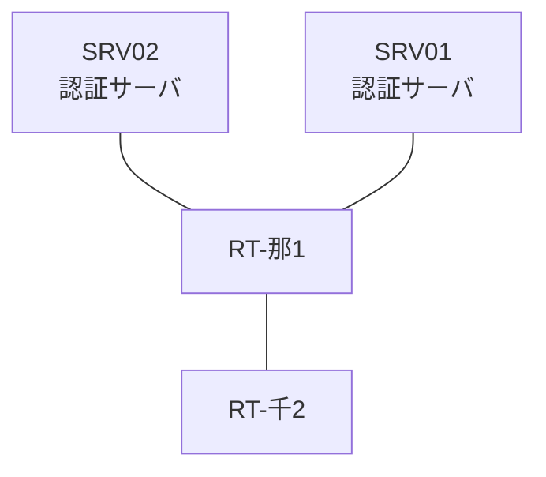

# 問題 20260823-007

> **本問は機器に接続せずに解答すること。追加の show 実行は認めない。**

## シナリオ

あなたの組織は、下記に示されているところのネットワークを運用しています。2 つの拠点のルータが、共通の認証サーバ群を用いて、管理者の認証を行うように構成されています。一方のルータはサーバと直結しており、他方はそのルーターを経由してサーバに到達します。いくつかの宛先への通信について、報告が上がっています。あなたは、示されているところの出力および構成に基づいて、その構成が、下記において記述されているとおりに動作していない理由を、判断する必要があります。那覇・千葉 の両拠点で、利用者 noc-hanako が権限レベル 15 で機器を操作できること。認証は認証サーバ群 AUTH-GRP を用いること。緊急時にコンソールから操作できる経路を失わないこと。運用者の遠隔からの接続が失われないこと。



### 認証サーバの仕様

| 項目 | SRV01 | SRV02 |
|---|---|---|
| アドレス | 10.99.136.2 | 10.99.137.2 |
| 待受ポート | 1812 / 1813 | 11812 / 11813 |
| 共有鍵 | K-9931 | K-9931 |
| 受理する送信元 | 10.6.0.1 ・ 10.9.0.2 | 同左 |
| 台帳 | noc-hanako(15) ・ monitor-op(1) ・ SUZUKI(15) | 同左 |
| 現在の稼働状態 | 保守作業のため停止中 | 稼働中 |

### ルータのアドレス

| ルータ | Loopback0 | 認証サーバ方向のインタフェース |
|---|---|---|
| RT-那1(那覇) | 10.6.0.1 | Ethernet0/0 = 10.99.136.1 |
| RT-千2(千葉) | 10.9.0.2 | Ethernet0/0 = 10.93.12.2 |

## 出力

| 拠点 | ユーザ | 結果 |
|---|---|---|
| 那覇 | noc-hanako | ログイン不可 |
| 那覇 | monitor-op | ログイン不可 |
| 那覇 | local-admin | ログインは通るが exec 拒否 |
| 那覇 | noc-hanako(6 セッション目以降) | ログイン不可 |
| 那覇 | local-admin(コンソールから) | ログイン可(権限レベル 15) |
| 那覇 | noc-hanako(ログインに要する時間) | 1 回目 約 4 秒 / 2 回目以降 即時 |
| 千葉 | noc-hanako | ログイン可(権限レベル 15) |
| 千葉 | monitor-op | ログイン可(権限レベル 1) |
| 千葉 | local-admin | ログイン不可 |
| 千葉 | monitor-op からの特権昇格 | 昇格可(15) |
| 千葉 | noc-hanako(6 セッション目以降) | ログイン可(権限レベル 15) |
| 千葉 | local-admin(コンソールから) | ログイン可(権限レベル 15) |
| 千葉 | noc-hanako(ログインに要する時間) | 1 回目 約 4 秒 / 2 回目以降 即時 |

認証サーバがすべて停止した場合:

| 拠点 | ユーザ | 結果 |
|---|---|---|
| 那覇 | local-admin | ログイン可(権限レベル 15) |
| 那覇 | SUZUKI | ログイン可(権限レベル 15) |
| 那覇 | local-admin(コンソールから) | ログイン可(権限レベル 15) |
| 千葉 | local-admin | ログイン可(権限レベル 15) |
| 千葉 | SUZUKI | ログイン可(権限レベル 15) |
| 千葉 | local-admin(コンソールから) | ログイン可(権限レベル 15) |

```
那覇: User was successfully authenticated. (1 回目 約 4 秒 / 2 回目以降 即時)
千葉: User was successfully authenticated. (1 回目 約 4 秒 / 2 回目以降 即時)
```
```
RT-那1# show running-config | section aaa
aaa new-model
!
radius server RAD1
 address ipv4 10.99.136.2 auth-port 1812 acct-port 1813
 key K-9931
!
radius server RAD2
 address ipv4 10.99.137.2 auth-port 11812 acct-port 11813
 key K-9931
!
aaa group server radius AUTH-GRP
 server name RAD1
 server name RAD2
 deadtime 5
!
aaa authentication login default local
aaa authentication login CONSOLE local
aaa authentication login REMOTE group AUTH-GRP local
aaa authorization exec default group AUTH-GRP local
aaa authorization exec CONSOLE local
aaa authorization console
!
ip radius source-interface Loopback0
radius-server timeout 2
radius-server retransmit 1
radius-server dead-criteria time 2 tries 1
!
username local-admin privilege 15 secret 5 $1$xxxx
username SUZUKI privilege 15 secret 5 $1$yyyy
!
line con 0
 exec-timeout 0 0
 logging synchronous
 login authentication CONSOLE
 authorization exec CONSOLE
line vty 0 4
 exec-timeout 0 0
 transport input ssh
line vty 5 15
 exec-timeout 0 0
 transport input ssh
```
```
RT-千2# show running-config | section aaa
aaa new-model
!
radius server RAD1
 address ipv4 10.99.136.2 auth-port 1812 acct-port 1813
 key K-9931
!
radius server RAD2
 address ipv4 10.99.137.2 auth-port 11812 acct-port 11813
 key K-9931
!
aaa group server radius AUTH-GRP
 server name RAD1
 server name RAD2
 deadtime 5
!
aaa authentication login default group AUTH-GRP local
aaa authentication login CONSOLE local
aaa authorization exec default group AUTH-GRP local
aaa authorization exec CONSOLE local
aaa authorization console
!
ip radius source-interface Loopback0
radius-server timeout 2
radius-server retransmit 1
radius-server dead-criteria time 2 tries 1
!
username local-admin privilege 15 secret 5 $1$xxxx
username SUZUKI privilege 15 secret 5 $1$yyyy
!
line con 0
 exec-timeout 0 0
 logging synchronous
 login authentication CONSOLE
 authorization exec CONSOLE
line vty 0 4
 exec-timeout 0 0
 transport input ssh
line vty 5 15
 exec-timeout 0 0
 transport input ssh
```

## 設問

次のうち、正しいものは、どれですか。

## 選択肢
A. アクセスリストが、認証サーバからの応答を遮断している。

B. ルータと認証サーバの共有鍵が一致していない。

C. 作成した方式リストが回線に適用されていない。

D. 方式リストが、一部の vty 回線にしか適用されていない。
