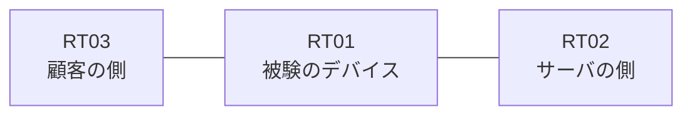

# 問題 20260823-008

> **本問は機器に接続せずに解答すること。追加の show 実行は認めない。**

## トポロジ

あなたの組織は、下記に示されているところのネットワークを運用しています。ある企業のネットワークにおいて、RT01 は、顧客の側のネットワークと、サーバの側のネットワークとの間に配置されており、IPv6 によって運用されています。



## 要件

1. RT01 において、`2001:DB8:D3:8::/64`、`2001:DB8:D3:9::/64`、`2001:DB8:D3:A::/64` のネットワークからの通信のみが、`2001:DB8:D3:FF::10` の TCP ポート 80 に到達できなければなりません。
2. `2001:DB8:D3:D::/64` からの通信は、許可されることはできません。
3. 拒否のエントリを使用してはなりません。
4. 本作業は、日中の時間帯において実施されるという理由により、対象外であるところのデバイスに対する構成の変更は、許可されていません。

## 現在の状態

いくつかの宛先への通信について、報告が上がっています。示されているところの出力および構成に基づいて、要求されているところの動作が得られていない理由が、判断されなければなりません。

観測 | サーバへの到達
--- | ---
送信元が 2001:DB8:D3:8::/64 のネットワークにあるホストから、2001:DB8:D3:FF::10 の TCP ポート 80 宛ての通信 | 到達可
送信元が 2001:DB8:D3:9::/64 のネットワークにあるホストから、2001:DB8:D3:FF::10 の TCP ポート 80 宛ての通信 | 到達可
送信元が 2001:DB8:D3:A::/64 のネットワークにあるホストから、2001:DB8:D3:FF::10 の TCP ポート 80 宛ての通信 | 到達可
送信元が 2001:DB8:D3:B::/64 のネットワークにあるホストから、2001:DB8:D3:FF::10 の TCP ポート 80 宛ての通信 | 到達可
送信元が 2001:DB8:D3:D::/64 のネットワークにあるホストから、2001:DB8:D3:FF::10 の TCP ポート 80 宛ての通信 | 到達可
送信元が 2001:DB8:D3:FA::/64 のネットワークにあるホストから、2001:DB8:D3:FF::10 の TCP ポート 80 宛ての通信 | 到達不可

```
RT01# show ipv6 access-list
IPv6 access list V6-EDGE-IN
    permit ipv6 2001:DB8:D3:8::/61 any sequence 10
```
```
RT01# show ipv6 neighbors
IPv6 Address                              Age Link-layer Addr State Interface
2001:DB8:D3:8::3                            0 aabb.cc02.4f00  REACH Et0/0
```

## 設定抜粋

```
RT01# show running-config | section ipv6 access-list|traffic-filter
ipv6 access-list V6-EDGE-IN
 sequence 10 permit ipv6 2001:DB8:D3:8::/61 any
interface Ethernet0/0
 ipv6 traffic-filter V6-EDGE-IN in
```

## 設問

次のうち、正しいものは、どれですか。

## 選択肢
A. シーケンス番号が連続していないため、エントリが評価されていない

B. プレフィックスの長さが長く、対象としているネットワークの一部が一致の対象から外れている

C. アクセス・リストが `ip access-group` によって適用されている

D. 末尾に明示の拒否のエントリが記述されているため、近隣探索に対する暗黙の許可が失われ、隣接のアドレスが解決できていない

E. プレフィックスの長さが短く、対象としていないネットワークまでが一致の対象に含まれている

F. 参照されているアクセス・リストが定義されていない
