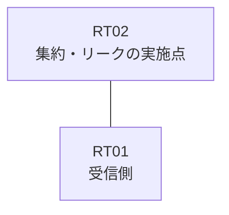

# 問題 20260823-011

> **本問は機器に接続せずに解答すること。追加の show 実行は認めない。**

## トポロジ

あなたは、下記のネットワークの保守を担当する技術者です。拠点のルータ RT02 は、複数のループバック インターフェイスによって、サービスのためのアドレスのブロック 172.19.84.16/30 を収容しています。RT02 と RT01 は、1本のリンクによって直接に接続されており、そして、EIGRP 65100 が構成されています。



| 対象 | 内容 |
|------|------|
| RT02 のループバック | 172.19.84.17, 172.19.84.18, 172.19.84.19 |
| RT02 の運用系ループバック | 10.223.250.99 |
| RT02 ⇔ RT01 のリンク | 10.96.18.0/24（RT02=10.96.18.1 / RT01=10.96.18.2・Ethernet0/0） |

## 要件

1. ブロックの内部の明細のルートは、広告されてはなりません。
2. RT01 に対して、ブロック 172.19.84.16/30 は、集約のルートとして広告される必要があります。
3. インターフェイスにおける集約の構成は、過去の障害の経緯という理由により、認められていません。
4. インタフェースの IP アドレッシングは、変更されることはできません。
5. 運用のためのループバック 10.223.250.99 (/32) は、引き続き受信される必要があります。
6. ただし、監視のためのホストである 172.19.84.19 (/32) の明細のルートは、集約とともに、受信される必要があります。

## 現在の状態

通信の一部において、想定されていない挙動が、観測されています。あなたは、示されているところの出力および構成に基づいて、その構成が、下記において記述されているとおりに動作していない理由を、判断する必要があります。

```
RT01# show ip route eigrp | begin Gateway
Gateway of last resort is not set
      10.0.0.0/32 is subnetted, 1 subnets
D        10.223.250.99 [90/409600] via 10.96.18.1, 00:06:45, Ethernet0/0
      172.19.0.0/30 is subnetted, 1 subnets
D        172.19.84.16 [90/409600] via 10.96.18.1, 00:06:45, Ethernet0/0
```

## 設定抜粋

```
RT02# show running-config
Building configuration...
!
interface Loopback0
 ip address 172.19.84.17 255.255.255.255
interface Loopback1
 ip address 172.19.84.18 255.255.255.255
interface Loopback2
 ip address 172.19.84.19 255.255.255.255
interface Loopback10
 ip address 10.223.250.99 255.255.255.255
interface Ethernet0/0
 description === to RT01 ===
 ip address 10.96.18.1 255.255.255.252
 ip summary-address eigrp 65100 172.19.84.16 255.255.255.252 leak-map LEAKS
!
router eigrp 65100
 network 172.19.84.17 0.0.0.0
 network 172.19.84.18 0.0.0.0
 network 172.19.84.19 0.0.0.0
 network 10.223.250.99 0.0.0.0
 network 10.96.18.0 0.0.0.3
!
ip prefix-list MON32 seq 5 permit 172.19.84.19/32
ip prefix-list PL-MON seq 5 permit 172.19.84.16/30 le 32
ip prefix-list PL01 seq 5 permit 172.19.84.19/32
!
route-map LEAK permit 10
 match ip address prefix-list PL01
route-map RMAP01 permit 10
 match ip address prefix-list PL-MON
!
```

## 設問

次のうち、正しいものは、どれですか。

## 選択肢
A. RT02 において、インターフェイスの集約の構成、および、172.19.84.19 を除くところのブロックのループバックの network のステートメントを削除する。`ip route 172.19.84.16 255.255.255.252 Null0` のスタティック・ルートを作成し、それを EIGRP 65100 へ再配送する

B. RT02 において、ブロックのループバックのすべてを network のステートメントによって EIGRP 65100 へ参加させる。そして、集約を `ip summary-address eigrp 65100 172.19.84.16 255.255.255.252 leak-map RM-NEW` の形へ構成し直し、RM-NEW は、172.19.84.19/32 を許可するところのプレフィックス・リストに一致させる

C. RT02 において、集約を `ip summary-address eigrp 65100 172.19.84.16 255.255.255.252 leak-map RM-NEW` の形へ構成し直し、RM-NEW は、172.19.84.17/32 を許可するところのプレフィックス・リストに一致させる

D. RT02 において、ブロックのループバックのすべてを network のステートメントによって参加させ、そして、集約を `ip summary-address eigrp 65100 172.19.84.16 255.255.255.252` の形(leak-map なし)へ構成し直す

E. RT02 において、ブロックのループバックの network のステートメントを削除し、それらを `redistribute connected route-map` によって EIGRP 65100 へ注入する。そして、集約を `ip summary-address eigrp 65100 172.19.84.16 255.255.255.252 leak-map RM-NEW` の形へ構成し直し、RM-NEW は、172.19.84.19/32 を許可するところのプレフィックス・リストに一致させる
