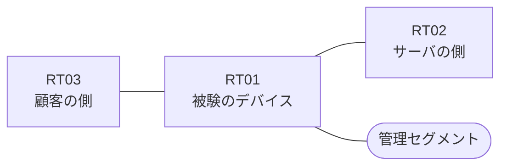

# 問題 20260823-013

> **本問は機器に接続せずに解答すること。追加の show 実行は認めない。**

## トポロジ

あなたは、下記のネットワークの保守を担当する技術者です。ある企業のネットワークにおいて、RT01 は、顧客の側のネットワークと、サーバの側のネットワークとの間に、配置されています。



| 区間 | 被験デバイス側のインターフェイス | ネットワーク |
|------|----------------------------------|--------------|
| RT03（顧客の側） ⇔ RT01 | `Ethernet0/0` | 10.91.253.0/24 |
| RT01 ⇔ RT02（サーバの側） | `Ethernet0/1` | 10.91.254.0/24 |
| RT01 ⇔ 管理セグメント | `Ethernet0/2` | 10.91.255.0/24 |

## 要件

1. 本作業は、日中の時間帯において実施されるという理由により、対象外であるところのデバイスに対する構成の変更は、許可されていません。
2. RT01 において、`10.91.16.0/24` から `10.91.22.0/24` までの範囲にあるネットワークからの通信のみが、サーバである `172.23.65.63` の TCP ポート 22 に到達できなければなりません。
3. アクセス リストは、顧客の側のインターフェイスである `Ethernet0/0` において、着信の方向に適用されなければなりません。
4. 当該のサーバの他のポートへの通信、および当該のサーバ以外の宛先への通信は、許可されることはできません。
5. `10.91.23.0/24` からの通信は、許可されてはなりません。
6. `10.91.25.0/24` からの通信は、許可されてはなりません。
7. 対象としていないネットワークが、一致の対象に含まれてはなりません。また、エントリの行数は、最小でなければなりません。

## 現在の状態

ユーザーから、通信に関する事象が、報告されています。示されているところの出力および構成に基づいて、要求されているところの動作が得られていない理由が、判断されなければなりません。

観測 | サーバへの到達
--- | ---
送信元が 10.91.16.0/24 のネットワークにあるホストから、172.23.65.63 の TCP ポート 22 宛ての通信 | 到達可
送信元が 10.91.17.0/24 のネットワークにあるホストから、172.23.65.63 の TCP ポート 22 宛ての通信 | 到達可
送信元が 10.91.18.0/24 のネットワークにあるホストから、172.23.65.63 の TCP ポート 22 宛ての通信 | 到達可
送信元が 10.91.19.0/24 のネットワークにあるホストから、172.23.65.63 の TCP ポート 22 宛ての通信 | 到達可
送信元が 10.91.20.0/24 のネットワークにあるホストから、172.23.65.63 の TCP ポート 22 宛ての通信 | 到達可
送信元が 10.91.21.0/24 のネットワークにあるホストから、172.23.65.63 の TCP ポート 22 宛ての通信 | 到達可
送信元が 10.91.22.0/24 のネットワークにあるホストから、172.23.65.63 の TCP ポート 22 宛ての通信 | 到達可
送信元が 10.91.23.0/24 のネットワークにあるホストから、172.23.65.63 の TCP ポート 22 宛ての通信 | 到達可
送信元が 10.91.25.0/24 のネットワークにあるホストから、172.23.65.63 の TCP ポート 22 宛ての通信 | 到達不可
送信元が 10.91.250.0/24 のネットワークにあるホストから、172.23.65.63 の TCP ポート 22 宛ての通信 | 到達不可
送信元が 10.91.16.0/24 のネットワークにあるホストから、172.23.65.63 の TCP ポート 25 宛ての通信 | 到達不可
送信元が 10.91.16.0/24 のネットワークにあるホストから、172.23.65.152 の TCP ポート 22 宛ての通信 | 到達不可

```
RT01# show ip access-lists
Extended IP access list 120
    10 permit tcp 10.91.16.0 0.0.7.255 host 172.23.65.63 eq 22
```

## 設定抜粋

```
RT01# show running-config | section ^interface
interface Ethernet0/0
 description === to RT03 ===
 ip address 10.91.253.1 255.255.255.0
 ip access-group 120 in
interface Ethernet0/1
 description === to RT02 ===
 ip address 10.91.254.1 255.255.255.0
interface Ethernet0/2
 description === management ===
 ip address 10.91.255.1 255.255.255.0
```

## 設問

次のうち、正しいものは、どれですか。

## 選択肢
A. ルーティング・プロトコルの隣接関係が確立されていない

B. プロトコルとして ip が指定されているため、ポートによる制限が行われていない

C. 宛先として any が指定されているため、当該のサーバ以外への通信までが許可されている

D. ワイルドカードのビットが過剰であり、対象としていないネットワークまでが一致の対象に含まれている

E. インターフェイスが管理上シャットダウンされている

F. 先行するエントリが広い範囲を許可しており、後続のエントリが評価されない
