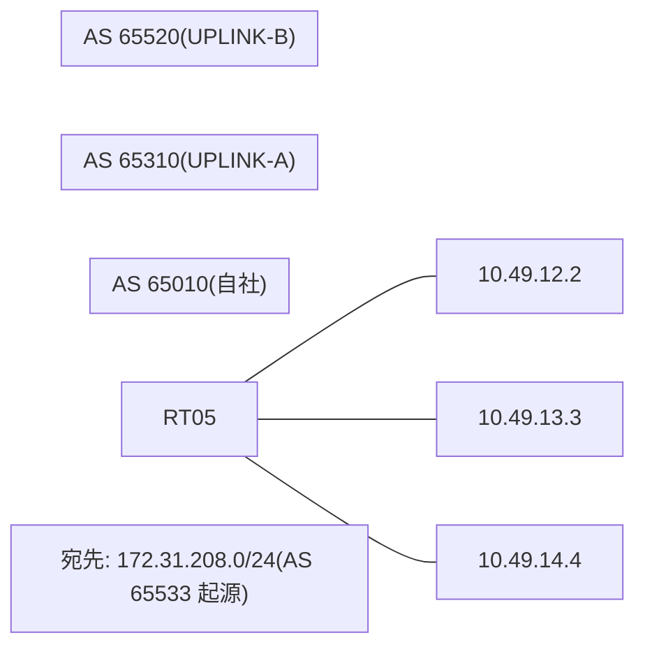

# 問題 20260823-014

> **本問は機器に接続せずに解答すること。追加の show 実行は認めない。**

## シナリオ

あなたは、下記のネットワークの保守を担当する技術者です。自社のルータ RT05 は、外部のネットワーク 172.31.208.0/24 への到達性を、複数の経路を通じて、確立しています。 UPLINK-A とは、2 本のリンクで、接続されています。 UPLINK-B とも、接続されています。外部との 1 つのセッションが失われ、それまで使用されていたところの経路は、取り下げられました。ルータは、残るところの経路からの、ベストパスの選出を、行おうとしています。示されているところの出力は、その時点で、採取されたものです。示されているところの出力、および、構成に基づいて、判断すること。なお、機器の構成は、示されている抜粋のほかは、既定値である。



## 出力

```
RT05# show running-config | section router bgp
router bgp 65010
 bgp router-id 209.209.209.209
 bgp log-neighbor-changes
 neighbor 10.49.12.2 remote-as 65310
 neighbor 10.49.13.3 remote-as 65310
 neighbor 10.49.14.4 remote-as 65520
 !
 address-family ipv4
  neighbor 10.49.12.2 activate
  neighbor 10.49.13.3 activate
  neighbor 10.49.14.4 activate
 exit-address-family
```
```
RT05# show ip bgp
BGP table version is 60, local router ID is 209.209.209.209
Status codes: s suppressed, d damped, h history, * valid, > best, i - internal, 
              r RIB-failure, S Stale, m multipath, b backup-path, f RT-Filter, 
              x best-external, a additional-path, c RIB-compressed, 
              t secondary path, L long-lived-stale,
Origin codes: i - IGP, e - EGP, ? - incomplete
RPKI validation codes: V valid, I invalid, N Not found

     Network          Next Hop            Metric LocPrf Weight Path
 *    172.31.208.0/24  10.49.14.4                             0 65520 65520 65533 i
 *                     10.49.12.2              20             0 65310 65533 i
 *                     10.49.13.3             300             0 65310 65533 i
```

## 設問

示されているところの出力に基づいて、この後、172.31.208.0/24 のベストパスとして選出され、転送に使用されるところの経路は、どれですか。(1つを選択してください)

## 選択肢
A. next hop 10.49.12.2 の経路

B. いずれの経路も、ベストパスとして、選出されない

C. next hop 10.49.13.3 の経路

D. next hop 10.49.14.4 の経路
