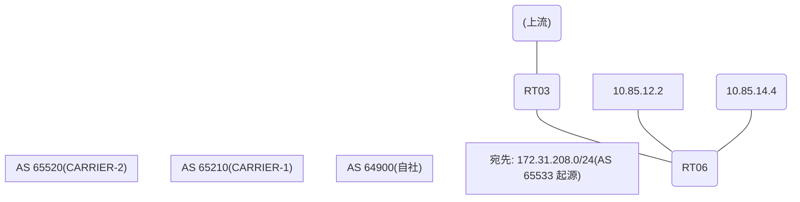

# 問題 20260823-015

> **本問は機器に接続せずに解答すること。追加の show 実行は認めない。**

## トポロジ

あなたの組織は、下記に示されているところのネットワークを運用しています。自社のルータ RT06 は、外部のネットワーク 172.31.208.0/24 への到達性を、複数の経路を通じて、確立しています。 CARRIER-1 とは、接続されています。 CARRIER-2 とも、接続されています。 一部の経路は、自 AS 内の境界ルータから、iBGP で、学習されています。



## 要件

1. RT06 における、172.31.208.0/24 への転送は、next hop 10.85.14.4 の経路を、使用すること。
2. この変更の影響は、当該のルータに、限定されること。AS 内の、ほかのルータの経路選択を、変更してはならない。
3. 各事業者から受信するところの MED の値は、相互に調整されていない、独自の値である。経路選択の判断基準として、使用してはならない。
4. なお、設定の投入後、変更は、適切に、反映されているものとする。

## 現在の状態

現在、172.31.208.0/24 への転送は、要件に適合しないところの経路を、使用しています。

```
RT06# show ip bgp
BGP table version is 12, local router ID is 9.9.9.9
Status codes: s suppressed, d damped, h history, * valid, > best, i - internal, 
              r RIB-failure, S Stale, m multipath, b backup-path, f RT-Filter, 
              x best-external, a additional-path, c RIB-compressed, 
              t secondary path, L long-lived-stale,
Origin codes: i - IGP, e - EGP, ? - incomplete
RPKI validation codes: V valid, I invalid, N Not found

     Network          Next Hop            Metric LocPrf Weight Path
 *>   172.31.208.0/24  10.85.12.2             200             0 65210 65533 i
 * i                   3.6.6.6                       100      0 65210 65210 65533 65533 i
 *                     10.85.14.4              80             0 65520 65533 ?
```

## 設定抜粋

```
RT06# show running-config | section router bgp
router bgp 64900
 bgp router-id 9.9.9.9
 bgp log-neighbor-changes
 neighbor 3.6.6.6 remote-as 64900
 neighbor 3.6.6.6 update-source Loopback0
 neighbor 10.85.12.2 remote-as 65210
 neighbor 10.85.14.4 remote-as 65520
 !
 address-family ipv4
  neighbor 3.6.6.6 activate
  neighbor 10.85.12.2 activate
  neighbor 10.85.14.4 activate
 exit-address-family
```

## 設問

示されているところのすべての要件が満たされることを確実にするために、適用されなければならない構成は、どれですか。(1つを選択してください)

## 選択肢
**A.**
```
router bgp 64900
 bgp always-compare-med
```

**B.**
```
route-map RM-MED-A permit 10
 set metric 200
route-map RM-MED-B permit 10
 set metric 10
router bgp 64900
 address-family ipv4
  neighbor 10.85.12.2 route-map RM-MED-A out
  neighbor 10.85.13.3 route-map RM-MED-B out
```

**C.**
```
router bgp 64900
 address-family ipv4
  neighbor 10.85.14.4 weight 30000
```

**D.**
```
route-map RM-BACKUP-OUT permit 10
 set as-path prepend 64900 64900
router bgp 64900
 address-family ipv4
  neighbor 10.85.12.2 route-map RM-BACKUP-OUT out
```

**E.**
```
clear ip bgp * soft
```

**F.**
```
route-map RM-PRIMARY-IN permit 10
 set local-preference 200
router bgp 64900
 address-family ipv4
  neighbor 10.85.14.4 route-map RM-PRIMARY-IN in
```
