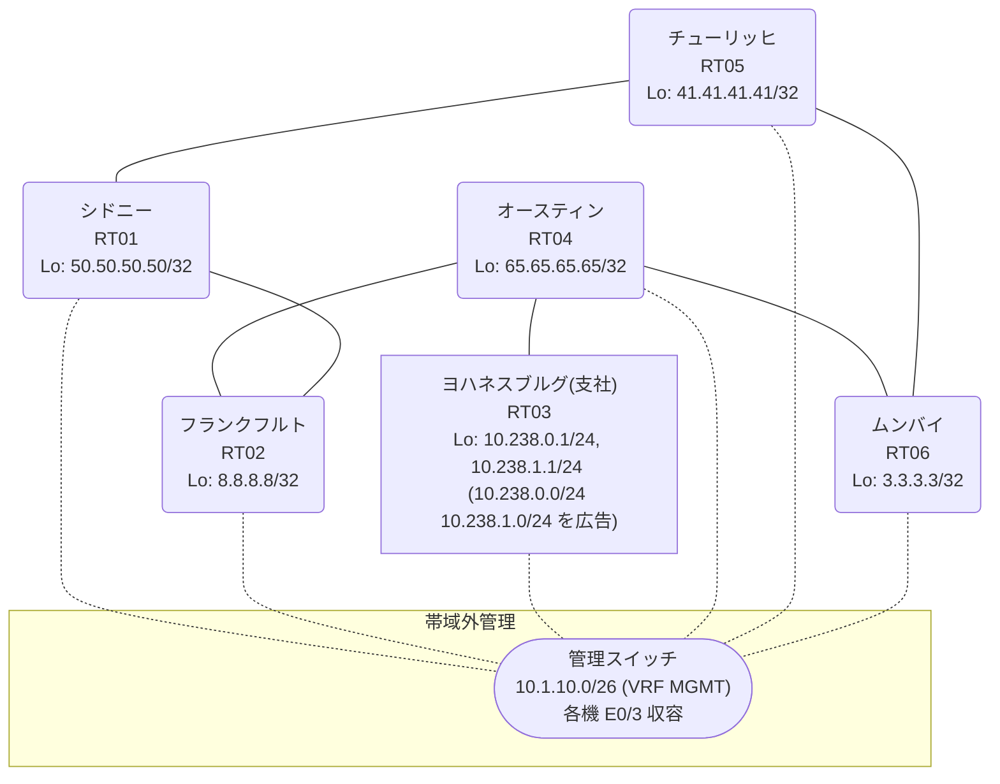

# 問題 20260823-016

> **本問は機器に接続せずに解答すること。追加の show 実行は認めない。**

## トポロジ

あなたの組織は、下記に示されているところのネットワークを運用しています。あなたの会社のネットワークは、支社のドメインと、本社のコアのドメイン(OSPF)とが、2 台の境界のルーターによって接続され、そして、それらは境界において接続されています。支社のネットワーク `10.238.0.0/24` および `10.238.1.0/24` は、RT03 によって、広告されています。どちらの境界が失われた場合においても、通信が継続されることができるように、設計されています。ルーティングの設計の詳細は、示されているところの出力から、読み取られることが、期待されています。



| 拠点 | ルータ | Loopback / 広告網 |
|------|--------|--------------------|
| オースティン | RT04 | 65.65.65.65/32 |
| シドニー | RT01 | 50.50.50.50/32 |
| チューリッヒ | RT05 | 41.41.41.41/32 |
| フランクフルト | RT02 | 8.8.8.8/32 |
| ムンバイ | RT06 | 3.3.3.3/32 |
| ヨハネスブルグ(支社) | RT03 | 10.238.0.1/24, 10.238.1.1/24 (`10.238.0.0/24` `10.238.1.0/24` を広告) |

リンク一覧:
```
  RT03:E0/0(.2) ── RT04:E0/0(.1)   10.76.69.0/30
  RT04:E0/1(.1) ── RT06:E0/0(.2)   10.78.217.0/30
  RT04:E0/2(.1) ── RT02:E0/0(.2)   10.168.101.0/30
  RT06:E0/1(.1) ── RT05:E0/0(.2)   172.16.248.0/30
  RT05:E0/1(.1) ── RT01:E0/0(.2)   172.16.71.0/30
  RT02:E0/1(.1) ── RT01:E0/1(.2)   172.16.110.0/30
```

## 要件

1. 管理のための構成に対して、変更が加えられてはなりません。
2. 支社のネットワーク `10.238.0.0/24` / `10.238.1.0/24` への到達可能性が、すべてのサイトにおいて、確保されていること。
3. 支社のネットワーク宛のパケットが、広告元である RT03 の方向へ転送され、そして、転送のループが存在していないこと。
4. 二点相互再配送による、冗長の設計が、維持されなければなりません。
5. 本作業は、日中の時間帯において実施されるという理由により、対象外であるところのデバイスに対する構成の変更は、許可されていません。
6. スタティック・ルートおよび既定のルートによる迂回は、実施されてはなりません。

## 現在の状態

通信の一部において、想定されていない挙動が、観測されています。あなたは、提示されているところの情報のみを使用して、要求されている状態が満たされていない理由を、特定しなければなりません。

```
RT02# show ip route
Gateway of last resort is not set
      3.0.0.0/32 is subnetted, 1 subnets
O        3.3.3.3 [110/31] via 172.16.110.2, 00:04:12, Ethernet0/1
      8.0.0.0/32 is subnetted, 1 subnets
C        8.8.8.8 is directly connected, Loopback0
      10.0.0.0/8 is variably subnetted, 6 subnets, 3 masks
O E2     10.76.69.0/30 [110/20] via 172.16.110.2, 00:04:12, Ethernet0/1
O E2     10.78.217.0/30 [110/20] via 172.16.110.2, 00:04:12, Ethernet0/1
C        10.168.101.0/30 is directly connected, Ethernet0/0
L        10.168.101.2/32 is directly connected, Ethernet0/0
O E2     10.238.0.0/24 [110/20] via 172.16.110.2, 00:04:12, Ethernet0/1
O E2     10.238.1.0/24 [110/20] via 172.16.110.2, 00:04:12, Ethernet0/1
      41.0.0.0/32 is subnetted, 1 subnets
O        41.41.41.41 [110/21] via 172.16.110.2, 00:04:15, Ethernet0/1
      50.0.0.0/32 is subnetted, 1 subnets
O        50.50.50.50 [110/11] via 172.16.110.2, 00:04:22, Ethernet0/1
      65.0.0.0/32 is subnetted, 1 subnets
O E2     65.65.65.65 [110/20] via 172.16.110.2, 00:04:12, Ethernet0/1
      172.16.0.0/16 is variably subnetted, 4 subnets, 2 masks
O        172.16.71.0/30 [110/20] via 172.16.110.2, 00:04:22, Ethernet0/1
C        172.16.110.0/30 is directly connected, Ethernet0/1
L        172.16.110.1/32 is directly connected, Ethernet0/1
O        172.16.248.0/30 [110/30] via 172.16.110.2, 00:04:15, Ethernet0/1
```
```
RT06# show ip route 10.238.0.0
Routing entry for 10.238.0.0/24
  Known via "rip", distance 120, metric 2
  Redistributing via ospf 1, rip
  Advertised by ospf 1 subnets route-map RIP2OSPF
  Last update from 10.78.217.1 on Ethernet0/0, 00:00:21 ago
  Routing Descriptor Blocks:
  * 10.78.217.1, from 10.78.217.1, 00:00:21 ago, via Ethernet0/0
      Route metric is 2, traffic share count is 1
```
```
RT04# show ip route 41.41.41.41
Routing entry for 41.41.41.41/32
  Known via "rip", distance 120, metric 5
  Tag 300
  Redistributing via rip
  Last update from 10.168.101.2 on Ethernet0/2, 00:00:02 ago
  Routing Descriptor Blocks:
    10.168.101.2, from 10.168.101.2, 00:00:02 ago, via Ethernet0/2
      Route metric is 5, traffic share count is 1
      Route tag 300
  * 10.78.217.2, from 10.78.217.2, 00:00:20 ago, via Ethernet0/1
      Route metric is 5, traffic share count is 1
      Route tag 300
```
```
RT02# traceroute 10.238.0.1 probe 1 timeout 1 ttl 1 8
Type escape sequence to abort.
Tracing the route to 10.238.0.1
VRF info: (vrf in name/id, vrf out name/id)
  1 172.16.110.2 1 msec
  2 172.16.71.1 2 msec
  3 172.16.248.1 2 msec
  4 10.78.217.1 11 msec
  5 10.76.69.2 14 msec
```

## 設定抜粋

```
RT06# show running-config | section router
router ospf 1
 router-id 3.3.3.3
 redistribute rip route-map RIP2OSPF
 network 3.3.3.3 0.0.0.0 area 0
 network 172.16.248.0 0.0.0.3 area 0
 distance ospf external 180
router rip
 version 2
 redistribute ospf 1 metric 5 route-map OSPF2RIP
 network 3.0.0.0
 network 10.0.0.0
 no auto-summary
```

## 設問

次のうち、正しいものは、どれですか。

## 選択肢
A. RT04 において、両方の境界からの経路の管理距離が異なっている

B. 出自のタグによる遮断が機能しておらず、経路が周回している

C. RT02 の redistribute が欠落しており、OSPF ドメインが支社網の経路を喪失している

D. RT02 が、フィードバックの外部経路を、支社からの正規の経路より優先している

E. 残置されたフィルタが、一方の境界からの広告を抑止している

F. 支社網の経路が収束せず、境界の間で振動している
