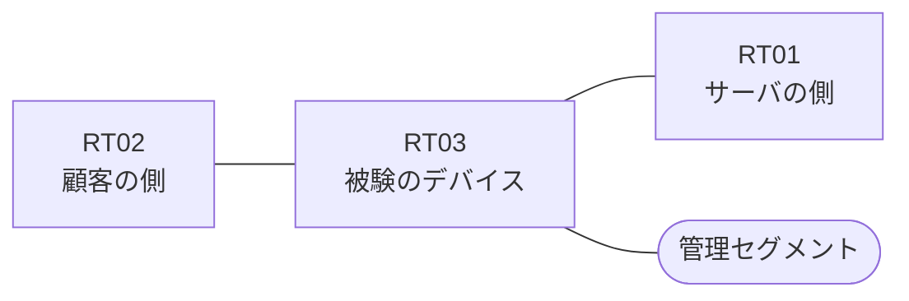

# 問題 20260823-018

> **本問は機器に接続せずに解答すること。追加の show 実行は認めない。**

## トポロジ

あなたは、ネットワークの運用を担当しています。ある企業のネットワークにおいて、RT03 は、顧客の側のネットワークと、サーバの側のネットワークとの間に、配置されています。



| 区間 | 被験デバイス側のインターフェイス | ネットワーク |
|------|----------------------------------|--------------|
| RT02（顧客の側） ⇔ RT03 | `Ethernet1/0` | 10.94.253.0/24 |
| RT03 ⇔ RT01（サーバの側） | `Ethernet1/1` | 10.94.254.0/24 |
| RT03 ⇔ 管理セグメント | `Ethernet1/2` | 10.94.255.0/24 |

## 要件

1. ルーティング・プロトコルの種別およびプロセスの配置は、変更されることはできません。
2. 顧客の側のインターフェイスである `Ethernet1/0` と、サーバの側のインターフェイスである `Ethernet1/1` の双方において、着信の方向にアクセス・リストが適用されています。
3. 示されているところのアクセス・リストの適用は、変更されてはなりません。
4. サーバの側のネットワークから、顧客の側のネットワークへ**新たに開始される**通信は、許可されてはなりません。
5. RT03 において、`10.94.8.0/24`、`10.94.9.0/24`、`10.94.10.0/24` のネットワークから、サーバである `172.31.130.89` の TCP ポート 22 への通信は、セッションを確立できなければなりません。

## 現在の状態

いくつかの宛先への通信について、報告が上がっています。あなたは、提示されているところの情報のみを使用して、要求されている状態が満たされていない理由を、特定しなければなりません。

観測 | TCP セッション
--- | ---
送信元が 10.94.8.0/24 のネットワークにあるホストから、172.31.130.89 の TCP ポート 22 宛ての通信 | 確立できない
送信元が 10.94.9.0/24 のネットワークにあるホストから、172.31.130.89 の TCP ポート 22 宛ての通信 | 確立できない
送信元が 10.94.10.0/24 のネットワークにあるホストから、172.31.130.89 の TCP ポート 22 宛ての通信 | 確立できない
送信元が 10.94.11.0/24 のネットワークにあるホストから、172.31.130.89 の TCP ポート 22 宛ての通信 | 確立できない
送信元が 10.94.13.0/24 のネットワークにあるホストから、172.31.130.89 の TCP ポート 22 宛ての通信 | 確立できない
送信元が 10.94.250.0/24 のネットワークにあるホストから、172.31.130.89 の TCP ポート 22 宛ての通信 | 確立できない
送信元が 10.94.8.0/24 のネットワークにあるホストから、172.31.130.89 の TCP ポート 23 宛ての通信 | 確立できない
送信元が 10.94.8.0/24 のネットワークにあるホストから、172.31.130.160 の TCP ポート 22 宛ての通信 | 確立できない

```
RT03# show ip access-lists
Extended IP access list 120
    10 permit tcp 10.94.8.0 0.0.0.255 host 172.31.130.89 eq 22
    20 permit tcp 10.94.9.0 0.0.0.255 host 172.31.130.89 eq 22
    30 permit tcp 10.94.10.0 0.0.0.255 host 172.31.130.89 eq 22
Extended IP access list 110
    10 permit ip host 172.31.130.89 10.94.255.0 0.0.0.255
```

## 設定抜粋

```
RT03# show running-config | section ^interface
interface Ethernet1/0
 description === to RT02 ===
 ip address 10.94.253.1 255.255.255.0
 ip access-group 120 in
interface Ethernet1/1
 description === to RT01 ===
 ip address 10.94.254.1 255.255.255.0
 ip access-group 110 in
interface Ethernet1/2
 description === management ===
 ip address 10.94.255.1 255.255.255.0
```

## 設問

次のうち、正しいものは、どれですか。

## 選択肢
A. ワイルドカードのビットが連続しておらず、一致の対象が飛び飛びになっている

B. 戻りの通信を許可するアクセス・リストに、established のキーワードを伴うエントリが存在しない

C. インターフェイスに適用されているアクセス・リストに、エントリが1つも存在しない

D. ワイルドカードのビットが過剰であり、対象としていないネットワークまでが一致の対象に含まれている

E. プレフィックス・リストがルート・マップから参照されていない

F. インターフェイスが管理上シャットダウンされている
