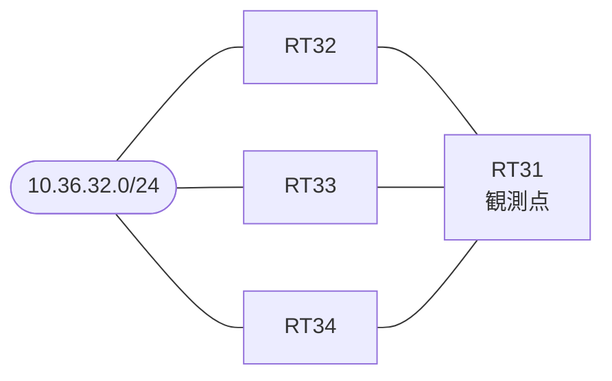

# 問題 20260823-020

> **本問は機器に接続せずに解答すること。追加の show 実行は認めない。**

## シナリオ

あなたの組織は、下記に示されているところのネットワークを運用しています。拠点のルータ RT31 は、複数の隣接するルータを経由して、10.36.32.0/24 への経路を学習しています。ネットワークは単一の EIGRP のオートノマス システム(200)として運用されており、そして、冗長なパスの活用が検討されています。経路の選好に関する挙動のレビューが、実施されています。管理のための構成に対して、変更が加えられてはなりません。RT31 における 10.36.32.0/24 への転送のパスは、運用の設計の意図と一致していなければなりません。既存の隣接関係は、維持される必要があります。構成の変更は、1 箇所に限られなければなりません。現在選好されているところの経路の側の構成は、変更されてはなりません。



| 対象 | 内容 |
|------|------|
| RT31 ⇔ RT32 | Ethernet0/0・10.221.2.0/24（RT31 側の delay = 100） |
| RT31 ⇔ RT33 | Ethernet0/1・10.221.3.0/24（RT31 側の delay = 300） |
| RT31 ⇔ RT34 | Ethernet0/2・10.221.4.0/24（RT31 側の delay = 100） |
| 宛先 | 10.36.32.0/24（すべての隣接から到達可能） |

## 出力

```
RT31# show ip eigrp topology all-links
EIGRP-IPv4 Topology Table for AS(200)/ID(73.0.0.1)
Codes: P - Passive, A - Active, U - Update, Q - Query, R - Reply,
       r - reply Status, s - sia Status 

P 10.221.2.0/24, 1 successors, FD is 281600, serno 2
        via Connected, Ethernet0/0
P 10.221.3.0/24, 1 successors, FD is 332800, serno 3
        via Connected, Ethernet0/1
P 10.36.32.0/24, 1 successors, FD is 435200, serno 7, refcount 1
        via 10.221.2.2 (435200/409600), Ethernet0/0
        via 10.221.4.4 (460800/435200), Ethernet0/2
        via 10.221.3.3 (486400/409600), Ethernet0/1
```
```
RT31# show running-config | section router eigrp
router eigrp 200
 eigrp router-id 73.0.0.1
 network 10.221.0.0 0.0.255.255
 no auto-summary
```
```
RT31# show running-config | section interface
interface Ethernet0/0
 description === to RT32 ===
 ip address 10.221.2.1 255.255.255.0
 delay 100
interface Ethernet0/1
 description === to RT33 ===
 ip address 10.221.3.1 255.255.255.0
 delay 300
interface Ethernet0/2
 description === to RT34 ===
 ip address 10.221.4.1 255.255.255.0
 delay 100
```

## 設問

現在の最良の経路を変更することなく、現在は搭載されていない冗長なパスの経路も転送に利用されるようにするために、実施されなければならない変更は、どれですか。(1つを選択してください)

## 選択肢
A. RT31 の Ethernet0/2 の delay を 100 へ下げる

B. RT31 において、10.36.32.0/24 へのスタティック・ルートを 10.221.4.4 宛てに追加する

C. RT34 の、宛先の側のインタフェースの delay を 100 へ下げる

D. RT31 の Ethernet0/2 の delay を 100 へ下げ、かつ RT34 の宛先の側の delay を 100 へ下げる

E. RT31 の EIGRP のプロセスにおいて、variance を 6 へ引き上げる
