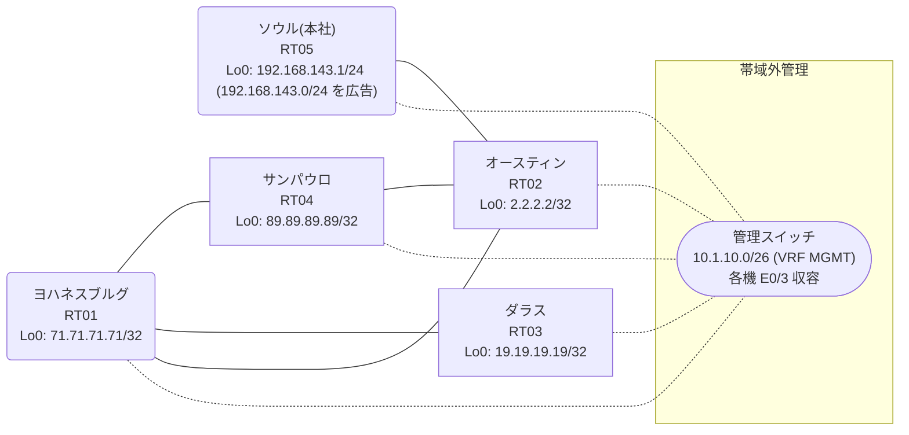

# 問題 20260824-001

> **本問は機器に接続せずに解答すること。追加の show 実行は認めない。**

## トポロジ

あなたは、ネットワークの運用を担当しています。本社の顧客のネットワークは、BGP AS 65466 の RT05 によって、広告されています。あなたの会社の内部は、BGP / EIGRP / OSPF という 3 つのドメインから構成されています。サイトと、ルータおよびアドレスとの対応は、下記の表に示されているとおりです。



| 拠点 | ルータ | 拠点網 / 広告網 |
|------|--------|------------------|
| オースティン | RT02 | 2.2.2.2/32 |
| サンパウロ | RT04 | 89.89.89.89/32 |
| ソウル(本社) | RT05 | 192.168.143.1/24 (`192.168.143.0/24` を広告) |
| ダラス | RT03 | 19.19.19.19/32 |
| ヨハネスブルグ | RT01 | 71.71.71.71/32 |

リンク一覧:
```
  RT05:E0/0(.1) ── RT02:E0/0(.2)   10.225.231.0/30
  RT02:E0/1(.1) ── RT04:E0/0(.2)   10.37.142.0/30
  RT02:E0/2(.1) ── RT01:E0/0(.2)   10.247.116.0/30
  RT04:E0/1(.1) ── RT01:E0/1(.2)   10.22.208.0/30
  RT01:E0/2(.1) ── RT03:E0/0(.2)   10.38.195.0/30
```

## 要件

1. インタフェースの IP アドレッシングは、変更されてはなりません。
2. 顧客のネットワーク `192.168.143.0/24` を含むすべての宛先への到達可能性が、すべてのサイトにおいて、確保されていること。
3. 過去の障害への対応において投入された設定が、ルータの一部に、残存しています。それらの設定の見直しは、実施されていません。
4. 既存の再配送の設計が、変更または撤去されることはできません。スタティック・ルートによる回避も、許可されていません。
5. `192.168.143.0/24` 宛のパケットが、広告元である RT05 の方向へ転送され、そして、転送のループが存在していないこと。

## 現在の状態

一部の通信が、意図されているとおりに動作していない、という報告があります。示されているところの出力および構成に基づいて、要求されているところの動作が得られていない理由が、判断されなければなりません。

```
RT02# show ip prefix-list
ip prefix-list PL-STG1: 2 entries
   seq 5 deny 89.89.89.89/32
   seq 10 permit 0.0.0.0/0 le 32
ip prefix-list PL-STG2: 2 entries
   seq 5 deny 19.19.19.19/32
   seq 10 permit 0.0.0.0/0 le 32
```
```
RT02# show ip bgp
BGP table version is 10, local router ID is 2.2.2.2
Status codes: s suppressed, d damped, h history, * valid, > best, i - internal, 
              r RIB-failure, S Stale, m multipath, b backup-path, f RT-Filter, 
              x best-external, a additional-path, c RIB-compressed, 
              t secondary path, L long-lived-stale,
Origin codes: i - IGP, e - EGP, ? - incomplete
RPKI validation codes: V valid, I invalid, N Not found

     Network          Next Hop            Metric LocPrf Weight Path
 *>   2.2.2.2/32       0.0.0.0                  0         32768 i
 *>   10.22.208.0/30   10.247.116.2            20         32768 ?
 *>   10.38.195.0/30   10.247.116.2            20         32768 ?
 *>   10.247.116.0/30  0.0.0.0                  0         32768 ?
 *>   19.19.19.19/32   10.247.116.2            21         32768 ?
 *>   71.71.71.71/32   10.247.116.2            11         32768 ?
 *>   89.89.89.89/32   10.247.116.2            21         32768 ?
 r>i  192.168.143.0    10.225.231.1             0    100      0 i
```
```
RT02# show access-lists
Standard IP access list 12
    10 deny   89.89.89.89
    20 permit any
Standard IP access list 80
    10 deny   19.19.19.19
    20 permit any
```
```
RT02# show ip route
Gateway of last resort is not set
      2.0.0.0/32 is subnetted, 1 subnets
C        2.2.2.2 is directly connected, Loopback0
      10.0.0.0/8 is variably subnetted, 8 subnets, 2 masks
O        10.22.208.0/30 [110/20] via 10.247.116.2, 00:03:55, Ethernet0/2
C        10.37.142.0/30 is directly connected, Ethernet0/1
L        10.37.142.1/32 is directly connected, Ethernet0/1
O        10.38.195.0/30 [110/20] via 10.247.116.2, 00:04:18, Ethernet0/2
C        10.225.231.0/30 is directly connected, Ethernet0/0
L        10.225.231.2/32 is directly connected, Ethernet0/0
C        10.247.116.0/30 is directly connected, Ethernet0/2
L        10.247.116.1/32 is directly connected, Ethernet0/2
      19.0.0.0/32 is subnetted, 1 subnets
O        19.19.19.19 [110/21] via 10.247.116.2, 00:03:50, Ethernet0/2
      71.0.0.0/32 is subnetted, 1 subnets
O        71.71.71.71 [110/11] via 10.247.116.2, 00:04:18, Ethernet0/2
      89.0.0.0/32 is subnetted, 1 subnets
O        89.89.89.89 [110/21] via 10.247.116.2, 00:03:55, Ethernet0/2
D EX  192.168.143.0/24 [170/307200] via 10.37.142.2, 00:03:24, Ethernet0/1
```
```
RT02# show route-map
route-map RM-STG1, deny, sequence 10
  Match clauses:
    ip address prefix-lists: PL-STG1 
  Set clauses:
  Policy routing matches: 0 packets, 0 bytes
route-map RM-STG1, permit, sequence 20
  Match clauses:
  Set clauses:
  Policy routing matches: 0 packets, 0 bytes
route-map RM-STG2, deny, sequence 10
  Match clauses:
    ip address prefix-lists: PL-STG2 
  Set clauses:
  Policy routing matches: 0 packets, 0 bytes
route-map RM-STG2, permit, sequence 20
  Match clauses:
  Set clauses:
  Policy routing matches: 0 packets, 0 bytes
```
```
RT02# show ip protocols | include Routing Protocol|Distance
Routing Protocol is "application"
    Gateway         Distance      Last Update
  Distance: (default is 4)
Routing Protocol is "eigrp 738"
      Distance: internal 90 external 170
    Gateway         Distance      Last Update
  Distance: internal 90 external 170
Routing Protocol is "ospf 25"
    Gateway         Distance      Last Update
  Distance: intra-area 110 inter-area 110 external 212
Routing Protocol is "bgp 65466"
    Gateway         Distance      Last Update
  Distance: external 20 internal 200 local 200
```
```
RT03# traceroute 192.168.143.1 probe 1 timeout 1 ttl 1 8
Type escape sequence to abort.
Tracing the route to 192.168.143.1
VRF info: (vrf in name/id, vrf out name/id)
  1 10.38.195.1 2 msec
  2 10.247.116.1 2 msec
  3 10.37.142.2 2 msec
  4 10.22.208.2 1 msec
  5 10.247.116.1 28 msec
  6 10.37.142.2 3 msec
  7 10.22.208.2 3 msec
  8 10.247.116.1 2 msec
```

## 設定抜粋

```
RT02# show running-config | section router
router eigrp 738
 network 10.37.142.0 0.0.0.3
 passive-interface Loopback0
router ospf 25
 router-id 2.2.2.2
 redistribute eigrp 738
 redistribute bgp 65466
 network 2.2.2.2 0.0.0.0 area 0
 network 10.247.116.0 0.0.0.3 area 0
 distance ospf external 212
router bgp 65466
 bgp router-id 2.2.2.2
 bgp log-neighbor-changes
 bgp redistribute-internal
 network 2.2.2.2 mask 255.255.255.255
 redistribute ospf 25
 neighbor 10.225.231.1 remote-as 65466
```
```
RT04# show running-config | section router
router eigrp 738
 network 10.37.142.0 0.0.0.3
 redistribute ospf 25 metric 100000 100 255 1 1500
router ospf 25
 router-id 89.89.89.89
 redistribute eigrp 738
 network 10.22.208.0 0.0.0.3 area 0
 network 89.89.89.89 0.0.0.0 area 0
```
```
RT01# show running-config | section router
router ospf 25
 router-id 71.71.71.71
 timers throttle spf 50 200 5000
 passive-interface Loopback0
 network 10.22.208.0 0.0.0.3 area 0
 network 10.38.195.0 0.0.0.3 area 0
 network 10.247.116.0 0.0.0.3 area 0
 network 71.71.71.71 0.0.0.0 area 0
```
```
RT05# show running-config | section router
router bgp 65466
 bgp router-id 192.168.143.1
 bgp log-neighbor-changes
 network 192.168.143.0
 neighbor 10.225.231.2 remote-as 65466
```

## 設問

次のうち、正しいものは、どれですか。

## 選択肢
A. RT02 に設定されている distance が OSPF の外部経路の管理距離を212 へ引き上げたことにより、経路が EIGRP 側へ迂回し、周回が生じている

B. RT02 が、一周して戻ってきた外部経路を iBGP の経路より優先して採用している

C. 当該プレフィックスの next-hop が最適でなく、遠回りの経路が選択されている

D. RT02 において当該プレフィックスの外部経路タイプが E2 であり、内部コストが加算されていない

E. RT02 の BGP テーブルにおいて当該経路が RIB-failure となり、ベストパスが選出できていない

F. RT05 からの広告が RT02 に到達していない
