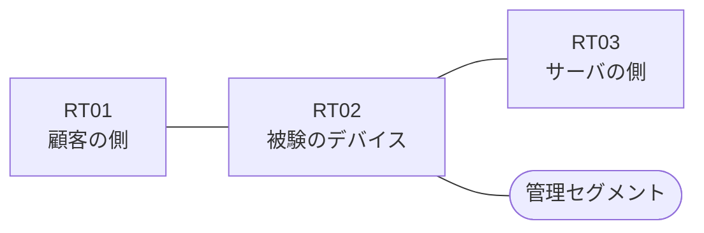

# 問題 20260824-003

> **本問は機器に接続せずに解答すること。追加の show 実行は認めない。**

## トポロジ

あなたは、下記のネットワークの保守を担当する技術者です。ある企業のネットワークにおいて、RT02 は、顧客の側のネットワークと、サーバの側のネットワークとの間に、配置されています。



| 区間 | 被験デバイス側のインターフェイス | ネットワーク |
|------|----------------------------------|--------------|
| RT01（顧客の側） ⇔ RT02 | `Ethernet0/0` | 10.156.253.0/24 |
| RT02 ⇔ RT03（サーバの側） | `Ethernet0/1` | 10.156.254.0/24 |
| RT02 ⇔ 管理セグメント | `Ethernet0/2` | 10.156.255.0/24 |

## 要件

1. 顧客の側のインターフェイスである `Ethernet0/0` と、サーバの側のインターフェイスである `Ethernet0/1` の双方において、着信の方向にアクセス リストが適用されています。
2. サーバの側のネットワークから、顧客の側のネットワークへ**新たに開始される**通信は、許可されてはなりません。
3. 示されているところのアクセス リストの適用は、変更されることはできません。
4. ルーティング・プロトコルの種別およびプロセスの配置は、変更されてはなりません。
5. RT02 において、`10.156.192.0/24`、`10.156.193.0/24`、`10.156.194.0/24`、`10.156.195.0/24` のネットワークから、サーバである `172.26.49.92` の TCP ポート 3389 への通信は、セッションを確立できなければなりません。

## 現在の状態

ユーザーから、通信に関する事象が、報告されています。あなたは、示されているところの出力および構成に基づいて、その構成が、下記において記述されているとおりに動作していない理由を、判断する必要があります。

観測 | TCP セッション
--- | ---
送信元が 10.156.192.0/24 のネットワークにあるホストから、172.26.49.92 の TCP ポート 3389 宛ての通信 | 確立できる
送信元が 10.156.193.0/24 のネットワークにあるホストから、172.26.49.92 の TCP ポート 3389 宛ての通信 | 確立できる
送信元が 10.156.194.0/24 のネットワークにあるホストから、172.26.49.92 の TCP ポート 3389 宛ての通信 | 確立できない
送信元が 10.156.195.0/24 のネットワークにあるホストから、172.26.49.92 の TCP ポート 3389 宛ての通信 | 確立できない
送信元が 10.156.196.0/24 のネットワークにあるホストから、172.26.49.92 の TCP ポート 3389 宛ての通信 | 確立できない
送信元が 10.156.197.0/24 のネットワークにあるホストから、172.26.49.92 の TCP ポート 3389 宛ての通信 | 確立できない
送信元が 10.156.250.0/24 のネットワークにあるホストから、172.26.49.92 の TCP ポート 3389 宛ての通信 | 確立できない
送信元が 10.156.192.0/24 のネットワークにあるホストから、172.26.49.92 の TCP ポート 21 宛ての通信 | 確立できない
送信元が 10.156.192.0/24 のネットワークにあるホストから、172.26.49.187 の TCP ポート 3389 宛ての通信 | 確立できない

```
RT02# show ip access-lists
Extended IP access list 120
    10 permit tcp 10.156.192.0 0.0.0.255 host 172.26.49.92 eq 3389
    20 permit tcp 10.156.193.0 0.0.0.255 host 172.26.49.92 eq 3389
    30 permit tcp 10.156.194.0 0.0.0.255 host 172.26.49.92 eq 3389
    40 permit tcp 10.156.195.0 0.0.0.255 host 172.26.49.92 eq 3389
Extended IP access list 110
    10 permit tcp host 172.26.49.92 eq 3389 10.156.192.0 0.0.1.255 established
```

## 設定抜粋

```
RT02# show running-config | section ^interface
interface Ethernet0/0
 description === to RT01 ===
 ip address 10.156.253.1 255.255.255.0
 ip access-group 120 in
interface Ethernet0/1
 description === to RT03 ===
 ip address 10.156.254.1 255.255.255.0
 ip access-group 110 in
interface Ethernet0/2
 description === management ===
 ip address 10.156.255.1 255.255.255.0
```

## 設問

次のうち、正しいものは、どれですか。

## 選択肢
A. インターフェイスから参照されているアクセス・リストが、定義されていない

B. 戻りの通信を許可するアクセス・リストに、established のキーワードを伴うエントリが存在しない

C. ルーティング・プロトコルの隣接関係が確立されていない

D. インターフェイスが管理上シャットダウンされている

E. 戻りの通信を許可するアクセス・リストの範囲が、対象としているネットワークの一部しか含んでいない

F. ポートの演算子が、宛先の側ではなく送信元の側に記述されている
