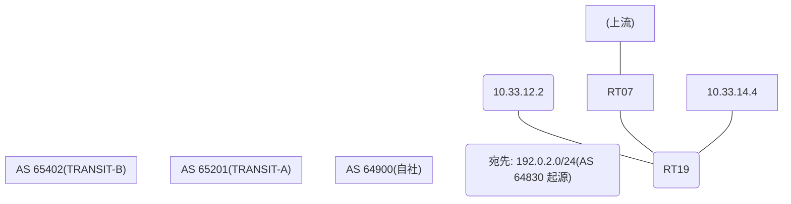

# 問題 20260824-004

> **本問は機器に接続せずに解答すること。追加の show 実行は認めない。**

## トポロジ

あなたは、ネットワークの運用を担当しています。自社のルーター RT19 は、外部のネットワーク 192.0.2.0/24 への到達性を、複数の経路を通じて、確立しています。 TRANSIT-A とは、接続されています。 TRANSIT-B とも、接続されています。 一部の経路は、自 AS 内の境界ルータから、iBGP で、学習されています。



## 要件

1. 示されているところの出力、および、構成に基づいて、判断すること。
2. なお、機器の構成は、示されている抜粋のほかは、既定値である。

## 現在の状態

ベストパスの選出の結果について、その根拠が、確認されようとしています。

```
RT19# show ip bgp
BGP table version is 50, local router ID is 234.234.234.234
Status codes: s suppressed, d damped, h history, * valid, > best, i - internal, 
              r RIB-failure, S Stale, m multipath, b backup-path, f RT-Filter, 
              x best-external, a additional-path, c RIB-compressed, 
              t secondary path, L long-lived-stale,
Origin codes: i - IGP, e - EGP, ? - incomplete
RPKI validation codes: V valid, I invalid, N Not found

     Network          Next Hop            Metric LocPrf Weight Path
 *    192.0.2.0        10.33.12.2                             0 65201 65201 64830 i
 *>                    10.33.14.4                             0 65402 64830 ?
 * i                   7.5.5.5                       100      0 65201 64830 64830 64830 i
```
```
RT19# show ip bgp 192.0.2.0
BGP routing table entry for 192.0.2.0/24, version 50
Paths: (3 available, best #2, table default)
  Advertised to update-groups:
     1         
  Refresh Epoch 4
  65201 65201 64830
    10.33.12.2 from 10.33.12.2 (26.26.26.26)
      Origin IGP, localpref 100, valid, external
      rx pathid: 0, tx pathid: 0
      Updated on May 18 2026 16:20:03 UTC
  Refresh Epoch 4
  65402 64830
    10.33.14.4 from 10.33.14.4 (122.122.122.122)
      Origin incomplete, localpref 100, valid, external, best
      rx pathid: 0, tx pathid: 0x0
      Updated on May 18 2026 17:03:03 UTC
  Refresh Epoch 4
  65201 64830 64830 64830
    7.5.5.5 (metric 11) from 7.5.5.5 (7.5.5.5)
      Origin IGP, localpref 100, valid, internal
      rx pathid: 0, tx pathid: 0
      Updated on May 18 2026 18:45:03 UTC
```

## 設定抜粋

```
RT19# show running-config | section router bgp
router bgp 64900
 bgp router-id 234.234.234.234
 bgp log-neighbor-changes
 neighbor 7.5.5.5 remote-as 64900
 neighbor 7.5.5.5 update-source Loopback0
 neighbor 10.33.12.2 remote-as 65201
 neighbor 10.33.14.4 remote-as 65402
 !
 address-family ipv4
  neighbor 7.5.5.5 activate
  neighbor 10.33.12.2 activate
  neighbor 10.33.14.4 activate
 exit-address-family
```

## 設問

示されているところの出力において、ベストパスの選出を決定づけた要素は、どれですか。(1つを選択してください)

## 選択肢
A. AS-PATH 長(短いほうが優先)

B. MED(小さいほうが優先)

C. next-hop の解決可否(そもそも候補に入らない)

D. LOCAL_PREF(大きいほうが優先)

E. origin コード(i < e < ?)
