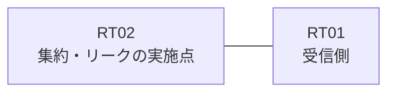

# 問題 20260824-005

> **本問は機器に接続せずに解答すること。追加の show 実行は認めない。**

## シナリオ

あなたは、ネットワークの運用を担当しています。拠点のルーター RT02 は、複数のループバック インターフェイスによって、サービスのためのアドレスのブロック 192.168.44.32/29 を収容しています。RT02 と RT01 は、1本のリンクによって直接に接続されており、そして、EIGRP 6571 が構成されています。通信の一部において、想定されていない挙動が、観測されています。あなたは、提示されているところの情報のみを使用して、要求されている状態が満たされていない理由を、特定しなければなりません。ただし、監視のためのホストである 192.168.44.33 (/32) の明細のルートは、集約とともに、受信される必要があります。RT01 に対して、ブロック 192.168.44.32/29 は、集約のルートとして広告される必要があります。インターフェイスにおける集約の構成は、過去の障害の経緯という理由により、認められていません。運用のためのループバック 10.249.14.7 (/32) は、引き続き受信されなければなりません。ブロックの内部の明細のルートは、広告されてはなりません。インタフェースの IP アドレッシングは、変更されることはできません。



| 対象 | 内容 |
|------|------|
| RT02 のループバック | 192.168.44.33, 192.168.44.34, 192.168.44.35, 192.168.44.36, 192.168.44.37 |
| RT02 の運用系ループバック | 10.249.14.7 |
| RT02 ⇔ RT01 のリンク | 10.124.72.0/24（RT02=10.124.72.1 / RT01=10.124.72.2・GigabitEthernet0/1） |

## 出力

```
RT01# show ip route eigrp | begin Gateway
Gateway of last resort is not set
      10.0.0.0/32 is subnetted, 1 subnets
D        10.249.14.7 [90/409600] via 10.124.72.1, 00:18:33, GigabitEthernet0/1
      192.168.44.0/24 is variably subnetted, 6 subnets, 2 masks
D        192.168.44.32/29 [90/409600] via 10.124.72.1, 00:18:33, GigabitEthernet0/1
D        192.168.44.33/32 [90/409600] via 10.124.72.1, 00:18:33, GigabitEthernet0/1
D        192.168.44.34/32 [90/409600] via 10.124.72.1, 00:18:33, GigabitEthernet0/1
D        192.168.44.35/32 [90/409600] via 10.124.72.1, 00:18:33, GigabitEthernet0/1
D        192.168.44.36/32 [90/409600] via 10.124.72.1, 00:18:33, GigabitEthernet0/1
D        192.168.44.37/32 [90/409600] via 10.124.72.1, 00:18:33, GigabitEthernet0/1
```
```
RT02# show running-config
Building configuration...
!
interface Loopback0
 ip address 192.168.44.33 255.255.255.255
interface Loopback1
 ip address 192.168.44.34 255.255.255.255
interface Loopback2
 ip address 192.168.44.35 255.255.255.255
interface Loopback3
 ip address 192.168.44.36 255.255.255.255
interface Loopback4
 ip address 192.168.44.37 255.255.255.255
interface Loopback10
 ip address 10.249.14.7 255.255.255.255
interface GigabitEthernet0/1
 description === to RT01 ===
 ip address 10.124.72.1 255.255.255.252
 ip summary-address eigrp 6571 192.168.44.32 255.255.255.248 leak-map MON-LEAK
!
router eigrp 6571
 network 192.168.44.33 0.0.0.0
 network 192.168.44.34 0.0.0.0
 network 192.168.44.35 0.0.0.0
 network 192.168.44.36 0.0.0.0
 network 192.168.44.37 0.0.0.0
 network 10.249.14.7 0.0.0.0
 network 10.124.72.0 0.0.0.3
!
ip prefix-list MON32 seq 5 permit 192.168.44.33/32
ip prefix-list PL01 seq 5 permit 192.168.44.32/29 le 32
access-list 10 permit 192.168.44.34
!
route-map MON-LEAK permit 10
 match ip address prefix-list PL_MON
route-map RMAP01 permit 10
 match ip address prefix-list PL01
!
```

## 設問

次のうち、正しいものは、どれですか。

## 選択肢
A. RT02 において、ブロックのループバックの network のステートメントを削除する。192.168.44.33/32 を許可するところのプレフィックス・リストに一致するルート・マップ RM-SHARED を作成し、`redistribute connected route-map RM-SHARED` によって対象を注入し、そして、**同じ** RM-SHARED を参照するところの `ip summary-address eigrp 6571 192.168.44.32 255.255.255.248 leak-map RM-SHARED` を構成する

B. RT02 において、インターフェイスの集約の構成を削除し、192.168.44.33/32 および 10.249.14.7/32 を許可するところのプレフィックス・リストを、distribute-list として GigabitEthernet0/1 の out の方向に適用する

C. RT02 において、インターフェイスの集約の構成、および、192.168.44.33 を除くところのブロックのループバックの network のステートメントを削除する。`ip route 192.168.44.32 255.255.255.248 Null0` のスタティック・ルートを作成し、それを EIGRP 6571 へ再配送する

D. RT02 において、集約を `ip summary-address eigrp 6571 192.168.44.32 255.255.255.248 leak-map RM-NEW` の形へ構成し直し、RM-NEW は、192.168.44.34/32 を許可するところのプレフィックス・リストに一致させる

E. RT02 において、ブロックのループバックのすべてを network のステートメントによって EIGRP 6571 へ参加させる。そして、集約を `ip summary-address eigrp 6571 192.168.44.32 255.255.255.248 leak-map RM-NEW` の形へ構成し直し、RM-NEW は、192.168.44.33/32 を許可するところのプレフィックス・リストに一致させる
