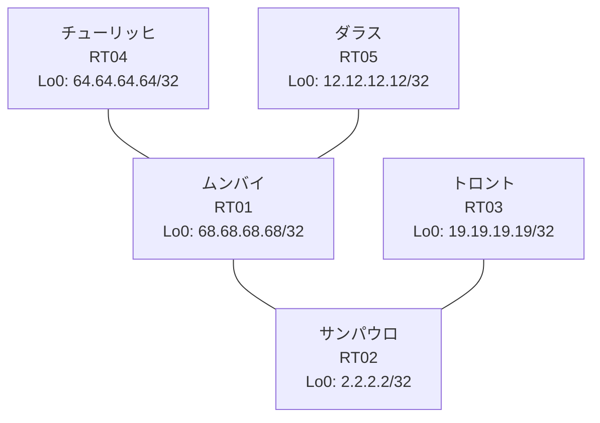

# 問題 20260824-006

> **本問は機器に接続せずに解答すること。追加の show 実行は認めない。**

## トポロジ

あなたは、ネットワークの運用を担当しています。あなたの会社のネットワークは、複数のルーティング・ドメインが、境界のルーターによって接続され、そして、すべての拠点の到達可能性が提供されている、というものです。ルーティングの設計の詳細は、示されているところのコンフィギュレーションから、読み取られることが、期待されています。各拠点のルーターと、拠点の網との対応は、下記の表に示されているとおりです。



| 拠点 | ルータ | 拠点網 |
|------|--------|----------------------|
| サンパウロ | RT02 | `2.2.2.2/32` |
| ダラス | RT05 | `12.12.12.12/32` |
| チューリッヒ | RT04 | `64.64.64.64/32` |
| トロント | RT03 | `19.19.19.19/32` |
| ムンバイ | RT01 | `68.68.68.68/32` |

リンク一覧:
```
  RT01:E0/0(.1) ── RT02:E0/0(.2)   10.37.40.0/30
  RT01:E0/1(.1) ── RT05:E0/0(.2)   10.201.135.0/30
  RT01:E0/2(.1) ── RT04:E0/0(.2)   10.89.106.0/30
  RT02:E0/1(.1) ── RT03:E0/0(.2)   10.202.177.0/30
```

## 要件

1. シード・メトリック `1000000 100 255 1 1500` の付与は、default-metric の方式に統一されなければなりません。
2. 管理のための構成に対して、変更が加えられてはなりません。
3. 本作業は、日中の時間帯において実施されるという理由により、対象外であるところのデバイスに対する構成の変更は、許可されていません。
4. ルートの再配送に対して、フィルタが、適用されてはなりません。
5. redistribute によって参照されるところのプロセス ID / AS 番号は、その境界に実在する隣接のドメインのものと一致させられ、そして、実在しないプロセスへの参照が、残置されてはなりません。
6. すべてのルータのループバック・インターフェイス 0 (/32) が、すべてのドメインの間で、相互に到達可能であること。

## 現在の状態

一部の通信が、意図されているとおりに動作していない、という報告があります。示されているところの出力および構成に基づいて、要求されているところの動作が得られていない理由が、判断されなければなりません。

```
RT03# show ip route
Gateway of last resort is not set
      2.0.0.0/32 is subnetted, 1 subnets
O        2.2.2.2 [110/11] via 10.202.177.1, 00:03:56, Ethernet0/0
      10.0.0.0/8 is variably subnetted, 3 subnets, 2 masks
O        10.37.40.0/30 [110/20] via 10.202.177.1, 00:03:56, Ethernet0/0
C        10.202.177.0/30 is directly connected, Ethernet0/0
L        10.202.177.2/32 is directly connected, Ethernet0/0
      19.0.0.0/32 is subnetted, 1 subnets
C        19.19.19.19 is directly connected, Loopback0
      68.0.0.0/32 is subnetted, 1 subnets
O        68.68.68.68 [110/21] via 10.202.177.1, 00:03:56, Ethernet0/0
```
```
RT04# show ip route
Gateway of last resort is not set
      2.0.0.0/32 is subnetted, 1 subnets
D EX     2.2.2.2 [170/307200] via 10.89.106.1, 00:04:18, Ethernet0/0
      10.0.0.0/8 is variably subnetted, 5 subnets, 2 masks
D EX     10.37.40.0/30 [170/307200] via 10.89.106.1, 00:04:52, Ethernet0/0
C        10.89.106.0/30 is directly connected, Ethernet0/0
L        10.89.106.2/32 is directly connected, Ethernet0/0
D        10.201.135.0/30 [90/307200] via 10.89.106.1, 00:04:52, Ethernet0/0
D EX     10.202.177.0/30 [170/307200] via 10.89.106.1, 00:04:18, Ethernet0/0
      12.0.0.0/32 is subnetted, 1 subnets
D        12.12.12.12 [90/435200] via 10.89.106.1, 00:04:45, Ethernet0/0
      19.0.0.0/32 is subnetted, 1 subnets
D EX     19.19.19.19 [170/307200] via 10.89.106.1, 00:04:17, Ethernet0/0
      64.0.0.0/32 is subnetted, 1 subnets
C        64.64.64.64 is directly connected, Loopback0
      68.0.0.0/32 is subnetted, 1 subnets
D        68.68.68.68 [90/409600] via 10.89.106.1, 00:04:52, Ethernet0/0
```
```
RT05# show ip route
Gateway of last resort is not set
      2.0.0.0/32 is subnetted, 1 subnets
D EX     2.2.2.2 [170/307200] via 10.201.135.1, 00:04:36, Ethernet0/0
      10.0.0.0/8 is variably subnetted, 5 subnets, 2 masks
D EX     10.37.40.0/30 [170/307200] via 10.201.135.1, 00:05:07, Ethernet0/0
D        10.89.106.0/30 [90/307200] via 10.201.135.1, 00:05:07, Ethernet0/0
C        10.201.135.0/30 is directly connected, Ethernet0/0
L        10.201.135.2/32 is directly connected, Ethernet0/0
D EX     10.202.177.0/30 [170/307200] via 10.201.135.1, 00:04:36, Ethernet0/0
      12.0.0.0/32 is subnetted, 1 subnets
C        12.12.12.12 is directly connected, Loopback0
      19.0.0.0/32 is subnetted, 1 subnets
D EX     19.19.19.19 [170/307200] via 10.201.135.1, 00:04:35, Ethernet0/0
      64.0.0.0/32 is subnetted, 1 subnets
D        64.64.64.64 [90/435200] via 10.201.135.1, 00:05:05, Ethernet0/0
      68.0.0.0/32 is subnetted, 1 subnets
D        68.68.68.68 [90/409600] via 10.201.135.1, 00:05:07, Ethernet0/0
```
```
RT01# show route-map
route-map RM-LEGACY1, deny, sequence 10
  Match clauses:
    ip address prefix-lists: PL-LEGACY1 
  Set clauses:
  Policy routing matches: 0 packets, 0 bytes
route-map RM-LEGACY1, permit, sequence 20
  Match clauses:
  Set clauses:
  Policy routing matches: 0 packets, 0 bytes
```
```
RT01# show ip prefix-list
ip prefix-list PL-LEGACY1: 2 entries
   seq 5 deny 19.19.19.19/32
   seq 10 permit 0.0.0.0/0 le 32
```
```
RT01# show access-lists
Standard IP access list 73
    10 deny   19.19.19.19
    20 permit any
```

## 設定抜粋

```
RT01# show running-config | section router
router eigrp 886
 default-metric 1000000 100 255 1 1500
 network 10.89.106.0 0.0.0.3
 network 10.201.135.0 0.0.0.3
 network 68.68.68.68 0.0.0.0
 redistribute ospf 29 match internal external 1 external 2
router ospf 29
 router-id 68.68.68.68
 timers throttle spf 50 200 5000
 redistribute eigrp 893 
 passive-interface Loopback0
 network 10.37.40.0 0.0.0.3 area 0
 network 68.68.68.68 0.0.0.0 area 0
```
```
RT02# show running-config | section router
router ospf 29
 router-id 2.2.2.2
 timers throttle spf 50 200 5000
 passive-interface Loopback0
 network 2.2.2.2 0.0.0.0 area 0
 network 10.37.40.0 0.0.0.3 area 0
 network 10.202.177.0 0.0.0.3 area 0
```
```
RT03# show running-config | section router
router ospf 29
 router-id 19.19.19.19
 network 10.202.177.0 0.0.0.3 area 0
 network 19.19.19.19 0.0.0.0 area 0
```
```
RT04# show running-config | section router
router eigrp 886
 network 10.89.106.0 0.0.0.3
 network 64.64.64.64 0.0.0.0
```
```
RT05# show running-config | section router
router eigrp 886
 network 10.201.135.0 0.0.0.3
 network 12.12.12.12 0.0.0.0
 passive-interface Loopback0
```

## 設問

次のうち、正しいものは、どれですか。

## 選択肢
A. RT01 の router ospf 29 配下に「default-metric 20」を追加する

B. RT01 の router eigrp 886 配下の「redistribute ospf 29 match internal external 1 external 2 metric 1000000 100 255 1 1500」を削除して参照 ID を見直す

C. RT01 で「clear ip route *」を実行する

D. RT01 の router ospf 29 配下に「redistribute eigrp 886 subnets」を追加する(既存行はそのまま)

E. RT03 の router ospf 29 配下で「no passive-interface <上流IF>」を設定する

F. RT01 の router ospf 29 配下で「no redistribute eigrp 893」を実行し「redistribute eigrp 886 subnets」を設定する
