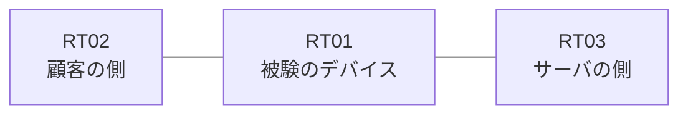

# 問題 20260824-008

> **本問は機器に接続せずに解答すること。追加の show 実行は認めない。**

## シナリオ

あなたは、下記のネットワークの保守を担当する技術者です。ある企業のネットワークにおいて、RT01 は、顧客の側のネットワークと、サーバの側のネットワークとの間に配置されており、IPv6 によって運用されています。`2001:DB8:88:85::/64` からの通信は、許可されることはできません。管理のための構成に対して、変更が加えられてはなりません。対象としていないネットワークが、一致の対象に含まれてはなりません。また、エントリの行数は、最小でなければなりません。RT01 において、`2001:DB8:88:80::/64`、`2001:DB8:88:81::/64`、`2001:DB8:88:82::/64` のネットワークからの通信のみが、`2001:DB8:88:FF::10` の TCP ポート 80 に到達できなければなりません。`2001:DB8:88:83::/64` からの通信は、許可されてはなりません。



## 出力

```
RT01# show ipv6 access-list
IPv6 access list V6-CUST-IN
    permit ipv6 2001:DB8:88:80::/61 any sequence 10
    deny ipv6 2001:DB8:88:85::/64 any sequence 20
```
```
RT01# show running-config | section ipv6 access-list|traffic-filter
ipv6 access-list V6-CUST-IN
 sequence 10 permit ipv6 2001:DB8:88:80::/61 any
 sequence 20 deny ipv6 2001:DB8:88:85::/64 any
interface Ethernet0/0
 ipv6 traffic-filter V6-CUST-IN in
```

## 設問

送信元が 2001:DB8:88:85::5 である1つのパケット が処理されるとき、一致のカウンタが増加するのは、どの行ですか。(1つを選択してください)

## 選択肢
A. `permit ipv6 2001:DB8:88:80::/61 any sequence 10` の行

B. いずれの行のカウンタも増加しない(暗黙の拒否によって処理される)

C. `deny ipv6 2001:DB8:88:85::/64 any sequence 20` の行
