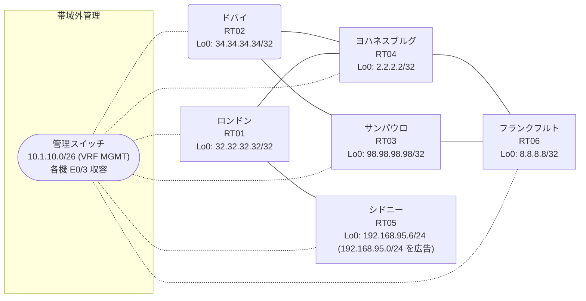

# 問題 20260825-001

> **本問は機器に接続せずに解答すること。追加の show 実行は認めない。**

## トポロジ

あなたは、下記のネットワークの保守を担当する技術者です。あなたの会社のネットワークは、OSPF のドメインと EIGRP のドメインとが、2 つの境界のルーターによって接続され、そして、それらは境界において接続されています。顧客のネットワーク `192.168.95.0/24` は、シドニー のサイトにおいて、別のルーティング プロトコルによって学習され、そして、再配送によって、社内へ持ち込まれています。ルーティングの設計の詳細は、示されているところのコンフィギュレーションから、読み取られることが、期待されています。



| 拠点 | ルータ | 拠点網 / 広告網 |
|------|--------|------------------|
| サンパウロ | RT03 | 98.98.98.98/32 |
| シドニー | RT05 | 192.168.95.6/24 (`192.168.95.0/24` を広告) |
| ドバイ | RT02 | 34.34.34.34/32 |
| フランクフルト | RT06 | 8.8.8.8/32 |
| ヨハネスブルグ | RT04 | 2.2.2.2/32 |
| ロンドン | RT01 | 32.32.32.32/32 |

リンク一覧:
```
  RT03:E0/0(.1) ── RT02:E0/0(.2)   172.16.84.0/24
  RT03:E0/1(.1) ── RT06:E0/0(.3)   172.16.126.0/24
  RT02:E0/1(.2) ── RT04:E0/0(.4)   172.16.14.0/24
  RT06:E0/1(.3) ── RT04:E0/1(.4)   172.16.60.0/24
  RT04:E0/2(.4) ── RT01:E0/0(.5)   172.16.114.0/24
  RT01:E0/1(.5) ── RT05:E0/0(.6)   172.16.41.0/24
```

## 要件

1. 管理のための構成に対して、変更が加えられてはなりません。
2. すべてのサイトから、`192.168.95.0/24` を含むところのすべての宛先へ、到達することができること。
3. スタティック ルートおよび既定のルートによる迂回は、実施されてはなりません。
4. `192.168.95.0/24` 宛のパケットが、広告元である RT05 の方向へ転送され、そして、転送のループが存在していないこと。
5. 既存の相互再配送の設計が、削除または停止されることはできません。

## 現在の状態

示されているところの構成は、現在、稼働中のネットワークから、取得されたものです。到達性に関する報告は、この時点では、確認されていません。


## 設定抜粋

```
RT03# show running-config | section router
router ospf 25
 router-id 98.98.98.98
 network 98.98.98.98 0.0.0.0 area 0
 network 172.16.84.0 0.0.0.255 area 0
 network 172.16.126.0 0.0.0.255 area 0
```
```
RT02# show running-config | section router
router eigrp 67
 network 172.16.14.0 0.0.0.255
 redistribute ospf 25 metric 1000000 1 255 1 1500
router ospf 25
 router-id 34.34.34.34
 redistribute eigrp 67
 network 34.34.34.34 0.0.0.0 area 0
 network 172.16.84.0 0.0.0.255 area 0
```
```
RT06# show running-config | section router
router eigrp 67
 network 172.16.60.0 0.0.0.255
 redistribute ospf 25 metric 1000000 1 255 1 1500
router ospf 25
 router-id 8.8.8.8
 redistribute eigrp 67
 network 8.8.8.8 0.0.0.0 area 0
 network 172.16.126.0 0.0.0.255 area 0
```
```
RT04# show running-config | section router
router eigrp 67
 network 2.2.2.2 0.0.0.0
 network 172.16.14.0 0.0.0.255
 network 172.16.60.0 0.0.0.255
 network 172.16.114.0 0.0.0.255
```
```
RT01# show running-config | section router
router eigrp 67
 network 32.32.32.32 0.0.0.0
 network 172.16.41.0 0.0.0.255
 network 172.16.114.0 0.0.0.255
```
```
RT05# show running-config | section router
router eigrp 67
 network 172.16.41.0 0.0.0.255
 redistribute rip metric 1000000 1 255 1 1500
router rip
 version 2
 network 192.168.95.0
 no auto-summary
```

## 設問

RT03 から、`192.168.95.0/24` 内のホスト宛に送信されるパケットの転送について、正しい記述は、どれですか。(1つを選択してください)

## 選択肢
A. RT03・RT02・RT06・RT04 の間で転送が繰り返され、宛先に到達しない

B. 境界の 2 台が経路を交互に選択し、断続的に宛先に到達する

C. RT05 が当該網を広告しておらず、RT04 において宛先が不明となる

D. RT04 において当該宛先への経路が存在せず、RT04 で破棄される

E. RT04 が RT01 方向と境界方向の等コスト分散を行い、一部のパケットのみが宛先に到達する

F. RT04 から RT01 を経由して RT05 へ転送され、宛先に到達する
