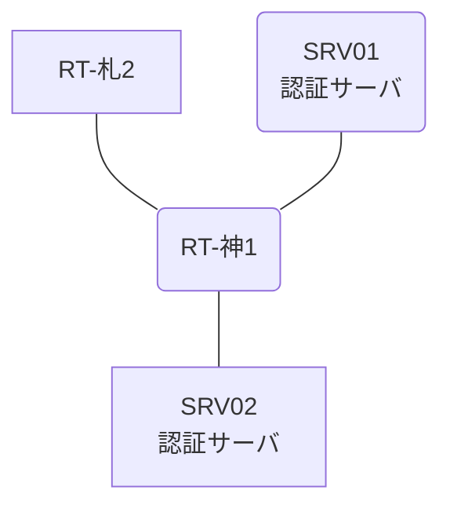

# 問題 20260825-002

> **本問は機器に接続せずに解答すること。追加の show 実行は認めない。**

## トポロジ

あなたは、下記のネットワークの保守を担当する技術者です。2 つの拠点のルータが、共通の認証サーバ群を用いて、管理者の認証を行うように構成されています。一方のルータはサーバと直結しており、他方はそのルーターを経由してサーバに到達します。



### 認証サーバの仕様

| 項目 | SRV01 | SRV02 |
|---|---|---|
| アドレス | 10.99.141.2 | 10.99.142.2 |
| 待受ポート | 1812 / 1813 | 11812 / 11813 |
| 共有鍵 | Rad-8102 | Rad-8102 |
| 受理する送信元 | 10.5.0.1 ・ 10.7.0.2 | 同左 |
| 台帳 | noc-hanako(15) ・ desk-01(1) ・ SUZUKI(15) | 同左 |
| 現在の稼働状態 | 稼働中 | 稼働中 |

### ルータのアドレス

| ルータ | Loopback0 | 認証サーバ方向のインタフェース |
|---|---|---|
| RT-神1(神戸) | 10.5.0.1 | Ethernet0/0 = 10.99.141.1 |
| RT-札2(札幌) | 10.7.0.2 | Ethernet0/0 = 10.91.12.2 |

## 要件

1. 神戸・札幌 の両拠点で、利用者 noc-hanako が権限レベル 15 で機器を操作できること。
2. 認証は認証サーバ群 NOC-RADIUS を用いること。
3. 運用者の遠隔からの接続が失われないこと。
4. 緊急時にコンソールから操作できる経路を失わないこと。

## 現在の状態

ユーザーから、通信に関する事象が、報告されています。あなたは、提示されているところの情報のみを使用して、要求されている状態が満たされていない理由を、特定しなければなりません。

| 拠点 | ユーザ | 結果 |
|---|---|---|
| 神戸 | noc-hanako | ログイン可(権限レベル 15) |
| 神戸 | desk-01 | ログイン可(権限レベル 1) |
| 神戸 | backup-adm | ログイン不可 |
| 神戸 | desk-01 からの特権昇格 | 昇格不可 |
| 神戸 | noc-hanako(6 セッション目以降) | ログイン可(権限レベル 15) |
| 神戸 | backup-adm(コンソールから) | ログイン可(権限レベル 15) |
| 神戸 | noc-hanako(ログインに要する時間) | 即時 |
| 札幌 | noc-hanako | ログイン可(権限レベル 15) |
| 札幌 | desk-01 | ログイン可(権限レベル 1) |
| 札幌 | backup-adm | ログイン不可 |
| 札幌 | desk-01 からの特権昇格 | 昇格可(15) |
| 札幌 | noc-hanako(6 セッション目以降) | ログイン可(権限レベル 15) |
| 札幌 | backup-adm(コンソールから) | ログイン可(権限レベル 15) |
| 札幌 | noc-hanako(ログインに要する時間) | 即時 |

認証サーバがすべて停止した場合:

| 拠点 | ユーザ | 結果 |
|---|---|---|
| 神戸 | backup-adm | ログイン可(権限レベル 15) |
| 神戸 | SUZUKI | ログイン可(権限レベル 15) |
| 神戸 | backup-adm(コンソールから) | ログイン可(権限レベル 15) |
| 札幌 | backup-adm | ログイン可(権限レベル 15) |
| 札幌 | SUZUKI | ログイン可(権限レベル 15) |
| 札幌 | backup-adm(コンソールから) | ログイン可(権限レベル 15) |

```
神戸: User was successfully authenticated. (即時)
札幌: User was successfully authenticated. (即時)
```

## 設定抜粋

```
RT-神1# show running-config | section aaa
aaa new-model
!
radius server RAD1
 address ipv4 10.99.141.2 auth-port 1812 acct-port 1813
 key Rad-8102
!
radius server RAD2
 address ipv4 10.99.142.2 auth-port 11812 acct-port 11813
 key Rad-8102
!
aaa group server radius NOC-RADIUS
 server name RAD1
 server name RAD2
 deadtime 5
!
aaa authentication login default group NOC-RADIUS local
aaa authentication login CONSOLE local
aaa authentication enable default group NOC-RADIUS enable
aaa authorization exec default group NOC-RADIUS local
aaa authorization exec CONSOLE local
aaa authorization console
!
ip radius source-interface Loopback0
radius-server timeout 5
radius-server retransmit 2
radius-server dead-criteria time 5 tries 1
!
username backup-adm privilege 15 secret 5 $1$xxxx
username SUZUKI privilege 15 secret 5 $1$yyyy
!
line con 0
 exec-timeout 0 0
 logging synchronous
 login authentication CONSOLE
 authorization exec CONSOLE
line vty 0 4
 exec-timeout 0 0
 transport input ssh
line vty 5 15
 exec-timeout 0 0
 transport input ssh
```
```
RT-札2# show running-config | section aaa
aaa new-model
!
radius server RAD1
 address ipv4 10.99.141.2 auth-port 1812 acct-port 1813
 key Rad-8102
!
radius server RAD2
 address ipv4 10.99.142.2 auth-port 11812 acct-port 11813
 key Rad-8102
!
aaa group server radius NOC-RADIUS
 server name RAD1
 server name RAD2
 deadtime 5
!
aaa authentication login default group NOC-RADIUS local
aaa authentication login CONSOLE local
aaa authorization exec default group NOC-RADIUS local
aaa authorization exec CONSOLE local
aaa authorization console
!
ip radius source-interface Loopback0
radius-server timeout 5
radius-server retransmit 2
radius-server dead-criteria time 5 tries 1
!
username backup-adm privilege 15 secret 5 $1$xxxx
username SUZUKI privilege 15 secret 5 $1$yyyy
!
line con 0
 exec-timeout 0 0
 logging synchronous
 login authentication CONSOLE
 authorization exec CONSOLE
line vty 0 4
 exec-timeout 0 0
 transport input ssh
line vty 5 15
 exec-timeout 0 0
 transport input ssh
```

## 設問

次のうち、正しいものは、どれですか。

## 選択肢
A. 認証サーバの利用者台帳に当該利用者が登録されていない。

B. 特権レベルへの昇格の認証が認証サーバ経由になっている。

C. 作成した方式リストが回線に適用されていない。

D. アクセスリストが、認証サーバからの応答を遮断している。
