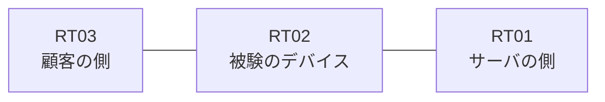

# 問題 20260825-003

> **本問は機器に接続せずに解答すること。追加の show 実行は認めない。**

## シナリオ

あなたの組織は、下記に示されているところのネットワークを運用しています。ある企業のネットワークにおいて、RT02 は、顧客の側のネットワークと、サーバの側のネットワークとの間に、配置されています。本作業は、日中の時間帯において実施されるという理由により、対象外であるところのデバイスに対する構成の変更は、許可されていません。変更は、必要最小限に留められなければなりません。RT02 において、`10.152.56.0/24`、`10.152.57.0/24`、`10.152.58.0/24` のネットワークからの通信のみが、アドレスの変換の対象とされる必要があります。



| 区間 | 被験デバイス側のインターフェイス | ネットワーク |
|------|----------------------------------|--------------|
| RT03（顧客の側） ⇔ RT02 | — | 10.152.253.0/24 |
| RT02 ⇔ RT01（サーバの側） | — | 10.152.254.0/24 |

## 出力

```
RT02# show running-config | section access-group|distribute-list|verify unicast|ip nat|access-class|class-map
 ip nat inside source list 20 interface Ethernet0/1 overload
```
```
RT02# show ip access-lists
Standard IP access list 20
    10 deny   10.152.56.0, wildcard bits 0.0.1.255
    20 permit 10.152.56.0, wildcard bits 0.0.7.255
```

## 設問

示されているところの構成において、変換されるものは、どれですか。(1つを選択してください)

## 選択肢
A. 送信元が 10.152.56.5 であるホストから、外部のネットワーク宛ての通信

B. 送信元が 10.152.61.5 であるホストから、外部のネットワーク宛ての通信

C. 送信元が 10.152.57.5 であるホストから、外部のネットワーク宛ての通信

D. 送信元が 10.152.250.5 であるホストから、外部のネットワーク宛ての通信
