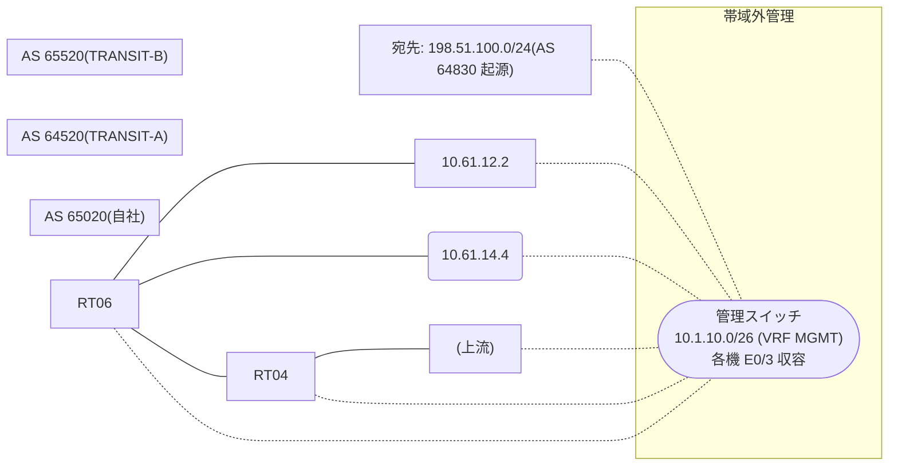

# 問題 20260825-004

> **本問は機器に接続せずに解答すること。追加の show 実行は認めない。**

## シナリオ

あなたは、下記のネットワークの保守を担当する技術者です。自社のルータ RT06 は、外部のネットワーク 198.51.100.0/24 への到達性を、複数の経路を通じて、確立しています。 TRANSIT-A とは、接続されています。 TRANSIT-B とも、接続されています。 一部の経路は、自 AS 内の境界ルータから、iBGP で、学習されています。外部との 1 つのセッションが失われ、それまで使用されていたところの経路は、取り下げられました。ルータは、残るところの経路からの、ベストパスの選出を、行おうとしています。示されているところの出力は、その時点で、採取されたものです。示されているところの出力、および、構成に基づいて、判断すること。なお、機器の構成は、示されている抜粋のほかは、既定値である。



## 出力

```
RT06# show running-config | section router bgp
router bgp 65020
 bgp router-id 76.76.76.76
 bgp log-neighbor-changes
 bgp bestpath compare-routerid
 neighbor 6.6.6.6 remote-as 65020
 neighbor 6.6.6.6 update-source Loopback0
 neighbor 10.61.12.2 remote-as 64520
 neighbor 10.61.14.4 remote-as 65520
 !
 address-family ipv4
  neighbor 6.6.6.6 activate
  neighbor 10.61.12.2 activate
  neighbor 10.61.14.4 activate
 exit-address-family
```
```
RT06# show ip bgp 198.51.100.0
BGP routing table entry for 198.51.100.0/24, version 11
BGP Bestpath: compare-routerid
Paths: (3 available, no best path)
  Not advertised to any peer
  Refresh Epoch 4
  64520 64520 64830 64830
    6.6.6.6 (metric 101) from 6.6.6.6 (6.6.6.6)
      Origin IGP, localpref 100, valid, internal
      rx pathid: 0, tx pathid: 0
      Updated on Mar 25 2026 19:10:56 UTC
  Refresh Epoch 2
  65520 64830
    10.61.14.4 from 10.61.14.4 (221.221.221.221)
      Origin IGP, metric 80, localpref 100, valid, external
      rx pathid: 0, tx pathid: 0
      Updated on Mar 25 2026 18:27:14 UTC
  Refresh Epoch 1
  64520 64830
    10.61.12.2 from 10.61.12.2 (170.170.170.170)
      Origin IGP, metric 400, localpref 100, valid, external
      rx pathid: 0, tx pathid: 0
      Updated on Mar 25 2026 17:05:07 UTC
```
```
RT06# show ip bgp
BGP table version is 11, local router ID is 76.76.76.76
Status codes: s suppressed, d damped, h history, * valid, > best, i - internal, 
              r RIB-failure, S Stale, m multipath, b backup-path, f RT-Filter, 
              x best-external, a additional-path, c RIB-compressed, 
              t secondary path, L long-lived-stale,
Origin codes: i - IGP, e - EGP, ? - incomplete
RPKI validation codes: V valid, I invalid, N Not found

     Network          Next Hop            Metric LocPrf Weight Path
 * i  198.51.100.0     6.6.6.6                       100      0 64520 64520 64830 64830 i
 *                     10.61.14.4              80             0 65520 64830 i
 *                     10.61.12.2             400             0 64520 64830 i
```

## 設問

示されているところの出力に基づいて、この後、198.51.100.0/24 のベストパスとして選出され、転送に使用されるところの経路は、どれですか。(1つを選択してください)

## 選択肢
A. next hop 10.61.14.4 の経路

B. next hop 6.6.6.6 の経路

C. いずれの経路も、ベストパスとして、選出されない

D. next hop 10.61.12.2 の経路
