# 問題 20260825-005

> **本問は機器に接続せずに解答すること。追加の show 実行は認めない。**

## シナリオ

あなたは、下記のネットワークの保守を担当する技術者です。クライアントである C1 は OSPFv3 の ドメイン に、そして、C2 は EIGRP の ドメイン に、それぞれ収容されています。RT-C は、2 つの ドメイン の境界に位置しており、双方向の 再配送 が構成されています。ユーザーから、通信に関する事象が、報告されています。あなたは、提示されているところの情報のみを使用して、要求されている状態が満たされていない理由を、特定しなければなりません。C1 と C2 は、相互に 通信 できなければなりません。ルーティング プロトコル において デフォルト の ルート を生成することは、認められていません。インタフェースの IP アドレッシングは、変更されてはなりません。RT-C における 再配送 および フィルター の 構成は、変更されることはできません。

```mermaid
graph LR
  RTC --- RA
  C2 --- RB
  C2["C2<br/>クライアント<br/>EIGRP AS 1"]
  C1("C1<br/>クライアント<br/>OSPFv3 10")
  RB["RB<br/>中継"]
  RB --- RTC
  RTC("RT-C<br/>ASBR<br/>双方向の再配送")
  RA["RA<br/>中継"]
  C1 --- RA
  subgraph OOB["帯域外管理"]
    MGMTSW(["管理スイッチ<br/>10.1.10.0/26 (VRF MGMT)<br/>各機 E0/3 収容"])
  end
  C1 -.- MGMTSW
  RA -.- MGMTSW
  RTC -.- MGMTSW
  RB -.- MGMTSW
  C2 -.- MGMTSW
```



| ルータ | 位置づけ | 参加プロトコル |
|--------|----------|----------------|
| C1 | クライアント | OSPFv3 10 area 0 |
| RA | 中継 | OSPFv3 10 area 0 |
| RT-C | **ASBR(2 つの ドメイン の 境界)** | 双方向の 再配送 |
| RB | 中継 | EIGRP NAMED AS 1 |
| C2 | クライアント | EIGRP NAMED AS 1 |

リンク一覧:
```
  (a) C1:Et0/0         ── RA:Et0/1           2001:DB8:20:A::/64    C1 = 2001:DB8:20:A::2
  (b) RA:Et0/0         ── RT-C:Ethernet0/0   2001:DB8:1A:AA::/64
  (c) RT-C:Ethernet0/1 ── RB:Et0/0           2001:DB8:10:1::/64
  (d) RB:Et0/1         ── C2:Et0/0           2001:DB8:1:B::/64     C2 = 2001:DB8:1:B::2
```

OSPFv3 の ドメイン には、RA によって注入されたところの 外部の ルート `2001:DB8:C:20::/64` が存在する。

## 出力

```
C1# show ipv6 route ospf | include ^O|via
OE2 2001:DB8:1:B::/64 [110/20]
     via FE80::A8BB:CCFF:FE01:5D00, Ethernet0/0
OE2 2001:DB8:C:20::/64 [110/20]
     via FE80::A8BB:CCFF:FE01:5D00, Ethernet0/0
OE2 2001:DB8:10:1::/64 [110/20]
     via FE80::A8BB:CCFF:FE01:5D00, Ethernet0/0
```
```
RB# show ipv6 route eigrp | include ^D|^EX|via
(no entries)
```
```
C1# ping 2001:DB8:1:B::2
Type escape sequence to abort.
Sending 5, 100-byte ICMP Echos to 2001:DB8:1:B::2, timeout is 2 seconds:
.....
Success rate is 0 percent (0/5)

C2# ping 2001:DB8:20:A::2
Type escape sequence to abort.
Sending 5, 100-byte ICMP Echos to 2001:DB8:20:A::2, timeout is 2 seconds:

% No valid route for destination
Success rate is 0 percent (0/1)
```
```
RT-C# show running-config
Building configuration...
!
interface Ethernet0/0
 description === to RA ===
 no ip address
 ipv6 address 2001:DB8:1A:AA::1/64
 ipv6 enable
 ipv6 ospf 10 area 0
!
interface Ethernet0/1
 description === to RB ===
 no ip address
 ipv6 address 2001:DB8:10:1::1/64
 ipv6 enable
!
router eigrp NAMED
 !
 address-family ipv6 unicast autonomous-system 1
  !
  af-interface Ethernet0/0
   shutdown
  exit-af-interface
  !
  topology base
   redistribute ospf 10 match internal metric 100000 100 255 1 1500 route-map EMAP011 include-connected
  exit-af-topology
  eigrp router-id 4.4.7.7
 exit-address-family
!
router ospfv3 10
 router-id 8.7.3.6
 !
 address-family ipv6 unicast
  redistribute eigrp 1 route-map MAP-IN include-connected
 exit-address-family
!
ipv6 prefix-list O544 seq 5 permit 2001:DB8:1A:AA::/64
ipv6 prefix-list PL-EIGRP seq 5 permit 2001:DB8:1A:AA::/64
ipv6 prefix-list PL-EIGRP seq 10 permit 2001:DB8:20:A::/64
ipv6 prefix-list PL-OSPF seq 5 permit 2001:DB8:20:A::/64
ipv6 prefix-list PL-OSPF seq 10 permit 2001:DB8:1:B::/64
ipv6 prefix-list PL-REDIST seq 5 permit 2001:DB8:10:1::/64
ipv6 prefix-list PL-REDIST seq 10 permit 2001:DB8:1:B::/64
!
route-map EMAP01 permit 10
 match ipv6 address prefix-list PL-EIGRP
route-map MAP-IN permit 10
 match ipv6 address prefix-list PL-REDIST
route-map OMAP01 permit 10
 match ipv6 address prefix-list O544
!
```

## 設問

次のうち、正しいものは、どれですか。

## 選択肢
**A.**
```
router eigrp NAMED
 address-family ipv6 unicast autonomous-system 1
  topology base
   no redistribute ospf 10
   redistribute ospf 10 match internal include-connected
  exit-af-topology
 exit-address-family
exit
router ospfv3 10
 address-family ipv6 unicast
  no redistribute eigrp 1
  redistribute eigrp 1 include-connected
 exit-address-family
exit
```

**B.**
```
router eigrp NAMED
 address-family ipv6 unicast autonomous-system 1
  topology base
   no redistribute ospf 10
   redistribute ospf 10 match internal metric 100000 100 255 1 1500 route-map EMAP01 include-connected
  exit-af-topology
 exit-address-family
exit
```

**C.**
```
no ipv6 prefix-list PL-EIGRP
no ipv6 prefix-list PL-REDIST
```

**D.**
```
router eigrp NAMED
 address-family ipv6 unicast autonomous-system 1
  af-interface Ethernet0/1
   summary-address ::/0
  exit-af-interface
 exit-address-family
exit
router ospfv3 10
 address-family ipv6 unicast
  default-information originate always
 exit-address-family
exit
```

**E.**
```
! --- RA ---
ipv6 route 2001:DB8:1:B::/64 2001:DB8:1A:AA::1
! --- RB ---
ipv6 route 2001:DB8:20:A::/64 2001:DB8:10:1::1
! --- C1 ---
ipv6 route ::/0 2001:DB8:20:A::1
! --- C2 ---
ipv6 route ::/0 2001:DB8:1:B::1
```
