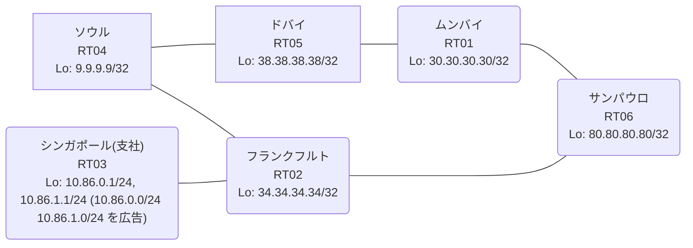

# 問題 20260825-006

> **本問は機器に接続せずに解答すること。追加の show 実行は認めない。**

## シナリオ

あなたは、ネットワークの運用を担当しています。あなたの会社のネットワークは、支社のドメインと、本社のコアのドメイン(OSPF)とが、2 台の境界のルータによって接続され、そして、それらは境界において接続されています。支社のネットワーク `10.86.0.0/24` および `10.86.1.0/24` は、RT03 によって、広告されています。どちらの境界が失われた場合においても、通信が継続されることができるように、設計されています。ルーティングの設計の詳細は、示されているところの出力から、読み取られることが、期待されています。ユーザーから、通信に関する事象が、報告されています。あなたは、示されているところの出力および構成に基づいて、その構成が、下記において記述されているとおりに動作していない理由を、判断する必要があります。二点相互再配送による、冗長の設計が、維持される必要があります。支社のネットワーク宛のトラフィックが RT03 へ配送され、経路の周回が、発生していないこと。ルーティング・プロトコルの種別およびプロセスの配置は、変更されることはできません。すべてのサイトから、支社のネットワーク `10.86.0.0/24` および `10.86.1.0/24` を含むところの、すべての宛先へ、到達することができること。スタティック ルートおよび既定のルートによる迂回は、実施されることはできません。



| 拠点 | ルータ | Loopback / 広告網 |
|------|--------|--------------------|
| サンパウロ | RT06 | 80.80.80.80/32 |
| シンガポール(支社) | RT03 | 10.86.0.1/24, 10.86.1.1/24 (`10.86.0.0/24` `10.86.1.0/24` を広告) |
| ソウル | RT04 | 9.9.9.9/32 |
| ドバイ | RT05 | 38.38.38.38/32 |
| フランクフルト | RT02 | 34.34.34.34/32 |
| ムンバイ | RT01 | 30.30.30.30/32 |

リンク一覧:
```
  RT03:E0/0(.2) ── RT02:E0/0(.1)   10.184.11.0/30
  RT02:E0/1(.1) ── RT06:E0/0(.2)   10.138.240.0/30
  RT02:E0/2(.1) ── RT04:E0/0(.2)   10.209.227.0/30
  RT06:E0/1(.1) ── RT01:E0/0(.2)   172.16.7.0/30
  RT01:E0/1(.1) ── RT05:E0/0(.2)   172.16.88.0/30
  RT04:E0/1(.1) ── RT05:E0/1(.2)   172.16.164.0/30
```

## 出力

```
RT04# show running-config | section router
router ospf 1
 router-id 9.9.9.9
 redistribute rip
 network 9.9.9.9 0.0.0.0 area 0
 network 172.16.164.0 0.0.0.3 area 0
router rip
 version 2
 redistribute ospf 1 metric 1
 network 9.0.0.0
 network 10.0.0.0
 no auto-summary
```
```
RT06# show running-config | section router
router ospf 1
 router-id 80.80.80.80
 redistribute rip
 network 80.80.80.80 0.0.0.0 area 0
 network 172.16.7.0 0.0.0.3 area 0
router rip
 version 2
 redistribute ospf 1 metric 1
 network 10.0.0.0
 network 80.0.0.0
 no auto-summary
```
```
RT02# show ip route
Gateway of last resort is not set
      9.0.0.0/32 is subnetted, 1 subnets
R        9.9.9.9 [120/1] via 10.209.227.2, 00:00:09, Ethernet0/2
                 [120/1] via 10.138.240.2, 00:00:15, Ethernet0/1
      10.0.0.0/8 is variably subnetted, 8 subnets, 3 masks
R        10.86.0.0/24 [120/1] via 10.184.11.2, 00:00:01, Ethernet0/0
                      [120/1] via 10.138.240.2, 00:00:15, Ethernet0/1
R        10.86.1.0/24 [120/1] via 10.184.11.2, 00:00:01, Ethernet0/0
                      [120/1] via 10.138.240.2, 00:00:15, Ethernet0/1
C        10.138.240.0/30 is directly connected, Ethernet0/1
L        10.138.240.1/32 is directly connected, Ethernet0/1
C        10.184.11.0/30 is directly connected, Ethernet0/0
L        10.184.11.1/32 is directly connected, Ethernet0/0
C        10.209.227.0/30 is directly connected, Ethernet0/2
L        10.209.227.1/32 is directly connected, Ethernet0/2
      30.0.0.0/32 is subnetted, 1 subnets
R        30.30.30.30 [120/1] via 10.209.227.2, 00:00:09, Ethernet0/2
                     [120/1] via 10.138.240.2, 00:00:15, Ethernet0/1
      34.0.0.0/32 is subnetted, 1 subnets
C        34.34.34.34 is directly connected, Loopback0
      38.0.0.0/32 is subnetted, 1 subnets
R        38.38.38.38 [120/1] via 10.209.227.2, 00:00:09, Ethernet0/2
                     [120/1] via 10.138.240.2, 00:00:15, Ethernet0/1
      80.0.0.0/32 is subnetted, 1 subnets
R        80.80.80.80 [120/1] via 10.209.227.2, 00:00:09, Ethernet0/2
                     [120/1] via 10.138.240.2, 00:00:15, Ethernet0/1
      172.16.0.0/30 is subnetted, 3 subnets
R        172.16.7.0 [120/1] via 10.209.227.2, 00:00:09, Ethernet0/2
                    [120/1] via 10.138.240.2, 00:00:15, Ethernet0/1
R        172.16.88.0 [120/1] via 10.209.227.2, 00:00:09, Ethernet0/2
                     [120/1] via 10.138.240.2, 00:00:15, Ethernet0/1
R        172.16.164.0 [120/1] via 10.209.227.2, 00:00:09, Ethernet0/2
                      [120/1] via 10.138.240.2, 00:00:15, Ethernet0/1
```
```
RT04# show ip route 10.86.0.0
Routing entry for 10.86.0.0/24
  Known via "rip", distance 120, metric 2
  Redistributing via ospf 1, rip
  Advertised by ospf 1 subnets
  Last update from 10.209.227.1 on Ethernet0/0, 00:00:24 ago
  Routing Descriptor Blocks:
  * 10.209.227.1, from 10.209.227.1, 00:00:24 ago, via Ethernet0/0
      Route metric is 2, traffic share count is 1
```
```
RT05# traceroute 10.86.0.1 probe 1 timeout 1 ttl 1 8
Type escape sequence to abort.
Tracing the route to 10.86.0.1
VRF info: (vrf in name/id, vrf out name/id)
  1 172.16.164.1 1 msec
  2 10.209.227.1 5 msec
  3 10.138.240.2 1 msec
  4 172.16.7.2 2 msec
  5 172.16.88.2 2 msec
  6 172.16.164.1 3 msec
  7 10.209.227.1 3 msec
  8 10.138.240.2 5 msec
```

## 設問

次のうち、正しいものは、どれですか。

## 選択肢
A. 等コストの複数経路による正常な負荷分散であり、事象は仕様どおりである

B. RT03 が支社網を広告しておらず、正規の経路が存在しない

C. RT02 が、境界で再注入された経路を、RT03 からの正規の経路と等価に扱っている

D. 支社網の経路が収束せず、境界の間で振動している

E. RT02 において、再注入された経路の管理距離が、正規の経路のそれより小さい

F. 境界の OSPF→RIP の再配送でメトリックが無限大となり、経路が広告されていない
