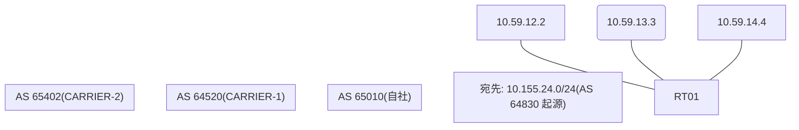

# 問題 20260825-010

> **本問は機器に接続せずに解答すること。追加の show 実行は認めない。**

## トポロジ

あなたは、下記のネットワークの保守を担当する技術者です。自社のルーター RT01 は、外部のネットワーク 10.155.24.0/24 への到達性を、複数の経路を通じて、確立しています。 CARRIER-1 とは、2 本のリンクで、接続されています。 CARRIER-2 とも、接続されています。



## 要件

1. RT01 における、10.155.24.0/24 への転送は、next hop 10.59.13.3 の経路を、使用すること。
2. この変更の影響は、当該のルータに、限定されること。AS 内の、ほかのルータの経路選択を、変更してはならない。
3. 各事業者から受信するところの MED の値は、相互に調整されていない、独自の値である。経路選択の判断基準として、使用してはならない。
4. なお、設定の投入後、変更は、適切に、反映されているものとする。

## 現在の状態

現在、10.155.24.0/24 への転送は、要件に適合しないところの経路を、使用しています。

```
RT01# show ip bgp 10.155.24.0
BGP routing table entry for 10.155.24.0/24, version 24
BGP Bestpath: compare-routerid
Paths: (3 available, best #2, table default)
  Advertised to update-groups:
     5         
  Refresh Epoch 1
  65402 65402 64830 64830
    10.59.14.4 from 10.59.14.4 (82.82.82.82)
      Origin IGP, localpref 100, valid, external
      rx pathid: 0, tx pathid: 0
      Updated on Mar 10 2026 10:35:56 UTC
  Refresh Epoch 3
  64520 64830
    10.59.12.2 from 10.59.12.2 (62.62.62.62)
      Origin IGP, localpref 100, valid, external, best
      rx pathid: 0, tx pathid: 0x0
      Updated on Mar 10 2026 08:18:14 UTC
  Refresh Epoch 2
  64520 64830
    10.59.13.3 from 10.59.13.3 (150.150.150.150)
      Origin IGP, localpref 100, valid, external
      rx pathid: 0, tx pathid: 0
      Updated on Mar 10 2026 08:03:07 UTC
```
```
RT01# show ip bgp
BGP table version is 24, local router ID is 175.175.175.175
Status codes: s suppressed, d damped, h history, * valid, > best, i - internal, 
              r RIB-failure, S Stale, m multipath, b backup-path, f RT-Filter, 
              x best-external, a additional-path, c RIB-compressed, 
              t secondary path, L long-lived-stale,
Origin codes: i - IGP, e - EGP, ? - incomplete
RPKI validation codes: V valid, I invalid, N Not found

     Network          Next Hop            Metric LocPrf Weight Path
 *    10.155.24.0/24   10.59.14.4                             0 65402 65402 64830 64830 i
 *>                    10.59.12.2                             0 64520 64830 i
 *                     10.59.13.3                             0 64520 64830 i
```

## 設定抜粋

```
RT01# show running-config | section router bgp
router bgp 65010
 bgp router-id 175.175.175.175
 bgp log-neighbor-changes
 bgp bestpath compare-routerid
 neighbor 10.59.12.2 remote-as 64520
 neighbor 10.59.13.3 remote-as 64520
 neighbor 10.59.14.4 remote-as 65402
 !
 address-family ipv4
  neighbor 10.59.12.2 activate
  neighbor 10.59.13.3 activate
  neighbor 10.59.14.4 activate
 exit-address-family
```

## 設問

示されているところのすべての要件が満たされることを確実にするために、適用されなければならない構成は、どれですか。(1つを選択してください)

## 選択肢
**A.**
```
router bgp 65010
 address-family ipv4
  neighbor 10.59.13.3 weight 30000
```

**B.**
```
route-map RM-MED-A permit 10
 set metric 200
route-map RM-MED-B permit 10
 set metric 10
router bgp 65010
 address-family ipv4
  neighbor 10.59.12.2 route-map RM-MED-A out
  neighbor 10.59.13.3 route-map RM-MED-B out
```

**C.**
```
route-map RM-BACKUP-OUT permit 10
 set as-path prepend 65010 65010
router bgp 65010
 address-family ipv4
  neighbor 10.59.12.2 route-map RM-BACKUP-OUT out
```

**D.**
```
clear ip bgp * soft
```

**E.**
```
router bgp 65010
 bgp always-compare-med
```

**F.**
```
route-map RM-PRIMARY-IN permit 10
 set local-preference 200
router bgp 65010
 address-family ipv4
  neighbor 10.59.13.3 route-map RM-PRIMARY-IN in
```
