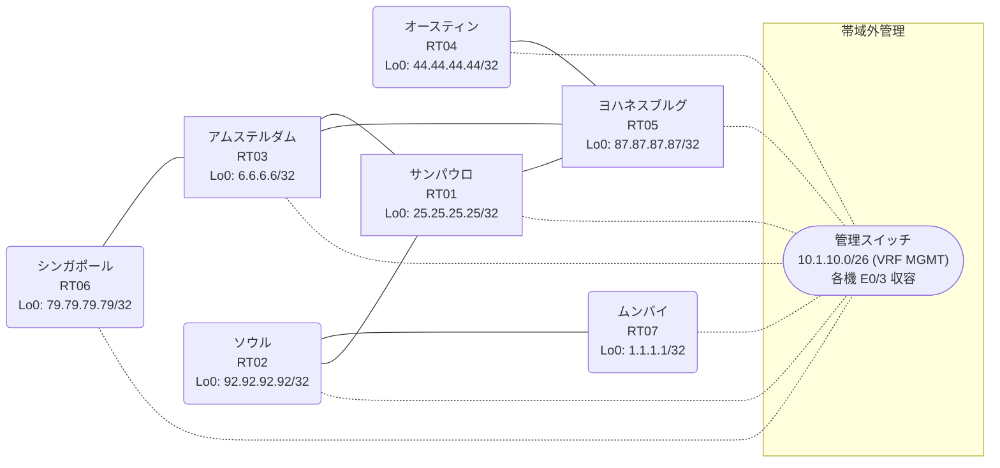

# 問題 20260825-011

> **本問は機器に接続せずに解答すること。追加の show 実行は認めない。**

## トポロジ

あなたの組織は、下記に示されているところのネットワークを運用しています。あなたの会社のネットワークは、複数のルーティング・ドメインが、境界のルータによって接続され、そして、すべての拠点のリーチアビリティが提供されている、というものです。ルーティングの設計の詳細は、示されているところの構成から、読み取られることが、期待されています。各拠点のルータと、拠点の網との対応は、下記の表に示されているとおりです。



| 拠点 | ルータ | 拠点網 |
|------|--------|----------------------|
| アムステルダム | RT03 | `6.6.6.6/32` |
| オースティン | RT04 | `44.44.44.44/32` |
| サンパウロ | RT01 | `25.25.25.25/32` |
| シンガポール | RT06 | `79.79.79.79/32` |
| ソウル | RT02 | `92.92.92.92/32` |
| ムンバイ | RT07 | `1.1.1.1/32` |
| ヨハネスブルグ | RT05 | `87.87.87.87/32` |

リンク一覧:
```
  RT01:E0/0(.1) ── RT03:E0/0(.2)   10.18.14.0/30
  RT02:E0/0(.1) ── RT07:E0/0(.2)   10.188.61.0/30
  RT03:E0/1(.1) ── RT05:E0/0(.2)   10.131.230.0/30
  RT01:E0/1(.1) ── RT05:E0/1(.2)   10.22.103.0/30
  RT01:E0/2(.1) ── RT02:E0/1(.2)   10.9.193.0/30
  RT05:E0/2(.1) ── RT04:E0/0(.2)   10.26.78.0/30
  RT03:E0/2(.1) ── RT06:E0/0(.2)   10.38.37.0/30
```

## 要件

1. 本作業は、日中の時間帯において実施されるという理由により、対象外であるところのデバイスに対する構成の変更は、許可されていません。
2. 再配送される経路の、選択的な制限は、実施されることはできません。
3. EIGRP へのルートの注入においては、redistribute のステートメントにおいて、シード メトリック `1000000 100 255 1 1500` が、直接に指定される必要があります。
4. 各サイトのネットワークは、ドメインをまたいで、すべてのサイトから、到達されることができること。
5. 存在しないプロセス/AS を参照するところの構成のステートメントが、残置されることはできません。

## 現在の状態

通信の一部において、想定されていない挙動が、観測されています。あなたは、提示されているところの情報のみを使用して、要求されている状態が満たされていない理由を、特定しなければなりません。

```
RT01# show ip prefix-list
ip prefix-list PL-BACKUP1: 2 entries
   seq 5 deny 6.6.6.6/32
   seq 10 permit 0.0.0.0/0 le 32
ip prefix-list PL-MIGR2: 2 entries
   seq 5 deny 44.44.44.44/32
   seq 10 permit 0.0.0.0/0 le 32
```
```
RT04# show ip route
Gateway of last resort is not set
      6.0.0.0/32 is subnetted, 1 subnets
D        6.6.6.6 [90/435200] via 10.26.78.1, 00:08:28, Ethernet0/0
      10.0.0.0/8 is variably subnetted, 6 subnets, 2 masks
D        10.18.14.0/30 [90/332800] via 10.26.78.1, 00:08:28, Ethernet0/0
D        10.22.103.0/30 [90/307200] via 10.26.78.1, 00:08:28, Ethernet0/0
C        10.26.78.0/30 is directly connected, Ethernet0/0
L        10.26.78.2/32 is directly connected, Ethernet0/0
D        10.38.37.0/30 [90/332800] via 10.26.78.1, 00:08:28, Ethernet0/0
D        10.131.230.0/30 [90/307200] via 10.26.78.1, 00:08:28, Ethernet0/0
      25.0.0.0/32 is subnetted, 1 subnets
D        25.25.25.25 [90/435200] via 10.26.78.1, 00:08:28, Ethernet0/0
      44.0.0.0/32 is subnetted, 1 subnets
C        44.44.44.44 is directly connected, Loopback0
      79.0.0.0/32 is subnetted, 1 subnets
D        79.79.79.79 [90/460800] via 10.26.78.1, 00:08:19, Ethernet0/0
      87.0.0.0/32 is subnetted, 1 subnets
D        87.87.87.87 [90/409600] via 10.26.78.1, 00:08:28, Ethernet0/0
```
```
RT06# show ip route
Gateway of last resort is not set
      6.0.0.0/32 is subnetted, 1 subnets
D        6.6.6.6 [90/409600] via 10.38.37.1, 00:09:01, Ethernet0/0
      10.0.0.0/8 is variably subnetted, 6 subnets, 2 masks
D        10.18.14.0/30 [90/307200] via 10.38.37.1, 00:09:01, Ethernet0/0
D        10.22.103.0/30 [90/332800] via 10.38.37.1, 00:09:01, Ethernet0/0
D        10.26.78.0/30 [90/332800] via 10.38.37.1, 00:09:01, Ethernet0/0
C        10.38.37.0/30 is directly connected, Ethernet0/0
L        10.38.37.2/32 is directly connected, Ethernet0/0
D        10.131.230.0/30 [90/307200] via 10.38.37.1, 00:09:01, Ethernet0/0
      25.0.0.0/32 is subnetted, 1 subnets
D        25.25.25.25 [90/435200] via 10.38.37.1, 00:09:01, Ethernet0/0
      44.0.0.0/32 is subnetted, 1 subnets
D        44.44.44.44 [90/460800] via 10.38.37.1, 00:08:59, Ethernet0/0
      79.0.0.0/32 is subnetted, 1 subnets
C        79.79.79.79 is directly connected, Loopback0
      87.0.0.0/32 is subnetted, 1 subnets
D        87.87.87.87 [90/435200] via 10.38.37.1, 00:09:01, Ethernet0/0
```
```
RT01# show access-lists
Standard IP access list 25
    10 deny   44.44.44.44
    20 permit any
Standard IP access list 78
    10 deny   6.6.6.6
    20 permit any
```
```
RT07# show ip route
Gateway of last resort is not set
      1.0.0.0/32 is subnetted, 1 subnets
C        1.1.1.1 is directly connected, Loopback0
      6.0.0.0/32 is subnetted, 1 subnets
O E2     6.6.6.6 [110/20] via 10.188.61.1, 00:07:57, Ethernet0/0
      10.0.0.0/8 is variably subnetted, 8 subnets, 2 masks
O        10.9.193.0/30 [110/20] via 10.188.61.1, 00:07:57, Ethernet0/0
O E2     10.18.14.0/30 [110/20] via 10.188.61.1, 00:07:57, Ethernet0/0
O E2     10.22.103.0/30 [110/20] via 10.188.61.1, 00:07:57, Ethernet0/0
O E2     10.26.78.0/30 [110/20] via 10.188.61.1, 00:07:57, Ethernet0/0
O E2     10.38.37.0/30 [110/20] via 10.188.61.1, 00:07:57, Ethernet0/0
O E2     10.131.230.0/30 [110/20] via 10.188.61.1, 00:07:57, Ethernet0/0
C        10.188.61.0/30 is directly connected, Ethernet0/0
L        10.188.61.2/32 is directly connected, Ethernet0/0
      25.0.0.0/32 is subnetted, 1 subnets
O        25.25.25.25 [110/21] via 10.188.61.1, 00:07:57, Ethernet0/0
      44.0.0.0/32 is subnetted, 1 subnets
O E2     44.44.44.44 [110/20] via 10.188.61.1, 00:07:57, Ethernet0/0
      79.0.0.0/32 is subnetted, 1 subnets
O E2     79.79.79.79 [110/20] via 10.188.61.1, 00:07:57, Ethernet0/0
      87.0.0.0/32 is subnetted, 1 subnets
O E2     87.87.87.87 [110/20] via 10.188.61.1, 00:07:57, Ethernet0/0
      92.0.0.0/32 is subnetted, 1 subnets
O        92.92.92.92 [110/11] via 10.188.61.1, 00:07:57, Ethernet0/0
```
```
RT01# show route-map
route-map RM-MIGR2, deny, sequence 10
  Match clauses:
    ip address prefix-lists: PL-MIGR2 
  Set clauses:
  Policy routing matches: 0 packets, 0 bytes
route-map RM-MIGR2, permit, sequence 20
  Match clauses:
  Set clauses:
  Policy routing matches: 0 packets, 0 bytes
route-map RM-BACKUP1, deny, sequence 10
  Match clauses:
    ip address prefix-lists: PL-BACKUP1 
  Set clauses:
  Policy routing matches: 0 packets, 0 bytes
route-map RM-BACKUP1, permit, sequence 20
  Match clauses:
  Set clauses:
  Policy routing matches: 0 packets, 0 bytes
```

## 設定抜粋

```
RT01# show running-config | section router
router eigrp 771
 network 10.18.14.0 0.0.0.3
 network 10.22.103.0 0.0.0.3
 network 25.25.25.25 0.0.0.0
 redistribute ospf 61 match internal external 1 external 2
 passive-interface Loopback0
router ospf 61
 router-id 25.25.25.25
 redistribute eigrp 771
 network 10.9.193.0 0.0.0.3 area 0
 network 25.25.25.25 0.0.0.0 area 0
```
```
RT02# show running-config | section router
router ospf 61
 router-id 92.92.92.92
 network 10.9.193.0 0.0.0.3 area 0
 network 10.188.61.0 0.0.0.3 area 0
 network 92.92.92.92 0.0.0.0 area 0
```
```
RT03# show running-config | section router
router eigrp 771
 timers active-time 5
 network 6.6.6.6 0.0.0.0
 network 10.18.14.0 0.0.0.3
 network 10.38.37.0 0.0.0.3
 network 10.131.230.0 0.0.0.3
 passive-interface Loopback0
```
```
RT04# show running-config | section router
router eigrp 771
 network 10.26.78.0 0.0.0.3
 network 44.44.44.44 0.0.0.0
```
```
RT05# show running-config | section router
router eigrp 771
 network 10.22.103.0 0.0.0.3
 network 10.26.78.0 0.0.0.3
 network 10.131.230.0 0.0.0.3
 network 87.87.87.87 0.0.0.0
```
```
RT06# show running-config | section router
router eigrp 771
 network 10.38.37.0 0.0.0.3
 network 79.79.79.79 0.0.0.0
```
```
RT07# show running-config | section router
router ospf 61
 router-id 1.1.1.1
 timers throttle spf 50 200 5000
 passive-interface Loopback0
 network 1.1.1.1 0.0.0.0 area 0
 network 10.188.61.0 0.0.0.3 area 0
```

## 設問

次のうち、正しいものは、どれですか。

## 選択肢
A. RT01 の router eigrp 771 への redistribute に seed metric が指定されていない

B. RT04 の router eigrp 771 で、上流側インタフェースが passive-interface に設定されている

C. RT01 の route-map RM-BACKUP1 が対象の経路を拒否している

D. RT01 の router eigrp 771 配下に redistribute が設定されていない

E. RT01 と RT04 側ドメインの間のリンクで MTU が一致していない

F. RT01 の router eigrp 771 配下の redistribute が、実在しないプロセス/AS を参照している
