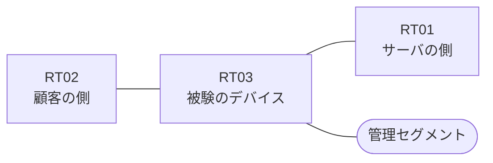

# 問題 20260825-013

> **本問は機器に接続せずに解答すること。追加の show 実行は認めない。**

## トポロジ

あなたは、ネットワークの運用を担当しています。ある企業のネットワークにおいて、RT03 は、顧客の側のネットワークと、サーバの側のネットワークとの間に、配置されています。



| 区間 | 被験デバイス側のインターフェイス | ネットワーク |
|------|----------------------------------|--------------|
| RT02（顧客の側） ⇔ RT03 | `Ethernet2/0` | 10.51.253.0/24 |
| RT03 ⇔ RT01（サーバの側） | `Ethernet2/1` | 10.51.254.0/24 |
| RT03 ⇔ 管理セグメント | `Ethernet2/2` | 10.51.255.0/24 |

## 要件

1. RT03 において、`10.51.128.0/24`、`10.51.129.0/24`、`10.51.130.0/24` のネットワークから、サーバである `172.20.55.68` の TCP ポート 22 への通信は、セッションを確立できなければなりません。
2. 往路のアクセス リストは `Ethernet2/0` に適用済みです。サーバの側のインターフェイスである `Ethernet2/1` に、着信の方向で適用するアクセス リストを構成します。
3. 当該のサーバの他のポートからの通信、および `172.20.55.196` からの通信は、許可されてはなりません。
4. ルーティング プロトコルの種別およびプロセスの配置は、変更されてはなりません。
5. サーバの側から**新たに開始される**通信は、許可されてはなりません。

## 現在の状態

```
RT03# show ip access-lists
Extended IP access list 150
    10 permit tcp 10.51.128.0 0.0.0.255 host 172.20.55.68 eq 22
    20 permit tcp 10.51.129.0 0.0.0.255 host 172.20.55.68 eq 22
    30 permit tcp 10.51.130.0 0.0.0.255 host 172.20.55.68 eq 22
```

## 設定抜粋

```
RT03# show running-config | section ^interface
interface Ethernet2/0
 description === to RT02 ===
 ip address 10.51.253.1 255.255.255.0
 ip access-group 150 in
interface Ethernet2/1
 description === to RT01 ===
 ip address 10.51.254.1 255.255.255.0
interface Ethernet2/2
 description === management ===
 ip address 10.51.255.1 255.255.255.0
```

## 設問

示されているところのすべての要件を満たすものは、どれですか。(1つを選択してください)

## 選択肢
**A.**
```
access-list 101 permit tcp 10.51.128.0 0.0.7.255 host 172.20.55.68 eq 22 established
```

**B.**
```
access-list 101 permit tcp host 172.20.55.68 any established
```

**C.**
```
access-list 101 permit tcp any eq 22 10.51.128.0 0.0.7.255 established
```

**D.**
```
access-list 101 permit tcp host 172.20.55.68 eq 22 10.51.128.0 0.0.7.255
```

**E.**
```
access-list 101 permit ip host 172.20.55.68 10.51.128.0 0.0.7.255
```

**F.**
```
access-list 101 permit tcp host 172.20.55.68 eq 22 10.51.128.0 0.0.7.255 established
```
