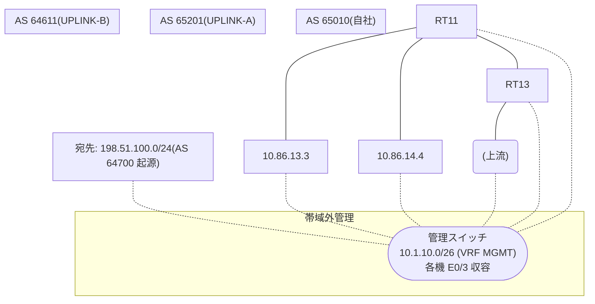

# 問題 20260825-014

> **本問は機器に接続せずに解答すること。追加の show 実行は認めない。**

## トポロジ

あなたは、ネットワークの運用を担当しています。自社のルーター RT11 は、外部のネットワーク 198.51.100.0/24 への到達性を、複数の経路を通じて、確立しています。 UPLINK-A とは、接続されています。 UPLINK-B とも、接続されています。 一部の経路は、自 AS 内の境界ルータから、iBGP で、学習されています。



## 要件

1. 示されているところの出力、および、構成に基づいて、判断すること。
2. なお、機器の構成は、示されている抜粋のほかは、既定値である。

## 現在の状態

運用チームは、AS 全体のトラフィックを UPLINK-A 経由とすることを意図して、境界ルータ RT13 に、示されているところの設定を、投入しました。しかしながら、RT11 のベストパスは、変更されていません。

```
RT11# show ip bgp
BGP table version is 32, local router ID is 228.228.228.228
Status codes: s suppressed, d damped, h history, * valid, > best, i - internal, 
              r RIB-failure, S Stale, m multipath, b backup-path, f RT-Filter, 
              x best-external, a additional-path, c RIB-compressed, 
              t secondary path, L long-lived-stale,
Origin codes: i - IGP, e - EGP, ? - incomplete
RPKI validation codes: V valid, I invalid, N Not found

     Network          Next Hop            Metric LocPrf Weight Path
 *>   198.51.100.0     10.86.14.4                             0 64611 64700 i
 *                     10.86.13.3                             0 65201 65201 64700 64700 i
 * i                   9.5.5.5                       100      0 65201 64700 i
```
```
RT11# show ip bgp 198.51.100.0
BGP routing table entry for 198.51.100.0/24, version 32
Paths: (3 available, best #1, table default)
  Advertised to update-groups:
     3         
  Refresh Epoch 2
  64611 64700
    10.86.14.4 from 10.86.14.4 (16.16.16.16)
      Origin IGP, localpref 100, valid, external, best
      rx pathid: 0, tx pathid: 0x0
      Updated on Jul 10 2026 14:58:03 UTC
  Refresh Epoch 1
  65201 65201 64700 64700
    10.86.13.3 from 10.86.13.3 (103.103.103.103)
      Origin IGP, localpref 100, valid, external
      rx pathid: 0, tx pathid: 0
      Updated on Jul 10 2026 13:14:56 UTC
  Refresh Epoch 2
  65201 64700
    9.5.5.5 (metric 11) from 9.5.5.5 (9.5.5.5)
      Origin IGP, localpref 100, valid, internal
      rx pathid: 0, tx pathid: 0
      Updated on Jul 10 2026 12:56:07 UTC
```

## 設定抜粋

```
RT11# show running-config | section router bgp
router bgp 65010
 bgp router-id 228.228.228.228
 bgp log-neighbor-changes
 neighbor 9.5.5.5 remote-as 65010
 neighbor 9.5.5.5 update-source Loopback0
 neighbor 10.86.13.3 remote-as 65201
 neighbor 10.86.14.4 remote-as 64611
 !
 address-family ipv4
  neighbor 9.5.5.5 activate
  neighbor 10.86.13.3 activate
  neighbor 10.86.14.4 activate
 exit-address-family
```
```
RT13# show running-config | section router bgp
router bgp 65010
 bgp router-id 9.5.5.5
 neighbor 228.228.228.228 remote-as 65010
 neighbor 228.228.228.228 update-source Loopback0
 neighbor 10.86.25.2 remote-as 65201
 !
 address-family ipv4
  neighbor 228.228.228.228 activate
  neighbor 228.228.228.228 next-hop-self
  neighbor 10.86.25.2 activate
  neighbor 10.86.25.2 weight 25000
 exit-address-family
```

## 設問

この事象の原因である可能性が、最も高いものは、どれですか。(1つを選択してください)

## 選択肢
A. 設定変更後に BGP セッションの再評価(clear)が行われていない

B. LOCAL_PREF は iBGP でのみ交換される属性であり、eBGP の近隣には送信されない

C. MED は、異なる隣接 AS から受信した経路の間では、既定では比較されない

D. weight は、それを設定したルータのローカルでのみ有効であり、iBGP の近隣には伝播しない
