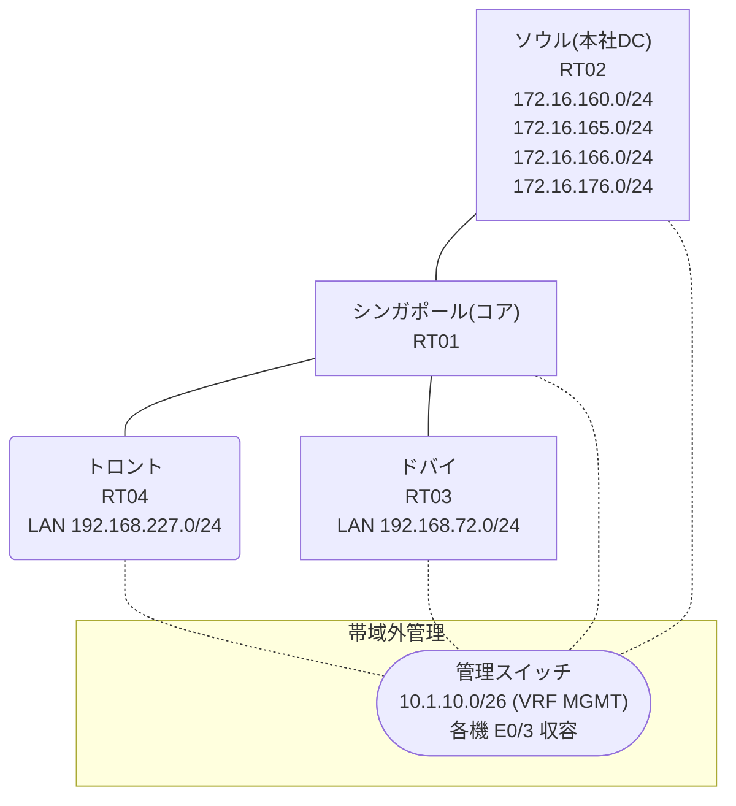

# 問題 20260825-015

> **本問は機器に接続せずに解答すること。追加の show 実行は認めない。**

## シナリオ

あなたは、ネットワークの運用を担当しています。コアのルータにおいて、それぞれのサイトの LAN から、本社のデータ・センターのサービスのネットワークへの転送が、制御されています。コアは、サービスのネットワークへのルーティングの情報を保持しておらず、そして、ポリシーに一致したトラフィックのみが、ネクスト・ホップへ転送されます。一部の通信が、意図されているとおりに動作していない、という報告があります。あなたは、提示されているところの情報のみを使用して、要求されている状態が満たされていない理由を、特定しなければなりません。アクセス・リストは、対象であるところのネットワークのみに、一致させなければなりません。PBR が適用されるポイントおよびネクスト ホップの設計は、変更されてはなりません。検証および隔離のためのネットワーク `172.16.166.0/24`・`172.16.176.0/24` へは、ポリシーによる転送が、実施されてはなりません。トロント および ドバイ のそれぞれのサイトから、業務のサービスのネットワーク `172.16.160.0/24`・`172.16.165.0/24` へ、到達することができること。ルーティング プロトコルの種別およびプロセスの配置は、変更されてはなりません。



リンク一覧:
```
  RT01(.1) ── RT02(.2)   192.168.173.0/29
  RT01(.254) ── RT04      192.168.227.0/24
  RT01(.254) ── RT03      192.168.72.0/24
```

## 出力

```
RT04# ping 172.16.160.1 repeat 5
Type escape sequence to abort.
Sending 5, 100-byte ICMP Echos to 172.16.160.1, timeout is 2 seconds:
!!!!!
Success rate is 100 percent (5/5), round-trip min/avg/max = 1/1/2 ms
```
```
RT04# ping 172.16.165.1 repeat 5
Type escape sequence to abort.
Sending 5, 100-byte ICMP Echos to 172.16.165.1, timeout is 2 seconds:
!!!!!
Success rate is 100 percent (5/5), round-trip min/avg/max = 1/1/1 ms
```
```
RT04# ping 172.16.166.1 repeat 5
Type escape sequence to abort.
Sending 5, 100-byte ICMP Echos to 172.16.166.1, timeout is 2 seconds:
!!!!!
Success rate is 100 percent (5/5), round-trip min/avg/max = 1/1/2 ms
```
```
RT04# ping 172.16.176.1 repeat 5
Type escape sequence to abort.
Sending 5, 100-byte ICMP Echos to 172.16.176.1, timeout is 2 seconds:
!!!!!
Success rate is 100 percent (5/5), round-trip min/avg/max = 1/1/2 ms
```
```
RT03# ping 172.16.165.1 repeat 5
Type escape sequence to abort.
Sending 5, 100-byte ICMP Echos to 172.16.165.1, timeout is 2 seconds:
!!!!!
Success rate is 100 percent (5/5), round-trip min/avg/max = 1/1/2 ms
```
```
RT03# ping 172.16.166.1 repeat 5
Type escape sequence to abort.
Sending 5, 100-byte ICMP Echos to 172.16.166.1, timeout is 2 seconds:
U.U.U
Success rate is 0 percent (0/5)
```
```
RT01# show route-map
route-map MAP-A, permit, sequence 10
  Match clauses:
  Set clauses:
    ip next-hop 192.168.173.2
  Policy routing matches: 20 packets, 2280 bytes
route-map MAP-B, permit, sequence 10
  Match clauses:
    ip address (access-lists): ACL-B 
  Set clauses:
    ip next-hop 192.168.173.2
  Policy routing matches: 5 packets, 570 bytes
```
```
RT01# show access-lists
Extended IP access list ACL-A
    10 permit ip 192.168.227.0 0.0.0.255 172.16.160.0 0.0.0.255
    20 permit ip 192.168.227.0 0.0.0.255 172.16.165.0 0.0.0.255
Extended IP access list ACL-B
    10 permit ip 192.168.72.0 0.0.0.255 172.16.160.0 0.0.0.255
    20 permit ip 192.168.72.0 0.0.0.255 172.16.165.0 0.0.0.255 (5 matches)
```
```
RT01# show running-config | section interface
interface Ethernet0/0
 ip address 192.168.173.1 255.255.255.248
interface Ethernet0/1
 ip address 192.168.227.254 255.255.255.0
 ip policy route-map MAP-A
interface Ethernet0/2
 ip address 192.168.72.254 255.255.255.0
 ip policy route-map MAP-B
interface Ethernet0/3
 description === MGMT (Ansible) ===
 vrf forwarding MGMT
 ip address 10.1.10.13 255.255.255.192
```
```
RT01# show running-config | section route-map|access-list
ip policy route-map MAP-A
 ip policy route-map MAP-B
ip access-list extended ACL-A
 10 permit ip 192.168.227.0 0.0.0.255 172.16.160.0 0.0.0.255
 20 permit ip 192.168.227.0 0.0.0.255 172.16.165.0 0.0.0.255
ip access-list extended ACL-B
 10 permit ip 192.168.72.0 0.0.0.255 172.16.160.0 0.0.0.255
 20 permit ip 192.168.72.0 0.0.0.255 172.16.165.0 0.0.0.255
route-map MAP-A permit 10 
 set ip next-hop 192.168.173.2
route-map MAP-B permit 10 
 match ip address ACL-B
 set ip next-hop 192.168.173.2
```
```
RT02# show running-config | section interface|ip route
interface Loopback0
 ip address 172.16.160.1 255.255.255.0
interface Loopback1
 ip address 172.16.165.1 255.255.255.0
interface Loopback2
 ip address 172.16.166.1 255.255.255.0
interface Loopback3
 ip address 172.16.176.1 255.255.255.0
interface Ethernet0/0
 ip address 192.168.173.2 255.255.255.248
interface Ethernet0/1
 no ip address
 shutdown
interface Ethernet0/2
 no ip address
 shutdown
interface Ethernet0/3
 description === MGMT (Ansible) ===
 vrf forwarding MGMT
 ip address 10.1.10.14 255.255.255.192
ip route 192.168.72.0 255.255.255.0 192.168.173.1
ip route 192.168.227.0 255.255.255.0 192.168.173.1
```
```
RT04# show running-config | section interface|ip route
interface Ethernet0/0
 ip address 192.168.227.1 255.255.255.0
interface Ethernet0/1
 no ip address
 shutdown
interface Ethernet0/2
 no ip address
 shutdown
interface Ethernet0/3
 description === MGMT (Ansible) ===
 vrf forwarding MGMT
 ip address 10.1.10.16 255.255.255.192
ip route 0.0.0.0 0.0.0.0 192.168.227.254
```
```
RT03# show running-config | section interface|ip route
interface Ethernet0/0
 ip address 192.168.72.1 255.255.255.0
interface Ethernet0/1
 no ip address
 shutdown
interface Ethernet0/2
 no ip address
 shutdown
interface Ethernet0/3
 description === MGMT (Ansible) ===
 vrf forwarding MGMT
 ip address 10.1.10.15 255.255.255.192
ip route 0.0.0.0 0.0.0.0 192.168.72.254
```

## 設問

次のうち、正しいものは、どれですか。

## 選択肢
A. ACL-A を「permit ip 192.168.227.0 0.0.0.255 172.16.160.0 0.0.5.255」の1行に置き換える

B. ACL-A を「deny ip 192.168.227.0 0.0.0.255 172.16.166.0 0.0.0.255」「permit ip 192.168.227.0 0.0.0.255 172.16.160.0 0.0.7.255」の2行(deny 先行)に置き換える

C. ACL-A を「permit ip 192.168.227.0 0.0.0.255 172.16.160.0 0.0.16.255」の1行に置き換える

D. ACL-A を「permit ip 192.168.227.0 0.0.0.255 172.16.160.0 0.0.1.255」の1行に置き換える

E. MAP-A の match を「match ip address ACL-A」に設定し直す

F. ACL-A を「permit ip 192.168.227.0 0.0.0.255 172.16.160.0 0.0.0.255」「permit ip 192.168.227.0 0.0.0.255 172.16.165.0 0.0.0.255」の2行に置き換える

G. MAP-A の match を「match ip address prefix-list PL-A」に変更する(PL-A: 172.16.160.0/24 と 172.16.165.0/24 を permit)
