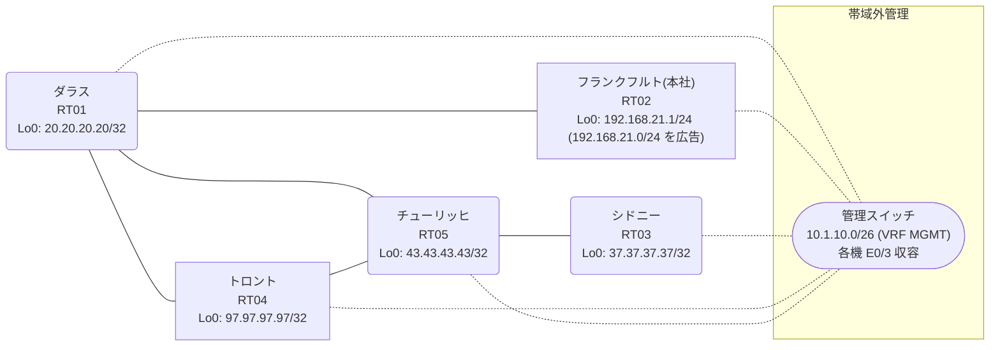

# 問題 20260826-001

> **本問は機器に接続せずに解答すること。追加の show 実行は認めない。**

## シナリオ

あなたは、ネットワークの運用を担当しています。本社の顧客のネットワークは、BGP AS 64775 の RT02 によって、広告されています。あなたの会社の内部は、BGP / EIGRP / OSPF という 3 つのドメインから構成されています。サイトと、ルータおよびアドレスとの対応は、下記の表に示されているとおりです。いくつかの宛先への通信について、報告が上がっています。あなたは、示されているところの出力および構成に基づいて、その構成が、下記において記述されているとおりに動作していない理由を、判断する必要があります。distance コマンドによる管理距離の操作は、監査のポリシー上、使用されることができません。顧客のネットワーク `192.168.21.0/24` を含むすべての宛先への到達可能性が、すべてのサイトにおいて、確保されていること。インタフェースの IP アドレッシングは、変更されてはなりません。スタティック・ルートおよび既定のルートによる迂回は、実施されることはできません。`192.168.21.0/24` 宛のトラフィックが RT02 へ配送され、経路の周回が、発生していないこと。遮断の条件は、プレフィックスの列挙によるものであってはならず、その経路がどこから来たものであるか、という属性によって、表現される必要があります。それぞれのドメインの間の再配送の設計は、維持されなければなりません。



| 拠点 | ルータ | 拠点網 / 広告網 |
|------|--------|------------------|
| シドニー | RT03 | 37.37.37.37/32 |
| ダラス | RT01 | 20.20.20.20/32 |
| チューリッヒ | RT05 | 43.43.43.43/32 |
| トロント | RT04 | 97.97.97.97/32 |
| フランクフルト(本社) | RT02 | 192.168.21.1/24 (`192.168.21.0/24` を広告) |

リンク一覧:
```
  RT02:E0/0(.1) ── RT01:E0/0(.2)   10.72.229.0/30
  RT01:E0/1(.1) ── RT04:E0/0(.2)   10.11.184.0/30
  RT01:E0/2(.1) ── RT05:E0/0(.2)   10.103.110.0/30
  RT04:E0/1(.1) ── RT05:E0/1(.2)   10.246.223.0/30
  RT05:E0/2(.1) ── RT03:E0/0(.2)   10.167.188.0/30
```

## 出力

```
RT01# show ip route
Gateway of last resort is not set
      10.0.0.0/8 is variably subnetted, 8 subnets, 2 masks
C        10.11.184.0/30 is directly connected, Ethernet0/1
L        10.11.184.1/32 is directly connected, Ethernet0/1
C        10.72.229.0/30 is directly connected, Ethernet0/0
L        10.72.229.2/32 is directly connected, Ethernet0/0
C        10.103.110.0/30 is directly connected, Ethernet0/2
L        10.103.110.1/32 is directly connected, Ethernet0/2
O        10.167.188.0/30 [110/20] via 10.103.110.2, 00:04:16, Ethernet0/2
O        10.246.223.0/30 [110/20] via 10.103.110.2, 00:03:47, Ethernet0/2
      20.0.0.0/32 is subnetted, 1 subnets
C        20.20.20.20 is directly connected, Loopback0
      37.0.0.0/32 is subnetted, 1 subnets
O        37.37.37.37 [110/21] via 10.103.110.2, 00:03:42, Ethernet0/2
      43.0.0.0/32 is subnetted, 1 subnets
O        43.43.43.43 [110/11] via 10.103.110.2, 00:04:16, Ethernet0/2
      97.0.0.0/32 is subnetted, 1 subnets
O        97.97.97.97 [110/21] via 10.103.110.2, 00:03:42, Ethernet0/2
D EX  192.168.21.0/24 [170/307200] via 10.11.184.2, 00:03:31, Ethernet0/1
```
```
RT01# show route-map
route-map RM-STG1, deny, sequence 10
  Match clauses:
    ip address prefix-lists: PL-STG1 
  Set clauses:
  Policy routing matches: 0 packets, 0 bytes
route-map RM-STG1, permit, sequence 20
  Match clauses:
  Set clauses:
  Policy routing matches: 0 packets, 0 bytes
```
```
RT01# show ip prefix-list
ip prefix-list PL-STG1: 2 entries
   seq 5 deny 37.37.37.37/32
   seq 10 permit 0.0.0.0/0 le 32
```
```
RT01# show access-lists
Standard IP access list 88
    10 deny   37.37.37.37
    20 permit any
```
```
RT01# show ip bgp
BGP table version is 10, local router ID is 20.20.20.20
Status codes: s suppressed, d damped, h history, * valid, > best, i - internal, 
              r RIB-failure, S Stale, m multipath, b backup-path, f RT-Filter, 
              x best-external, a additional-path, c RIB-compressed, 
              t secondary path, L long-lived-stale,
Origin codes: i - IGP, e - EGP, ? - incomplete
RPKI validation codes: V valid, I invalid, N Not found

     Network          Next Hop            Metric LocPrf Weight Path
 *>   10.103.110.0/30  0.0.0.0                  0         32768 ?
 *>   10.167.188.0/30  10.103.110.2            20         32768 ?
 *>   10.246.223.0/30  10.103.110.2            20         32768 ?
 *>   20.20.20.20/32   0.0.0.0                  0         32768 i
 *>   37.37.37.37/32   10.103.110.2            21         32768 ?
 *>   43.43.43.43/32   10.103.110.2            11         32768 ?
 *>   97.97.97.97/32   10.103.110.2            21         32768 ?
 r>i  192.168.21.0     10.72.229.1              0    100      0 i
```
```
RT01# show ip protocols | include Routing Protocol|Distance
Routing Protocol is "application"
    Gateway         Distance      Last Update
  Distance: (default is 4)
Routing Protocol is "eigrp 293"
      Distance: internal 90 external 170
    Gateway         Distance      Last Update
  Distance: internal 90 external 170
Routing Protocol is "ospf 71"
    Gateway         Distance      Last Update
  Distance: (default is 110)
Routing Protocol is "bgp 64775"
    Gateway         Distance      Last Update
  Distance: external 20 internal 200 local 200
```
```
RT03# traceroute 192.168.21.1 probe 1 timeout 1 ttl 1 8
Type escape sequence to abort.
Tracing the route to 192.168.21.1
VRF info: (vrf in name/id, vrf out name/id)
  1 10.167.188.1 1 msec
  2 10.103.110.1 1 msec
  3 10.11.184.2 35 msec
  4 10.246.223.2 1 msec
  5 10.103.110.1 10 msec
  6 10.11.184.2 19 msec
  7 10.246.223.2 3 msec
  8 10.103.110.1 24 msec
```
```
RT01# show running-config | section router
router eigrp 293
 timers active-time 5
 network 10.11.184.0 0.0.0.3
 passive-interface Loopback0
router ospf 71
 router-id 20.20.20.20
 redistribute eigrp 293
 redistribute bgp 64775
 network 10.103.110.0 0.0.0.3 area 0
 network 20.20.20.20 0.0.0.0 area 0
router bgp 64775
 bgp router-id 20.20.20.20
 bgp log-neighbor-changes
 bgp redistribute-internal
 network 20.20.20.20 mask 255.255.255.255
 redistribute ospf 71
 neighbor 10.72.229.1 remote-as 64775
```
```
RT04# show running-config | section router
router eigrp 293
 network 10.11.184.0 0.0.0.3
 redistribute ospf 71 metric 100000 100 255 1 1500
router ospf 71
 router-id 97.97.97.97
 redistribute eigrp 293
 network 10.246.223.0 0.0.0.3 area 0
 network 97.97.97.97 0.0.0.0 area 0
```
```
RT05# show running-config | section router
router ospf 71
 router-id 43.43.43.43
 passive-interface Loopback0
 network 10.103.110.0 0.0.0.3 area 0
 network 10.167.188.0 0.0.0.3 area 0
 network 10.246.223.0 0.0.0.3 area 0
 network 43.43.43.43 0.0.0.0 area 0
```
```
RT02# show running-config | section router
router bgp 64775
 bgp router-id 192.168.21.1
 bgp log-neighbor-changes
 network 192.168.21.0
 neighbor 10.72.229.2 remote-as 64775
```

## 設問

次のうち、正しいものは、どれですか。

## 選択肢
A. RT01 の router bgp 64775 配下に「distance bgp 20 165 165」を設定し、clear ip route * を実行する

B. RT01 の router ospf 71 配下の redistribute に「set tag 64775」を付与する route-map を適用する

C. RT01 で `192.168.21.0/24` のみ deny(他は permit)の prefix-list PL-BLOCK を作成し、router eigrp 293 配下に「distribute-list prefix PL-BLOCK in」を適用する

D. RT04 の router eigrp 293 配下の再配送に「set tag 64775」を付与する route-map を適用し、RT01 の router ospf 71 配下の redistribute に「match tag 64775」を deny する route-map を適用する

E. RT01 の router bgp 64775 配下から「bgp redistribute-internal」を削除する

F. RT01 の router ospf 71 配下の redistribute に「set tag 64775」を付与する route-map を適用し、RT04 の router eigrp 293 配下の再配送に「match tag 64775」を deny する route-map を適用する

G. RT04 の相互再配送(redistribute)の両方向に `192.168.21.0/24` を deny する route-map を適用する
