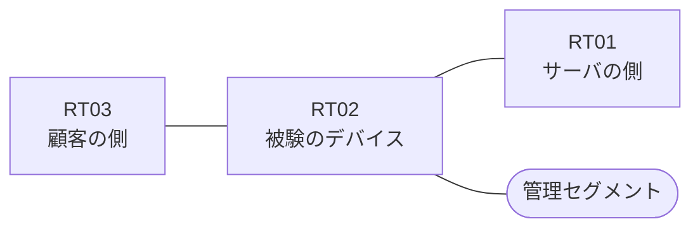

# 問題 20260826-003

> **本問は機器に接続せずに解答すること。追加の show 実行は認めない。**

## シナリオ

あなたの組織は、下記に示されているところのネットワークを運用しています。ある企業のネットワークにおいて、RT02 は、顧客の側のネットワークと、サーバの側のネットワークとの間に、配置されています。一部の通信が、意図されているとおりに動作していない、という報告があります。あなたは、示されているところの出力および構成に基づいて、その構成が、下記において記述されているとおりに動作していない理由を、判断する必要があります。アクセス リストは、顧客の側のインターフェイスである `Ethernet0/0` において、着信の方向に適用される必要があります。インタフェースの IP アドレッシングは、変更されることはできません。対象としていないネットワークが、一致の対象に含まれてはなりません。また、エントリの行数は、最小でなければなりません。RT02 において、`10.45.64.0/24`、`10.45.65.0/24`、`10.45.66.0/24` のネットワークからの通信のみが、許可されなければなりません。`10.45.69.0/24` からの通信は、許可されてはなりません。



| 区間 | 被験デバイス側のインターフェイス | ネットワーク |
|------|----------------------------------|--------------|
| RT03（顧客の側） ⇔ RT02 | `Ethernet0/0` | 10.45.253.0/24 |
| RT02 ⇔ RT01（サーバの側） | `Ethernet0/1` | 10.45.254.0/24 |
| RT02 ⇔ 管理セグメント | `Ethernet0/2` | 10.45.255.0/24 |

## 出力

観測 | サーバへの到達
--- | ---
送信元が 10.45.64.0/24 のネットワークにあるホストから、172.21.74.97 の TCP ポート 22 宛ての通信 | 到達可
送信元が 10.45.65.0/24 のネットワークにあるホストから、172.21.74.97 の TCP ポート 22 宛ての通信 | 到達可
送信元が 10.45.66.0/24 のネットワークにあるホストから、172.21.74.97 の TCP ポート 22 宛ての通信 | 到達可
送信元が 10.45.67.0/24 のネットワークにあるホストから、172.21.74.97 の TCP ポート 22 宛ての通信 | 到達可
送信元が 10.45.69.0/24 のネットワークにあるホストから、172.21.74.97 の TCP ポート 22 宛ての通信 | 到達可
送信元が 10.45.250.0/24 のネットワークにあるホストから、172.21.74.97 の TCP ポート 22 宛ての通信 | 到達可

```
RT02# show running-config | section ^interface
interface Ethernet0/0
 description === to RT03 ===
 ip address 10.45.253.1 255.255.255.0
interface Ethernet0/1
 description === to RT01 ===
 ip address 10.45.254.1 255.255.255.0
interface Ethernet0/2
 description === management ===
 ip address 10.45.255.1 255.255.255.0
```
```
RT02# show ip access-lists
Standard IP access list 50
    10 permit 10.45.64.0, wildcard bits 0.0.0.255
    20 permit 10.45.65.0, wildcard bits 0.0.0.255
    30 permit 10.45.66.0, wildcard bits 0.0.0.255
```

## 設問

次のうち、正しいものは、どれですか。

## 選択肢
A. ルーティング・プロトコルの隣接関係が確立されていない

B. アクセス・リストが、管理のためのインターフェイスに適用されている

C. インターフェイスが管理上シャットダウンされている

D. アクセス・リストが、いずれのインターフェイスにも適用されていない

E. ポートの演算子が、宛先の側ではなく送信元の側に記述されている

F. インターフェイスに適用されているアクセス・リストに、エントリが1つも存在しない
