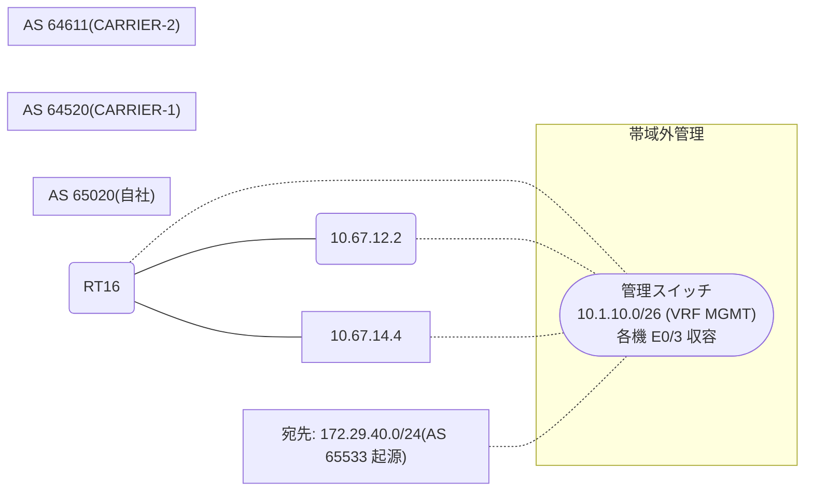

# 問題 20260826-004

> **本問は機器に接続せずに解答すること。追加の show 実行は認めない。**

## シナリオ

あなたは、ネットワークの運用を担当しています。自社のルーター RT16 は、外部のネットワーク 172.29.40.0/24 への到達性を、複数の経路を通じて、確立しています。 CARRIER-1 とは、接続されています。 CARRIER-2 とも、接続されています。ベストパスの選出の結果について、その根拠が、確認されようとしています。示されているところの出力、および、構成に基づいて、判断すること。なお、機器の構成は、示されている抜粋のほかは、既定値である。



## 出力

```
RT16# show running-config | section router bgp
router bgp 65020
 bgp router-id 79.79.79.79
 bgp log-neighbor-changes
 neighbor 10.67.12.2 remote-as 64520
 neighbor 10.67.14.4 remote-as 64611
 !
 address-family ipv4
  network 172.29.40.0 mask 255.255.255.0
  neighbor 10.67.12.2 activate
  neighbor 10.67.14.4 activate
 exit-address-family
```
```
RT16# show ip bgp
BGP table version is 57, local router ID is 79.79.79.79
Status codes: s suppressed, d damped, h history, * valid, > best, i - internal, 
              r RIB-failure, S Stale, m multipath, b backup-path, f RT-Filter, 
              x best-external, a additional-path, c RIB-compressed, 
              t secondary path, L long-lived-stale,
Origin codes: i - IGP, e - EGP, ? - incomplete
RPKI validation codes: V valid, I invalid, N Not found

     Network          Next Hop            Metric LocPrf Weight Path
 *>   172.29.40.0/24   0.0.0.0                  0         32768 i
 *                     10.67.14.4                             0 64611 65533 i
 *                     10.67.12.2                             0 64520 65533 i
```
```
RT16# show running-config | include ip route
ip route 172.29.40.0 255.255.255.0 Null0 name AGGREGATE
```
```
RT16# show ip bgp 172.29.40.0
BGP routing table entry for 172.29.40.0/24, version 57
Paths: (3 available, best #1, table default)
  Advertised to update-groups:
     3         
  Refresh Epoch 3
  Local
    0.0.0.0 from 0.0.0.0 (79.79.79.79)
      Origin IGP, metric 0, localpref 100, weight 32768, valid, sourced, local, best
      rx pathid: 0, tx pathid: 0x0
      Updated on Jul 3 2026 08:49:03 UTC
  Refresh Epoch 3
  64611 65533
    10.67.14.4 from 10.67.14.4 (219.219.219.219)
      Origin IGP, localpref 100, valid, external
      rx pathid: 0, tx pathid: 0
      Updated on Jul 3 2026 10:17:03 UTC
  Refresh Epoch 3
  64520 65533
    10.67.12.2 from 10.67.12.2 (243.243.243.243)
      Origin IGP, localpref 100, valid, external
      rx pathid: 0, tx pathid: 0
      Updated on Jul 3 2026 10:34:03 UTC
```

## 設問

示されているところの出力において、ベストパスの選出を決定づけた要素は、どれですか。(1つを選択してください)

## 選択肢
A. LOCAL_PREF(大きいほうが優先)

B. weight(大きいほうが優先)

C. 最も古い経路(eBGP 同士のタイ)

D. AS-PATH 長(短いほうが優先)

E. origin コード(i < e < ?)
