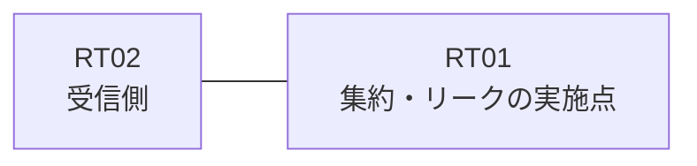

# 問題 20260826-005

> **本問は機器に接続せずに解答すること。追加の show 実行は認めない。**

## トポロジ

あなたは、下記のネットワークの保守を担当する技術者です。拠点のルータ RT01 は、複数のループバック インターフェイスによって、サービスのためのアドレスのブロック 172.25.248.16/29 を収容しています。RT01 と RT02 は、1本のリンクによって直接に接続されており、そして、EIGRP 200 が構成されています。



| 対象 | 内容 |
|------|------|
| RT01 のループバック | 172.25.248.17, 172.25.248.18, 172.25.248.19, 172.25.248.20 |
| RT01 の運用系ループバック | 10.229.234.136 |
| RT01 ⇔ RT02 のリンク | 10.31.208.0/24（RT01=10.31.208.1 / RT02=10.31.208.2・GigabitEthernet0/1） |

## 要件

1. ただし、監視のためのホストである 172.25.248.18 (/32) の明細のルートは、集約とともに、受信されなければなりません。
2. RT02 に対して、ブロック 172.25.248.16/29 は、集約のルートとして広告される必要があります。
3. 集約のルートおよび明細のルートは、いずれも、EIGRP の内部のルートとして受信される必要があります。
4. ブロックの内部の明細のルートは、広告されてはなりません。
5. 運用のためのループバック 10.229.234.136 (/32) は、引き続き受信される必要があります。
6. 管理のための構成に対して、変更が加えられてはなりません。

## 現在の状態

いくつかの宛先への通信について、報告が上がっています。あなたは、示されているところの出力および構成に基づいて、その構成が、下記において記述されているとおりに動作していない理由を、判断する必要があります。

```
RT02# show ip route eigrp | begin Gateway
Gateway of last resort is not set
      10.0.0.0/32 is subnetted, 1 subnets
D        10.229.234.136 [90/409600] via 10.31.208.1, 00:13:30, GigabitEthernet0/1
      172.25.0.0/16 is variably subnetted, 5 subnets, 2 masks
D        172.25.248.16/29 [90/409600] via 10.31.208.1, 00:13:30, GigabitEthernet0/1
D        172.25.248.17/32 [90/409600] via 10.31.208.1, 00:13:30, GigabitEthernet0/1
D        172.25.248.18/32 [90/409600] via 10.31.208.1, 00:13:30, GigabitEthernet0/1
D        172.25.248.19/32 [90/409600] via 10.31.208.1, 00:13:30, GigabitEthernet0/1
D        172.25.248.20/32 [90/409600] via 10.31.208.1, 00:13:30, GigabitEthernet0/1
```

## 設定抜粋

```
RT01# show running-config
Building configuration...
!
interface Loopback0
 ip address 172.25.248.17 255.255.255.255
interface Loopback1
 ip address 172.25.248.18 255.255.255.255
interface Loopback2
 ip address 172.25.248.19 255.255.255.255
interface Loopback3
 ip address 172.25.248.20 255.255.255.255
interface Loopback10
 ip address 10.229.234.136 255.255.255.255
interface GigabitEthernet0/1
 description === to RT02 ===
 ip address 10.31.208.1 255.255.255.252
 ip summary-address eigrp 200 172.25.248.16 255.255.255.248 leak-map LEAK
!
router eigrp 200
 network 172.25.248.17 0.0.0.0
 network 172.25.248.18 0.0.0.0
 network 172.25.248.19 0.0.0.0
 network 172.25.248.20 0.0.0.0
 network 10.229.234.136 0.0.0.0
 network 10.31.208.0 0.0.0.3
!
ip prefix-list PL-MON seq 5 permit 172.25.248.18/32
access-list 15 permit 172.25.248.19
!
route-map LEAK permit 10
 match ip address prefix-list PL01S
route-map RM-LEAK permit 10
 match ip address prefix-list PL-LEAK
!
```

## 設問

次のうち、正しいものは、どれですか。

## 選択肢
A. ルート・マップが参照しているところの名前のリストが、定義されていない

B. EIGRP のスタブ・ルーティングの構成によって、広告が制限されている

C. distribute-list によって、当該のインターフェイスからの広告がフィルタされている

D. ルート・マップの permit のエントリに、match のステートメントが存在しない

E. リストにおいて許可されているアドレスが、対象のループバックのアドレスと異なっている

F. leak-map が参照しているところの名前のルート・マップが、定義されていない
