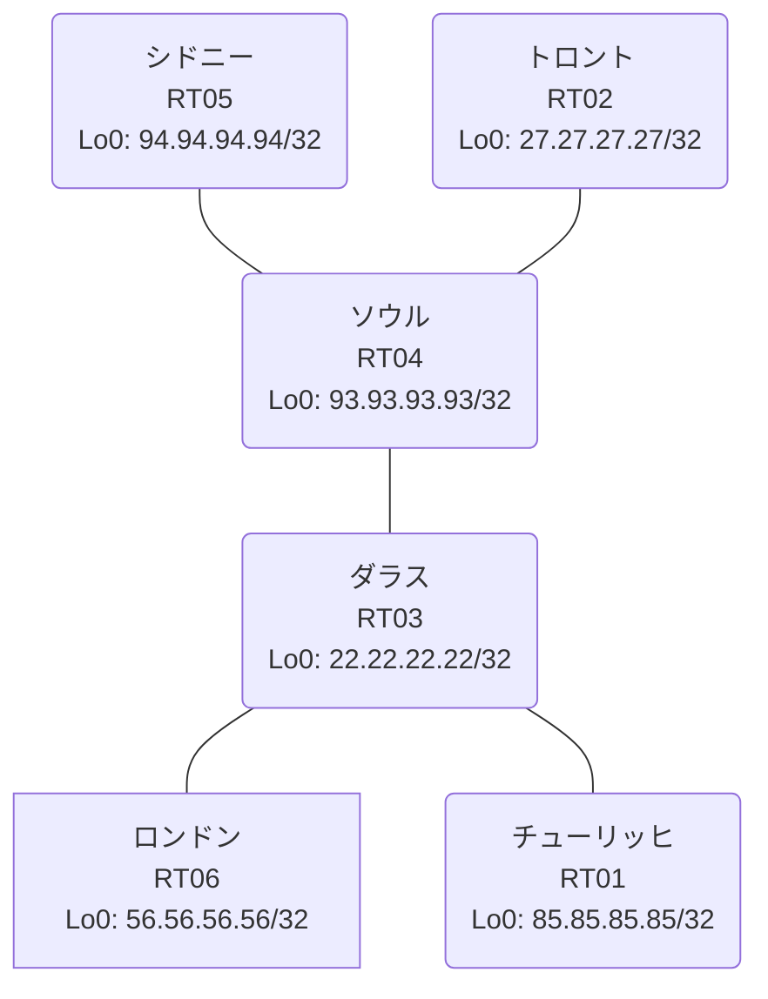

# 問題 20260827-001

> **本問は機器に接続せずに解答すること。追加の show 実行は認めない。**

## トポロジ

あなたは、下記のネットワークの保守を担当する技術者です。あなたの会社のネットワークは、複数のルーティング ドメインが、境界のルーターによって接続され、そして、すべてのサイトの到達可能性が提供されている、というものです。ルーティングの設計の詳細は、示されているところのコンフィギュレーションから、読み取られることが、期待されています。各サイトのルータと、サイトのネットワークとの対応は、下記の表に示されているとおりです。



| 拠点 | ルータ | 拠点網 |
|------|--------|----------------------|
| シドニー | RT05 | `94.94.94.94/32` |
| ソウル | RT04 | `93.93.93.93/32` |
| ダラス | RT03 | `22.22.22.22/32` |
| チューリッヒ | RT01 | `85.85.85.85/32` |
| トロント | RT02 | `27.27.27.27/32` |
| ロンドン | RT06 | `56.56.56.56/32` |

リンク一覧:
```
  RT03:E0/0(.1) ── RT01:E0/0(.2)   10.126.107.0/30
  RT04:E0/0(.1) ── RT05:E0/0(.2)   10.199.124.0/30
  RT04:E0/1(.1) ── RT02:E0/0(.2)   10.162.173.0/30
  RT03:E0/1(.1) ── RT06:E0/0(.2)   10.254.82.0/30
  RT04:E0/2(.1) ── RT03:E0/2(.2)   10.200.147.0/30
```

## 要件

1. シード・メトリック `100000 100 255 1 1500` の付与は、default-metric の方式に統一されなければなりません。
2. redistribute の参照先は、実在する隣接のプロセス/AS に限定され、無効な参照のステートメントが、コンフィギュレーションに残されることはできません。
3. 再配送に対するフィルタの適用は、禁止されているところのものです。
4. すべてのルーターのループバック インターフェイス 0 (/32) が、すべてのドメインの間で、相互に到達可能であること。
5. 管理のための構成に対して、変更が加えられてはなりません。
6. 本作業は、日中の時間帯において実施されるという理由により、対象外であるところのデバイスに対する構成の変更は、許可されていません。

## 現在の状態

一部の通信が、意図されているとおりに動作していない、という報告があります。あなたは、示されているところの出力および構成に基づいて、その構成が、下記において記述されているとおりに動作していない理由を、判断する必要があります。

```
RT01# show ip route
Gateway of last resort is not set
      10.0.0.0/8 is variably subnetted, 6 subnets, 2 masks
C        10.126.107.0/30 is directly connected, Ethernet0/0
L        10.126.107.2/32 is directly connected, Ethernet0/0
D EX     10.162.173.0/30 [170/332800] via 10.126.107.1, 00:04:58, Ethernet0/0
D EX     10.199.124.0/30 [170/332800] via 10.126.107.1, 00:04:58, Ethernet0/0
D        10.200.147.0/30 [90/307200] via 10.126.107.1, 00:04:58, Ethernet0/0
D EX     10.254.82.0/30 [170/307200] via 10.126.107.1, 00:04:58, Ethernet0/0
      22.0.0.0/32 is subnetted, 1 subnets
D        22.22.22.22 [90/409600] via 10.126.107.1, 00:04:58, Ethernet0/0
      27.0.0.0/32 is subnetted, 1 subnets
D EX     27.27.27.27 [170/332800] via 10.126.107.1, 00:04:12, Ethernet0/0
      85.0.0.0/32 is subnetted, 1 subnets
C        85.85.85.85 is directly connected, Loopback0
      93.0.0.0/32 is subnetted, 1 subnets
D        93.93.93.93 [90/435200] via 10.126.107.1, 00:04:58, Ethernet0/0
      94.0.0.0/32 is subnetted, 1 subnets
D EX     94.94.94.94 [170/332800] via 10.126.107.1, 00:04:12, Ethernet0/0
```
```
RT06# show ip route
Gateway of last resort is not set
      10.0.0.0/8 is variably subnetted, 6 subnets, 2 masks
D EX     10.126.107.0/30 [170/307200] via 10.254.82.1, 00:05:05, Ethernet0/0
D EX     10.162.173.0/30 [170/332800] via 10.254.82.1, 00:05:05, Ethernet0/0
D EX     10.199.124.0/30 [170/332800] via 10.254.82.1, 00:05:05, Ethernet0/0
D EX     10.200.147.0/30 [170/307200] via 10.254.82.1, 00:05:05, Ethernet0/0
C        10.254.82.0/30 is directly connected, Ethernet0/0
L        10.254.82.2/32 is directly connected, Ethernet0/0
      22.0.0.0/32 is subnetted, 1 subnets
D        22.22.22.22 [90/409600] via 10.254.82.1, 00:05:05, Ethernet0/0
      27.0.0.0/32 is subnetted, 1 subnets
D EX     27.27.27.27 [170/332800] via 10.254.82.1, 00:04:29, Ethernet0/0
      56.0.0.0/32 is subnetted, 1 subnets
C        56.56.56.56 is directly connected, Loopback0
      85.0.0.0/32 is subnetted, 1 subnets
D EX     85.85.85.85 [170/435200] via 10.254.82.1, 00:05:05, Ethernet0/0
      93.0.0.0/32 is subnetted, 1 subnets
D EX     93.93.93.93 [170/435200] via 10.254.82.1, 00:05:05, Ethernet0/0
      94.0.0.0/32 is subnetted, 1 subnets
D EX     94.94.94.94 [170/332800] via 10.254.82.1, 00:04:30, Ethernet0/0
```
```
RT05# show ip route
Gateway of last resort is not set
      10.0.0.0/8 is variably subnetted, 6 subnets, 2 masks
O E2     10.126.107.0/30 [110/20] via 10.199.124.1, 00:04:49, Ethernet0/0
O        10.162.173.0/30 [110/20] via 10.199.124.1, 00:04:49, Ethernet0/0
C        10.199.124.0/30 is directly connected, Ethernet0/0
L        10.199.124.2/32 is directly connected, Ethernet0/0
O E2     10.200.147.0/30 [110/20] via 10.199.124.1, 00:04:49, Ethernet0/0
O E2     10.254.82.0/30 [110/20] via 10.199.124.1, 00:04:49, Ethernet0/0
      22.0.0.0/32 is subnetted, 1 subnets
O E2     22.22.22.22 [110/20] via 10.199.124.1, 00:04:49, Ethernet0/0
      27.0.0.0/32 is subnetted, 1 subnets
O        27.27.27.27 [110/21] via 10.199.124.1, 00:04:43, Ethernet0/0
      85.0.0.0/32 is subnetted, 1 subnets
O E2     85.85.85.85 [110/20] via 10.199.124.1, 00:04:49, Ethernet0/0
      93.0.0.0/32 is subnetted, 1 subnets
O        93.93.93.93 [110/11] via 10.199.124.1, 00:04:49, Ethernet0/0
      94.0.0.0/32 is subnetted, 1 subnets
C        94.94.94.94 is directly connected, Loopback0
```
```
RT03# show route-map
route-map RM-SVC, deny, sequence 10
  Match clauses:
    ip address prefix-lists: PL-SVC 
  Set clauses:
  Policy routing matches: 0 packets, 0 bytes
route-map RM-SVC, permit, sequence 20
  Match clauses:
  Set clauses:
  Policy routing matches: 0 packets, 0 bytes
route-map RM-MIGR1, deny, sequence 10
  Match clauses:
    ip address prefix-lists: PL-MIGR1 
  Set clauses:
  Policy routing matches: 0 packets, 0 bytes
route-map RM-MIGR1, permit, sequence 20
  Match clauses:
  Set clauses:
  Policy routing matches: 0 packets, 0 bytes
```
```
RT03# show ip prefix-list
ip prefix-list PL-MIGR1: 2 entries
   seq 5 deny 56.56.56.56/32
   seq 10 permit 0.0.0.0/0 le 32
ip prefix-list PL-SVC: 1 entries
   seq 5 permit 56.56.56.56/32
```
```
RT03# show access-lists
Standard IP access list 30
    10 deny   56.56.56.56
    20 permit any
```

## 設定抜粋

```
RT01# show running-config | section router
router eigrp 183
 network 10.126.107.0 0.0.0.3
 network 85.85.85.85 0.0.0.0
```
```
RT02# show running-config | section router
router ospf 16
 router-id 27.27.27.27
 timers throttle spf 50 200 5000
 passive-interface Loopback0
 network 10.162.173.0 0.0.0.3 area 0
 network 27.27.27.27 0.0.0.0 area 0
```
```
RT03# show running-config | section router
router eigrp 183
 default-metric 100000 100 255 1 1500
 network 10.126.107.0 0.0.0.3
 network 10.200.147.0 0.0.0.3
 network 22.22.22.22 0.0.0.0
 redistribute eigrp 386 route-map RM-SVC
router eigrp 386
 default-metric 100000 100 255 1 1500
 network 10.254.82.0 0.0.0.3
 network 22.22.22.22 0.0.0.0
 redistribute eigrp 183
 passive-interface Loopback0
```
```
RT04# show running-config | section router
router eigrp 183
 timers active-time 5
 default-metric 100000 100 255 1 1500
 network 10.200.147.0 0.0.0.3
 network 93.93.93.93 0.0.0.0
 redistribute ospf 16 match internal external 1 external 2
 passive-interface Loopback0
router ospf 16
 router-id 93.93.93.93
 redistribute eigrp 183
 network 10.162.173.0 0.0.0.3 area 0
 network 10.199.124.0 0.0.0.3 area 0
 network 93.93.93.93 0.0.0.0 area 0
```
```
RT05# show running-config | section router
router ospf 16
 router-id 94.94.94.94
 passive-interface Loopback0
 network 10.199.124.0 0.0.0.3 area 0
 network 94.94.94.94 0.0.0.0 area 0
```
```
RT06# show running-config | section router
router eigrp 386
 network 10.254.82.0 0.0.0.3
 network 56.56.56.56 0.0.0.0
```

## 設問

次のうち、正しいものは、どれですか。

## 選択肢
A. RT03 の router eigrp 183 配下の redistribute が、実在しないプロセス/AS を参照している

B. RT01 の router eigrp 183 で、上流側インタフェースが passive-interface に設定されている

C. RT03 の redistribute に適用された route-map が特定の拠点網を deny している

D. RT01 と隣接ルータの間で EIGRP のネイバー(隣接関係)が確立していない

E. RT03 の router eigrp 183 配下に redistribute が設定されていない

F. RT01 の router eigrp 183 に Loopback0 の network 文が設定されていない
