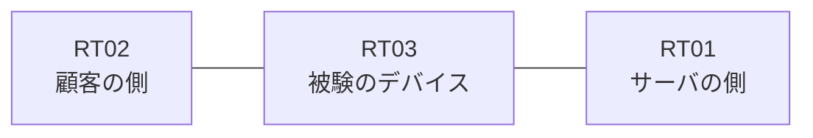

# 問題 20260827-003

> **本問は機器に接続せずに解答すること。追加の show 実行は認めない。**

## シナリオ

あなたの組織は、下記に示されているところのネットワークを運用しています。ある企業のネットワークにおいて、RT03 は、顧客の側のネットワークと、サーバの側のネットワークとの間に配置されており、IPv6 によって運用されています。いくつかの宛先への通信について、報告が上がっています。あなたは、提示されているところの情報のみを使用して、要求されている状態が満たされていない理由を、特定しなければなりません。RT03 において、`2001:DB8:EE:8::/64`、`2001:DB8:EE:9::/64`、`2001:DB8:EE:A::/64` のネットワークからの通信が、`2001:DB8:EE:FF::10` の TCP ポート 80 に到達できなければなりません。`2001:DB8:EE:B::/64` からの通信は、許可されることはできません。拒否のエントリを使用してはなりません。本作業は、日中の時間帯において実施されるという理由により、対象外であるところのデバイスに対する構成の変更は、許可されていません。`2001:DB8:EE:D::/64` からの通信は、許可されてはなりません。



## 出力

観測 | サーバへの到達
--- | ---
送信元が 2001:DB8:EE:8::/64 のネットワークにあるホストから、2001:DB8:EE:FF::10 の TCP ポート 80 宛ての通信 | 到達可
送信元が 2001:DB8:EE:9::/64 のネットワークにあるホストから、2001:DB8:EE:FF::10 の TCP ポート 80 宛ての通信 | 到達可
送信元が 2001:DB8:EE:A::/64 のネットワークにあるホストから、2001:DB8:EE:FF::10 の TCP ポート 80 宛ての通信 | 到達不可
送信元が 2001:DB8:EE:B::/64 のネットワークにあるホストから、2001:DB8:EE:FF::10 の TCP ポート 80 宛ての通信 | 到達不可
送信元が 2001:DB8:EE:D::/64 のネットワークにあるホストから、2001:DB8:EE:FF::10 の TCP ポート 80 宛ての通信 | 到達不可
送信元が 2001:DB8:EE:FA::/64 のネットワークにあるホストから、2001:DB8:EE:FF::10 の TCP ポート 80 宛ての通信 | 到達不可

```
RT03# show ipv6 access-list
IPv6 access list V6-CUST-IN
    permit ipv6 2001:DB8:EE:8::/63 any sequence 10
```
```
RT03# show ipv6 neighbors
IPv6 Address                              Age Link-layer Addr State Interface
2001:DB8:EE:8::3                            0 aabb.cc02.4f00  REACH Et0/0
```
```
RT03# show running-config | section ipv6 access-list|traffic-filter
ipv6 access-list V6-CUST-IN
 sequence 10 permit ipv6 2001:DB8:EE:8::/63 any
interface Ethernet0/0
 ipv6 traffic-filter V6-CUST-IN in
```

## 設問

次のうち、正しいものは、どれですか。

## 選択肢
A. ワイルドカードによる指定が受理されず、意図されたエントリが存在していない

B. シーケンス番号が連続していないため、エントリが評価されていない

C. 参照されているアクセス・リストが定義されていない

D. 末尾に明示の拒否のエントリが記述されているため、近隣探索に対する暗黙の許可が失われ、隣接のアドレスが解決できていない

E. プレフィックスの長さが長く、対象としているネットワークの一部が一致の対象から外れている

F. 空のアクセス・リストが参照されているため、暗黙の拒否によってすべてが破棄されている
