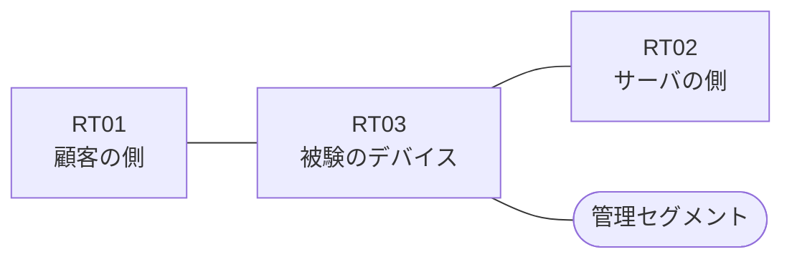

# 問題 20260827-005

> **本問は機器に接続せずに解答すること。追加の show 実行は認めない。**

## シナリオ

あなたの組織は、下記に示されているところのネットワークを運用しています。ある企業のネットワークにおいて、RT03 は、顧客の側のネットワークと、サーバの側のネットワークとの間に、配置されています。ユーザーから、通信に関する事象が、報告されています。示されているところの出力および構成に基づいて、要求されているところの動作が得られていない理由が、判断されなければなりません。アクセス リストは、顧客の側のインターフェイスである `Ethernet2/0` において、着信の方向に適用される必要があります。`10.73.32.0/24` からの通信は、許可されてはなりません。RT03 において、`10.73.33.0/24`、`10.73.35.0/24`、`10.73.37.0/24`、`10.73.39.0/24` のネットワークからの通信のみが、許可される必要があります。`10.73.34.0/24` からの通信は、許可されてはなりません。アクセス リストのエントリは、1行で構成される必要があります。ルーティング プロトコルの種別およびプロセスの配置は、変更されてはなりません。



| 区間 | 被験デバイス側のインターフェイス | ネットワーク |
|------|----------------------------------|--------------|
| RT01（顧客の側） ⇔ RT03 | `Ethernet2/0` | 10.73.253.0/24 |
| RT03 ⇔ RT02（サーバの側） | `Ethernet2/1` | 10.73.254.0/24 |
| RT03 ⇔ 管理セグメント | `Ethernet2/2` | 10.73.255.0/24 |

## 出力

観測 | サーバへの到達
--- | ---
送信元が 10.73.33.0/24 のネットワークにあるホストから、172.24.187.92 の TCP ポート 443 宛ての通信 | 到達可
送信元が 10.73.35.0/24 のネットワークにあるホストから、172.24.187.92 の TCP ポート 443 宛ての通信 | 到達可
送信元が 10.73.37.0/24 のネットワークにあるホストから、172.24.187.92 の TCP ポート 443 宛ての通信 | 到達可
送信元が 10.73.39.0/24 のネットワークにあるホストから、172.24.187.92 の TCP ポート 443 宛ての通信 | 到達可
送信元が 10.73.32.0/24 のネットワークにあるホストから、172.24.187.92 の TCP ポート 443 宛ての通信 | 到達可
送信元が 10.73.34.0/24 のネットワークにあるホストから、172.24.187.92 の TCP ポート 443 宛ての通信 | 到達可
送信元が 10.73.250.0/24 のネットワークにあるホストから、172.24.187.92 の TCP ポート 443 宛ての通信 | 到達可

```
RT03# show ip access-lists
```
```
RT03# show running-config | section ^interface
interface Ethernet2/0
 description === to RT01 ===
 ip address 10.73.253.1 255.255.255.0
 ip access-group CUST-IN in
interface Ethernet2/1
 description === to RT02 ===
 ip address 10.73.254.1 255.255.255.0
interface Ethernet2/2
 description === management ===
 ip address 10.73.255.1 255.255.255.0
```

## 設問

次のうち、正しいものは、どれですか。

## 選択肢
A. インターフェイスから参照されているアクセス・リストが、定義されていない

B. プレフィックス・リストがルート・マップから参照されていない

C. ルーティング・プロトコルの隣接関係が確立されていない

D. アクセス・リストが、顧客の側ではなくサーバの側のインターフェイスに、着信の方向で適用されている

E. インターフェイスに適用されているアクセス・リストに、エントリが1つも存在しない

F. プロトコルとして ip が指定されているため、ポートによる制限が行われていない
