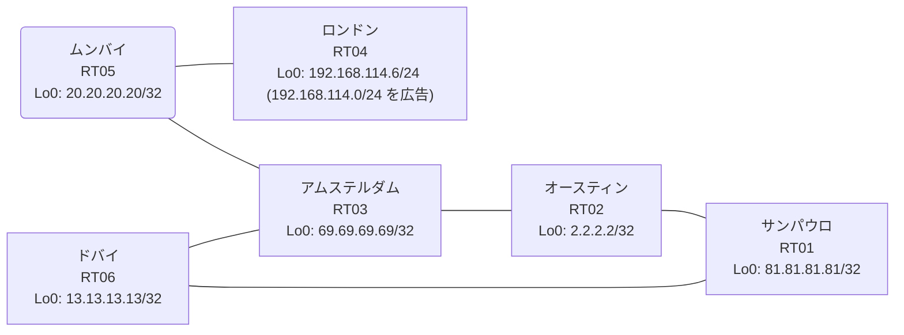

# 問題 20260827-006

> **本問は機器に接続せずに解答すること。追加の show 実行は認めない。**

## トポロジ

あなたは、下記のネットワークの保守を担当する技術者です。あなたの会社のネットワークは、OSPF のドメインと EIGRP のドメインとが、2 つの境界のルーターによって接続され、そして、それらは境界において接続されています。顧客のネットワーク `192.168.114.0/24` は、ロンドン のサイトにおいて、別のルーティング プロトコルによって学習され、そして、再配送によって、社内へ持ち込まれています。ルーティングの設計の詳細は、示されているところのコンフィギュレーションから、読み取られることが、期待されています。



| 拠点 | ルータ | 拠点網 / 広告網 |
|------|--------|------------------|
| アムステルダム | RT03 | 69.69.69.69/32 |
| オースティン | RT02 | 2.2.2.2/32 |
| サンパウロ | RT01 | 81.81.81.81/32 |
| ドバイ | RT06 | 13.13.13.13/32 |
| ムンバイ | RT05 | 20.20.20.20/32 |
| ロンドン | RT04 | 192.168.114.6/24 (`192.168.114.0/24` を広告) |

リンク一覧:
```
  RT01:E0/0(.1) ── RT06:E0/0(.2)   172.16.70.0/24
  RT01:E0/1(.1) ── RT02:E0/0(.3)   172.16.47.0/24
  RT06:E0/1(.2) ── RT03:E0/0(.4)   172.16.30.0/24
  RT02:E0/1(.3) ── RT03:E0/1(.4)   172.16.110.0/24
  RT03:E0/2(.4) ── RT05:E0/0(.5)   172.16.82.0/24
  RT05:E0/1(.5) ── RT04:E0/0(.6)   172.16.65.0/24
```

## 要件

1. スタティック・ルートおよび既定のルートによる迂回は、実施されることはできません。
2. ルーティング・プロトコルの種別およびプロセスの配置は、変更されてはなりません。
3. 本作業は、日中の時間帯において実施されるという理由により、対象外であるところのデバイスに対する構成の変更は、許可されていません。
4. 既存の相互再配送の設計が、削除または停止されてはなりません。
5. すべてのサイトから、`192.168.114.0/24` を含むところのすべての宛先へ、到達することができること。
6. `192.168.114.0/24` 宛のパケットが、広告元である RT04 の方向へ転送され、そして、転送のループが存在していないこと。
7. 是正は、番号付き標準アクセス・リストと、再配送点における distribute-list によって、実装されなければなりません。

## 現在の状態

通信の一部において、想定されていない挙動が、観測されています。あなたは、示されているところの出力および構成に基づいて、その構成が、下記において記述されているとおりに動作していない理由を、判断する必要があります。

```
RT03# show ip route
Gateway of last resort is not set
      2.0.0.0/32 is subnetted, 1 subnets
D EX     2.2.2.2 [170/281856] via 172.16.110.3, 00:04:08, Ethernet0/1
                 [170/281856] via 172.16.30.2, 00:04:08, Ethernet0/0
      13.0.0.0/32 is subnetted, 1 subnets
D EX     13.13.13.13 [170/281856] via 172.16.110.3, 00:04:04, Ethernet0/1
                     [170/281856] via 172.16.30.2, 00:04:04, Ethernet0/0
      20.0.0.0/32 is subnetted, 1 subnets
D        20.20.20.20 [90/409600] via 172.16.82.5, 00:04:54, Ethernet0/2
      69.0.0.0/32 is subnetted, 1 subnets
C        69.69.69.69 is directly connected, Loopback0
      81.0.0.0/32 is subnetted, 1 subnets
D EX     81.81.81.81 [170/281856] via 172.16.110.3, 00:04:08, Ethernet0/1
                     [170/281856] via 172.16.30.2, 00:04:08, Ethernet0/0
      172.16.0.0/16 is variably subnetted, 9 subnets, 2 masks
C        172.16.30.0/24 is directly connected, Ethernet0/0
L        172.16.30.4/32 is directly connected, Ethernet0/0
D EX     172.16.47.0/24 [170/281856] via 172.16.110.3, 00:04:08, Ethernet0/1
                        [170/281856] via 172.16.30.2, 00:04:08, Ethernet0/0
D        172.16.65.0/24 [90/307200] via 172.16.82.5, 00:04:54, Ethernet0/2
D EX     172.16.70.0/24 [170/281856] via 172.16.110.3, 00:04:12, Ethernet0/1
                        [170/281856] via 172.16.30.2, 00:04:12, Ethernet0/0
C        172.16.82.0/24 is directly connected, Ethernet0/2
L        172.16.82.4/32 is directly connected, Ethernet0/2
C        172.16.110.0/24 is directly connected, Ethernet0/1
L        172.16.110.4/32 is directly connected, Ethernet0/1
D EX  192.168.114.0/24 [170/281856] via 172.16.30.2, 00:04:08, Ethernet0/0
```
```
RT03# show ip eigrp topology 192.168.114.0 255.255.255.0
EIGRP-IPv4 Topology Entry for AS(17)/ID(69.69.69.69) for 192.168.114.0/24
  State is Passive, Query origin flag is 1, 1 Successor(s), FD is 281856
  Descriptor Blocks:
  172.16.30.2 (Ethernet0/0), from 172.16.30.2, Send flag is 0x0
      Composite metric is (281856/2816), route is External
      Vector metric:
        Minimum bandwidth is 10000 Kbit
        Total delay is 1010 microseconds
        Reliability is 255/255
        Load is 1/255
        Minimum MTU is 1500
        Hop count is 1
        Originating router is 13.13.13.13
      External data:
        AS number of route is 97
        External protocol is OSPF, external metric is 20
        Administrator tag is 0 (0x00000000)
  172.16.82.5 (Ethernet0/2), from 172.16.82.5, Send flag is 0x0
      Composite metric is (307456/281856), route is External
      Vector metric:
        Minimum bandwidth is 10000 Kbit
        Total delay is 2010 microseconds
        Reliability is 255/255
        Load is 1/255
        Minimum MTU is 1500
        Hop count is 2
        Originating router is 192.168.114.6
      External data:
        AS number of route is 0
        External protocol is RIP, external metric is 0
        Administrator tag is 0 (0x00000000)
```
```
RT05# show ip route
Gateway of last resort is not set
      2.0.0.0/32 is subnetted, 1 subnets
D EX     2.2.2.2 [170/307456] via 172.16.82.4, 00:04:26, Ethernet0/0
      13.0.0.0/32 is subnetted, 1 subnets
D EX     13.13.13.13 [170/307456] via 172.16.82.4, 00:05:01, Ethernet0/0
      20.0.0.0/32 is subnetted, 1 subnets
C        20.20.20.20 is directly connected, Loopback0
      69.0.0.0/32 is subnetted, 1 subnets
D        69.69.69.69 [90/409600] via 172.16.82.4, 00:05:17, Ethernet0/0
      81.0.0.0/32 is subnetted, 1 subnets
D EX     81.81.81.81 [170/307456] via 172.16.82.4, 00:04:26, Ethernet0/0
      172.16.0.0/16 is variably subnetted, 8 subnets, 2 masks
D        172.16.30.0/24 [90/307200] via 172.16.82.4, 00:05:17, Ethernet0/0
D EX     172.16.47.0/24 [170/307456] via 172.16.82.4, 00:04:26, Ethernet0/0
C        172.16.65.0/24 is directly connected, Ethernet0/1
L        172.16.65.5/32 is directly connected, Ethernet0/1
D EX     172.16.70.0/24 [170/307456] via 172.16.82.4, 00:05:01, Ethernet0/0
C        172.16.82.0/24 is directly connected, Ethernet0/0
L        172.16.82.5/32 is directly connected, Ethernet0/0
D        172.16.110.0/24 [90/307200] via 172.16.82.4, 00:05:17, Ethernet0/0
D EX  192.168.114.0/24 [170/281856] via 172.16.65.6, 00:04:26, Ethernet0/1
```
```
RT01# show ip route
Gateway of last resort is not set
      2.0.0.0/32 is subnetted, 1 subnets
O        2.2.2.2 [110/11] via 172.16.47.3, 00:04:49, Ethernet0/1
      13.0.0.0/32 is subnetted, 1 subnets
O        13.13.13.13 [110/11] via 172.16.70.2, 00:04:44, Ethernet0/0
      20.0.0.0/32 is subnetted, 1 subnets
O E2     20.20.20.20 [110/20] via 172.16.70.2, 00:04:44, Ethernet0/0
                     [110/20] via 172.16.47.3, 00:04:49, Ethernet0/1
      69.0.0.0/32 is subnetted, 1 subnets
O E2     69.69.69.69 [110/20] via 172.16.70.2, 00:04:44, Ethernet0/0
                     [110/20] via 172.16.47.3, 00:04:49, Ethernet0/1
      81.0.0.0/32 is subnetted, 1 subnets
C        81.81.81.81 is directly connected, Loopback0
      172.16.0.0/16 is variably subnetted, 8 subnets, 2 masks
O E2     172.16.30.0/24 [110/20] via 172.16.70.2, 00:04:44, Ethernet0/0
                        [110/20] via 172.16.47.3, 00:04:49, Ethernet0/1
C        172.16.47.0/24 is directly connected, Ethernet0/1
L        172.16.47.1/32 is directly connected, Ethernet0/1
O E2     172.16.65.0/24 [110/20] via 172.16.70.2, 00:04:44, Ethernet0/0
                        [110/20] via 172.16.47.3, 00:04:49, Ethernet0/1
C        172.16.70.0/24 is directly connected, Ethernet0/0
L        172.16.70.1/32 is directly connected, Ethernet0/0
O E2     172.16.82.0/24 [110/20] via 172.16.70.2, 00:04:44, Ethernet0/0
                        [110/20] via 172.16.47.3, 00:04:49, Ethernet0/1
O E2     172.16.110.0/24 [110/20] via 172.16.70.2, 00:04:44, Ethernet0/0
                         [110/20] via 172.16.47.3, 00:04:49, Ethernet0/1
O E2  192.168.114.0/24 [110/20] via 172.16.47.3, 00:04:49, Ethernet0/1
```
```
RT03# show ip protocols | include Routing Protocol|Distance
Routing Protocol is "application"
    Gateway         Distance      Last Update
  Distance: (default is 4)
Routing Protocol is "eigrp 17"
      Distance: internal 90 external 170
    Gateway         Distance      Last Update
  Distance: internal 90 external 170
```
```
RT01# traceroute 192.168.114.6 probe 1 timeout 1 ttl 1 8
Type escape sequence to abort.
Tracing the route to 192.168.114.6
VRF info: (vrf in name/id, vrf out name/id)
  1 172.16.47.3 1 msec
  2 172.16.110.4 2 msec
  3 172.16.30.2 2 msec
  4 172.16.70.1 2 msec
  5 172.16.47.3 2 msec
  6 172.16.110.4 3 msec
  7 172.16.30.2 24 msec
  8 172.16.70.1 2 msec
```

## 設定抜粋

```
RT01# show running-config | section router
router ospf 97
 router-id 81.81.81.81
 network 81.81.81.81 0.0.0.0 area 0
 network 172.16.47.0 0.0.0.255 area 0
 network 172.16.70.0 0.0.0.255 area 0
```
```
RT06# show running-config | section router
router eigrp 17
 network 172.16.30.0 0.0.0.255
 redistribute ospf 97 metric 1000000 1 255 1 1500
router ospf 97
 router-id 13.13.13.13
 redistribute eigrp 17
 network 13.13.13.13 0.0.0.0 area 0
 network 172.16.70.0 0.0.0.255 area 0
```
```
RT02# show running-config | section router
router eigrp 17
 network 172.16.110.0 0.0.0.255
 redistribute ospf 97 metric 1000000 1 255 1 1500
router ospf 97
 router-id 2.2.2.2
 redistribute eigrp 17
 network 2.2.2.2 0.0.0.0 area 0
 network 172.16.47.0 0.0.0.255 area 0
```
```
RT03# show running-config | section router
router eigrp 17
 network 69.69.69.69 0.0.0.0
 network 172.16.30.0 0.0.0.255
 network 172.16.82.0 0.0.0.255
 network 172.16.110.0 0.0.0.255
```
```
RT05# show running-config | section router
router eigrp 17
 network 20.20.20.20 0.0.0.0
 network 172.16.65.0 0.0.0.255
 network 172.16.82.0 0.0.0.255
```
```
RT04# show running-config | section router
router eigrp 17
 network 172.16.65.0 0.0.0.255
 redistribute rip metric 1000000 1 255 1 1500
router rip
 version 2
 network 192.168.114.0
 no auto-summary
```

## 設問

次のうち、正しいものは、どれですか。

## 選択肢
**A.**
```
router eigrp 17
 distance eigrp 90 200
```

**B.**
```
clear ip route *
```

**C.**
```
router eigrp 17
 redistribute rip metric 100 1 255 1 1500
```

**D.**
```
! RT06 と RT02 の両方に投入
access-list 78 deny 192.168.114.0 0.0.0.255
access-list 78 permit any
router eigrp 17
 distribute-list 78 out ospf 97
```

**E.**
```
! RT06 にのみ投入
access-list 78 deny 192.168.114.0 0.0.0.255
access-list 78 permit any
router eigrp 17
 distribute-list 78 out ospf 97
```

**F.**
```
! RT06 と RT02 の両方に投入
router ospf 97
 distance ospf external 180
```
