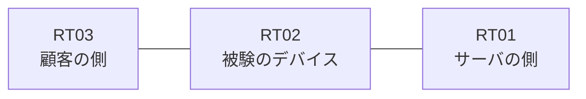

# 問題 20260827-008

> **本問は機器に接続せずに解答すること。追加の show 実行は認めない。**

## シナリオ

あなたは、ネットワークの運用を担当しています。ある企業のネットワークにおいて、RT02 は、顧客の側のネットワークと、サーバの側のネットワークとの間に、配置されています。RT02 は、RT01 および RT03 の両方から、ルーティング プロトコルによってルートを学習しています。要求されているところの動作が、得られていない、ということが、報告されています。原因として、**アクセス・リストにエントリが1つも存在しない** と **参照されているアクセス・リストが定義されていない** と **名前付きの拡張のアクセス・リストが指定されており、フィルタ自体が適用されていない** の 3 つが、想定されています。機器の構成は、まだ取得されていません。上記以外のルートの受理には、影響を与えてはなりません。RT02 は、`10.125.0.0/24`、`10.125.1.0/24`、`10.125.2.0/24` のネットワークのルートのみを、ルーティング・テーブルに保持しなければなりません。本作業は、日中の時間帯において実施されるという理由により、対象外であるところのデバイスに対する構成の変更は、許可されていません。



| 区間 | 被験デバイス側のインターフェイス | ネットワーク |
|------|----------------------------------|--------------|
| RT03（顧客の側） ⇔ RT02 | — | 10.125.253.0/24 |
| RT02 ⇔ RT01（サーバの側） | — | 10.125.254.0/24 |

## 出力

```
RT02# show ip route eigrp | begin Gateway
Gateway of last resort is not set

      10.125.0.0/16 is variably subnetted, 5 subnets, 2 masks
D        10.125.0.0/24 [90/409600] via 10.125.254.2, 00:04:11, Ethernet0/1
D        10.125.1.0/24 [90/409600] via 10.125.254.2, 00:04:11, Ethernet0/1
D        10.125.2.0/24 [90/409600] via 10.125.254.2, 00:04:11, Ethernet0/1
D        10.125.0.0/28 [90/409600] via 10.125.253.3, 00:04:11, Ethernet0/1
D        10.125.5.0/24 [90/409600] via 10.125.254.2, 00:04:11, Ethernet0/1
```

## 設問

この事象の原因を特定するために、次に取得するべき出力として、最も多くの候補を除外できるものは、どれですか。(1つを選択してください)

## 選択肢
A. RT02 における `show running-config | include distribute-list`

B. RT02 における `show ip interface Ethernet0/0`

C. RT02 における `show ip access-lists`

D. RT02 における `show ip route eigrp`

E. RT02 における `show ip protocols`
