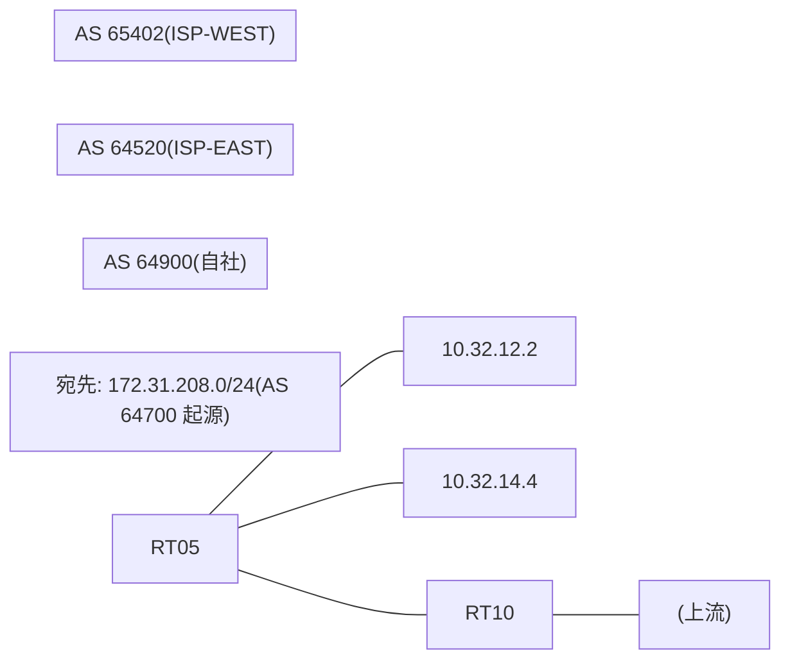

# 問題 20260827-009

> **本問は機器に接続せずに解答すること。追加の show 実行は認めない。**

## トポロジ

あなたは、ネットワークの運用を担当しています。自社のルータ RT05 は、外部のネットワーク 172.31.208.0/24 への到達性を、複数の経路を通じて、確立しています。 ISP-EAST とは、接続されています。 ISP-WEST とも、接続されています。 一部の経路は、自 AS 内の境界ルーターから、iBGP で、学習されています。



## 要件

1. 示されているところの出力、および、構成に基づいて、判断すること。
2. なお、機器の構成は、示されている抜粋のほかは、既定値である。

## 現在の状態

外部との 1 つのセッションが失われ、それまで使用されていたところの経路は、取り下げられました。ルータは、残るところの経路からの、ベストパスの選出を、行おうとしています。示されているところの出力は、その時点で、採取されたものです。

```
RT05# show ip bgp
BGP table version is 19, local router ID is 191.191.191.191
Status codes: s suppressed, d damped, h history, * valid, > best, i - internal, 
              r RIB-failure, S Stale, m multipath, b backup-path, f RT-Filter, 
              x best-external, a additional-path, c RIB-compressed, 
              t secondary path, L long-lived-stale,
Origin codes: i - IGP, e - EGP, ? - incomplete
RPKI validation codes: V valid, I invalid, N Not found

     Network          Next Hop            Metric LocPrf Weight Path
 *    172.31.208.0/24  10.32.12.2                    200      0 64520 64520 64520 64700 i
 *                     10.32.14.4                             0 65402 64700 i
 * i                   2.5.5.5                       100      0 64520 64700 i
```
```
RT05# show ip bgp 172.31.208.0
BGP routing table entry for 172.31.208.0/24, version 19
Paths: (3 available, no best path)
  Not advertised to any peer
  Refresh Epoch 1
  64520 64520 64520 64700
    10.32.12.2 from 10.32.12.2 (130.130.130.130)
      Origin IGP, localpref 200, valid, external
      rx pathid: 0, tx pathid: 0
      Updated on Jun 22 2026 07:51:03 UTC
  Refresh Epoch 1
  65402 64700
    10.32.14.4 from 10.32.14.4 (160.160.160.160)
      Origin IGP, localpref 100, valid, external
      rx pathid: 0, tx pathid: 0
      Updated on Jun 22 2026 09:14:03 UTC
  Refresh Epoch 1
  64520 64700
    2.5.5.5 (metric 11) from 2.5.5.5 (2.5.5.5)
      Origin IGP, localpref 100, valid, internal
      rx pathid: 0, tx pathid: 0
      Updated on Jun 22 2026 08:16:03 UTC
```

## 設定抜粋

```
RT05# show running-config | section router bgp
router bgp 64900
 bgp router-id 191.191.191.191
 bgp log-neighbor-changes
 neighbor 2.5.5.5 remote-as 64900
 neighbor 2.5.5.5 update-source Loopback0
 neighbor 10.32.12.2 remote-as 64520
 neighbor 10.32.14.4 remote-as 65402
 !
 address-family ipv4
  neighbor 2.5.5.5 activate
  neighbor 10.32.12.2 activate
  neighbor 10.32.12.2 route-map RM-CUST-IN in
  neighbor 10.32.14.4 activate
 exit-address-family
```
```
RT05# show running-config | section route-map
route-map RM-CUST-IN permit 10
 set local-preference 200
```

## 設問

示されているところの出力に基づいて、この後、172.31.208.0/24 のベストパスとして選出され、転送に使用されるところの経路は、どれですか。(1つを選択してください)

## 選択肢
A. いずれの経路も、ベストパスとして、選出されない

B. next hop 2.5.5.5 の経路

C. next hop 10.32.12.2 の経路

D. next hop 10.32.14.4 の経路
